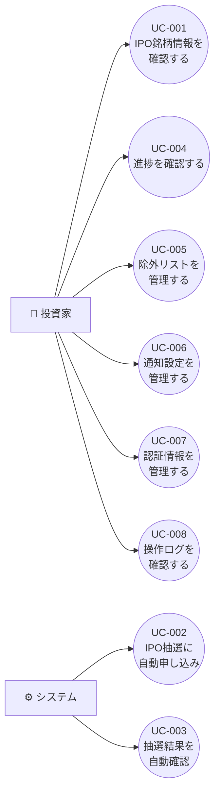

# 要件定義書

## 1. 目的

本プロジェクトは、証券会社におけるIPO（新規公開株）の抽選申し込みを自動化し、進捗を一元管理するWebアプリケーション「IPOtto」を構築することを目的とする。

個人投資家が複数のIPO銘柄に対して手動で行っている以下の作業を自動化し、申し込み漏れの防止と進捗の可視化を実現する。

- IPO銘柄情報の収集
- 抽選申し込み操作
- 当選/落選結果の確認
- 購入意思表示（将来対応）
- 初値売却判断（将来対応）

## 2. スコープ

### 2.1 対象範囲

**MVP（Phase 1）:**

- IPO銘柄情報の自動取得・管理
- 楽天証券でのIPO抽選申し込み自動化
- 当選/落選結果の自動確認
- 申し込み・結果の進捗管理ダッシュボード
- 除外リスト（ブラックリスト）による銘柄フィルタリング
- 通知機能（LINE / メール / Slack）
- 操作ログの記録
- 証券口座認証情報の暗号化管理

**Phase 2（将来対応）:**

- 楽天証券以外の証券会社への拡張（SBI証券、マネックス証券、松井証券等）
- 当選時の購入意思表示の自動化
- 上場後の初値売却判断・実行の自動化
- 銘柄評価・レーティング情報の取得と表示

### 2.2 対象外

- モバイルネイティブアプリ
- 複数ユーザー対応（マルチテナント）
- IPO以外の株式取引の自動化
- 投資助言・推奨機能（金融商品取引法上の投資助言業に該当するため）
- 証券会社の公式APIが利用規約でbot操作を禁止している場合の対応

## 3. 用語定義

| 用語 | 説明 |
|---|---|
| IPO | Initial Public Offering。新規公開株。企業が初めて株式を証券取引所に上場すること |
| ブックビルディング | IPOの公募価格を決定するための需要申告制度。投資家が希望価格と株数を申告する |
| 抽選申し込み | ブックビルディング期間中に証券会社を通じてIPO株の購入を申し込むこと |
| 当選/落選 | 抽選の結果、IPO株の購入権を得られたか否か |
| 購入意思表示 | 当選後に実際に購入する意思を証券会社に伝える手続き |
| 初値 | 上場日に最初につく株価 |
| 除外リスト | 自動申し込みの対象外とする銘柄のリスト（インサイダー規制対応等） |
| 主幹事証券 | IPOの引受業務を主導する証券会社。配分株数が多く当選確率が高い |

## 4. ステークホルダー

| ステークホルダー | 役割 | 関心事 |
|---|---|---|
| 個人投資家（本人） | 唯一の利用者 | IPO申し込みの自動化、申し込み漏れ防止、進捗の可視化 |
| 証券会社（楽天証券） | 外部サービス | サイトUI変更時のブラウザ自動操作への影響 |
| IPO情報提供サイト | 外部情報源 | IPO銘柄情報・スケジュールの取得元 |
| 通知サービス（LINE / メール / Slack） | 外部サービス | 通知配信の信頼性 |

## 5. ユースケース一覧

| ID | ユースケース名 | アクター | 優先度 |
|---|---|---|---|
| UC-001 | IPO銘柄情報を確認する | 投資家 | Must |
| UC-002 | IPO抽選に自動申し込みする | システム | Must |
| UC-003 | 抽選結果を自動確認する | システム | Must |
| UC-004 | 申し込み・結果の進捗を確認する | 投資家 | Must |
| UC-005 | 除外リストを管理する | 投資家 | Must |
| UC-006 | 通知設定を管理する | 投資家 | Must |
| UC-007 | 証券口座の認証情報を管理する | 投資家 | Must |
| UC-008 | 操作ログを確認する | 投資家 | Should |
| UC-009 | 当選時に購入意思を自動表示する | システム | Won't（Phase 2） |
| UC-010 | 上場後に初値売却を自動実行する | システム | Won't（Phase 2） |

### 5.1 ユースケース図

## 6. ユースケース詳細

### UC-001: IPO銘柄情報を確認する {#uc-001}

| 項目 | 内容 |
|---|---|
| **ID** | UC-001 |
| **アクター** | 投資家 |
| **事前条件** | システムがIPO情報を取得済みであること |
| **事後条件** | IPO銘柄の一覧・詳細が表示される |
| **トリガー** | 投資家がダッシュボードにアクセスする |

**基本フロー:**

1. 投資家がWebアプリのダッシュボードにアクセスする
2. システムが取得済みのIPO銘柄情報を一覧表示する
3. 投資家が銘柄を選択し、詳細情報（会社情報、公募価格、スケジュール、主幹事証券等）を確認する

**代替フロー:**

- 投資家がステータス（申し込み前、申し込み済み、当選、落選等）でフィルタリングする

**例外フロー:**

- IPO情報の取得に失敗している場合、最終取得日時とエラー内容を表示し、手動再取得ボタンを提供する

### UC-002: IPO抽選に自動申し込みする {#uc-002}

| 項目 | 内容 |
|---|---|
| **ID** | UC-002 |
| **アクター** | システム（スケジュール実行） |
| **事前条件** | 証券口座の認証情報が登録済みであること。ブックビルディング期間中であること |
| **事後条件** | 対象銘柄の抽選申し込みが完了し、操作ログが記録される |
| **トリガー** | スケジュールされた時刻に自動実行される |

**基本フロー:**

1. システムがスケジュールに従い、申し込み対象のIPO銘柄を特定する
2. 除外リストに含まれる銘柄を除外する
3. 証券会社のサイトにログインする（ブラウザ自動操作またはAPI）
4. 対象銘柄ごとに抽選申し込みを実行する
5. 申し込み結果（成功/失敗）を記録する
6. 投資家に通知を送信する（申し込み完了 or エラー）

**代替フロー:**

- 対象銘柄が0件の場合、処理をスキップし、ログに記録する

**例外フロー:**

- ログインに失敗した場合、リトライ（最大3回）後、エラー通知を送信し処理を中断する
- 申し込み操作中にサイトのUI変更等で操作が失敗した場合、エラー内容を記録し、即座に通知を送信する
- 残高不足で申し込みができない場合、その旨を記録・通知する

### UC-003: 抽選結果を自動確認する {#uc-003}

| 項目 | 内容 |
|---|---|
| **ID** | UC-003 |
| **アクター** | システム（スケジュール実行） |
| **事前条件** | 抽選申し込み済みの銘柄が存在すること。抽選結果発表日であること |
| **事後条件** | 当選/落選結果が記録され、投資家に通知される |
| **トリガー** | 抽選結果発表日にスケジュール実行される |

**基本フロー:**

1. システムが抽選結果発表日の銘柄を特定する
2. 証券会社のサイトにログインする
3. 対象銘柄の抽選結果（当選/落選/補欠当選）を取得する
4. 結果をデータベースに記録する
5. 投資家に結果を通知する

**代替フロー:**

- 結果がまだ発表されていない場合、一定間隔でリトライする（最大回数制限あり）

**例外フロー:**

- 結果取得に失敗した場合、エラーを記録・通知し、次回スケジュールでリトライする

### UC-004: 申し込み・結果の進捗を確認する {#uc-004}

| 項目 | 内容 |
|---|---|
| **ID** | UC-004 |
| **アクター** | 投資家 |
| **事前条件** | なし |
| **事後条件** | 各銘柄の申し込みステータスが一覧で表示される |
| **トリガー** | 投資家がダッシュボードにアクセスする |

**基本フロー:**

1. 投資家がダッシュボードにアクセスする
2. システムが全IPO銘柄のステータス一覧を表示する（未申し込み/申し込み済み/当選/落選/購入済み/除外）
3. 証券会社ごとの申し込み状況サマリーを表示する

**代替フロー:**

- 投資家が特定の期間やステータスでフィルタリングする

**例外フロー:**

- なし

### UC-005: 除外リストを管理する {#uc-005}

| 項目 | 内容 |
|---|---|
| **ID** | UC-005 |
| **アクター** | 投資家 |
| **事前条件** | なし |
| **事後条件** | 除外リストが更新される |
| **トリガー** | 投資家が除外リスト管理画面を操作する |

**基本フロー:**

1. 投資家が除外リスト管理画面にアクセスする
2. 銘柄名または企業名で検索し、除外対象を追加する
3. 除外理由（インサイダー規制、個人的判断等）を入力する

**代替フロー:**

- 投資家が除外リストから銘柄を削除する

**例外フロー:**

- なし

### UC-006: 通知設定を管理する {#uc-006}

| 項目 | 内容 |
|---|---|
| **ID** | UC-006 |
| **アクター** | 投資家 |
| **事前条件** | なし |
| **事後条件** | 通知チャネルと通知条件が更新される |
| **トリガー** | 投資家が通知設定画面を操作する |

**基本フロー:**

1. 投資家が通知設定画面にアクセスする
2. 通知チャネル（LINE / メール / Slack）を選択・設定する
3. 通知イベント（申し込み完了、抽選結果、エラー発生等）ごとに有効/無効を設定する

**代替フロー:**

- なし

**例外フロー:**

- 通知チャネルの接続テストに失敗した場合、エラーメッセージを表示する

### UC-007: 証券口座の認証情報を管理する {#uc-007}

| 項目 | 内容 |
|---|---|
| **ID** | UC-007 |
| **アクター** | 投資家 |
| **事前条件** | なし |
| **事後条件** | 証券口座の認証情報が暗号化されて保存される |
| **トリガー** | 投資家が認証情報管理画面を操作する |

**基本フロー:**

1. 投資家が認証情報管理画面にアクセスする
2. 証券会社を選択し、ログインID・パスワード・取引暗証番号を入力する
3. システムが認証情報を暗号化して保存する
4. 接続テスト（ログイン確認）を実行し、結果を表示する

**代替フロー:**

- 投資家が既存の認証情報を更新する
- 投資家が認証情報を削除する

**例外フロー:**

- 接続テストに失敗した場合、エラー内容を表示し、認証情報の再確認を促す

### UC-008: 操作ログを確認する {#uc-008}

| 項目 | 内容 |
|---|---|
| **ID** | UC-008 |
| **アクター** | 投資家 |
| **事前条件** | 操作ログが記録されていること |
| **事後条件** | 操作ログが一覧表示される |
| **トリガー** | 投資家がログ画面にアクセスする |

**基本フロー:**

1. 投資家がログ画面にアクセスする
2. システムが操作ログを時系列で表示する（日時、操作内容、結果、対象銘柄）
3. 投資家が日付範囲やイベント種別でフィルタリングする

**代替フロー:**

- なし

**例外フロー:**

- なし

## 7. 機能要件

### REQ-001: IPO銘柄情報の自動取得 {#req-001}

| 項目 | 内容 |
|---|---|
| **ID** | REQ-001 |
| **カテゴリ** | 機能要件 |
| **優先度** | Must |
| **関連ユースケース** | [UC-001](#uc-001) |
| **説明** | 外部IPO情報サイトからIPO銘柄情報（企業名、公募価格帯、スケジュール、主幹事証券等）を自動取得し、データベースに保存する。外部サイトからの取得が不可能な場合は証券会社サイトからのスクレイピングにフォールバックする |
| **受入基準** | 新規IPO銘柄が公表された翌日までにシステムに反映されること。銘柄情報にはブックビルディング期間、抽選日、上場日が含まれること |

### REQ-002: IPO抽選の自動申し込み {#req-002}

| 項目 | 内容 |
|---|---|
| **ID** | REQ-002 |
| **カテゴリ** | 機能要件 |
| **優先度** | Must |
| **関連ユースケース** | [UC-002](#uc-002) |
| **説明** | ブックビルディング期間中に、除外リストに含まれない全IPO銘柄に対して、楽天証券で自動的に抽選申し込みを行う。ブラウザ自動操作（Playwright等）またはAPIで証券会社サイトを操作する |
| **受入基準** | スケジュールされた時刻に自動で申し込みが実行されること。申し込み成功/失敗が正確に記録されること。除外リストの銘柄がスキップされること |

### REQ-003: 抽選結果の自動確認 {#req-003}

| 項目 | 内容 |
|---|---|
| **ID** | REQ-003 |
| **カテゴリ** | 機能要件 |
| **優先度** | Must |
| **関連ユースケース** | [UC-003](#uc-003) |
| **説明** | 抽選結果発表日に証券会社サイトから当選/落選/補欠当選の結果を自動取得し、記録する |
| **受入基準** | 結果発表日に自動で結果が取得されること。当選/落選/補欠当選が正確に判定・記録されること |

### REQ-004: 進捗管理ダッシュボード {#req-004}

| 項目 | 内容 |
|---|---|
| **ID** | REQ-004 |
| **カテゴリ** | 機能要件 |
| **優先度** | Must |
| **関連ユースケース** | [UC-004](#uc-004) |
| **説明** | 全IPO銘柄の申し込みステータスを一覧で確認できるダッシュボードを提供する。ステータスは「情報取得済み→申し込み予定→申し込み済み→当選/落選/補欠→購入済み」のフローで管理する |
| **受入基準** | 銘柄ごとのステータスが一目で把握できること。ステータス別の集計が表示されること。証券会社別のサマリーが表示されること |

### REQ-005: 除外リスト管理 {#req-005}

| 項目 | 内容 |
|---|---|
| **ID** | REQ-005 |
| **カテゴリ** | 機能要件 |
| **優先度** | Must |
| **関連ユースケース** | [UC-005](#uc-005) |
| **説明** | 自動申し込みの対象外とする銘柄（自社株等のインサイダー規制対象、個人的に除外したい銘柄）を管理する除外リスト機能を提供する |
| **受入基準** | 銘柄の追加・削除ができること。除外理由を記録できること。除外リストに含まれる銘柄が自動申し込みから確実にスキップされること |

### REQ-006: 通知機能 {#req-006}

| 項目 | 内容 |
|---|---|
| **ID** | REQ-006 |
| **カテゴリ** | 機能要件 |
| **優先度** | Must |
| **関連ユースケース** | [UC-006](#uc-006) |
| **説明** | 申し込み完了、抽選結果、エラー発生等のイベントを通知する。通知チャネルはアダプターパターンで実装し、LINE / メール / Slackに対応する。将来的なチャネル追加を容易にする |
| **受入基準** | 各イベントで指定チャネルに通知が送信されること。通知チャネルの追加が既存コードを変更せずに可能であること。イベントごとに通知の有効/無効を設定できること |

### REQ-007: 証券口座認証情報の管理 {#req-007}

| 項目 | 内容 |
|---|---|
| **ID** | REQ-007 |
| **カテゴリ** | 機能要件 |
| **優先度** | Must |
| **関連ユースケース** | [UC-007](#uc-007) |
| **説明** | 証券会社のログインID、パスワード、取引暗証番号を暗号化して安全に保管する。GCP Secret Manager等の秘密情報管理サービスを利用する |
| **受入基準** | 認証情報が平文で保存されないこと。認証情報の登録・更新・削除ができること。接続テスト機能で正常にログインできることを確認できること |

### REQ-008: 操作ログ {#req-008}

| 項目 | 内容 |
|---|---|
| **ID** | REQ-008 |
| **カテゴリ** | 機能要件 |
| **優先度** | Should |
| **関連ユースケース** | [UC-008](#uc-008) |
| **説明** | 全ての自動操作（ログイン、申し込み、結果確認等）の操作ログを記録し、Web UIから閲覧できる機能を提供する |
| **受入基準** | 操作日時、操作種別、対象銘柄、結果（成功/失敗）、エラー詳細が記録されること。日付範囲・イベント種別でフィルタリングできること |

### REQ-009: 証券会社アダプター {#req-009}

| 項目 | 内容 |
|---|---|
| **ID** | REQ-009 |
| **カテゴリ** | 機能要件 |
| **優先度** | Must |
| **関連ユースケース** | [UC-002](#uc-002), [UC-003](#uc-003) |
| **説明** | 証券会社との連携をアダプターパターンで抽象化し、証券会社ごとの具体的な操作（ブラウザ自動操作/API）を差し替え可能にする。MVPでは楽天証券アダプターのみ実装する |
| **受入基準** | 共通インターフェースが定義されていること。楽天証券アダプターが実装されていること。新しい証券会社アダプターの追加が既存コードを変更せずに可能であること |

## 8. 非機能要件

### 8.1 性能要件

| ID | 要件 | 目標値 |
|---|---|---|
| REQ-NF-001 | ダッシュボードの初期表示時間（p95） | 2秒以下 |
| REQ-NF-002 | IPO情報取得ジョブの実行時間 | 5分以下 |
| REQ-NF-003 | 1銘柄あたりの申し込み操作時間 | 3分以下 |

### 8.2 可用性要件

| ID | 要件 | 目標値 |
|---|---|---|
| REQ-NF-010 | スケジュールジョブの実行成功率（月間） | 99%以上 |
| REQ-NF-011 | ジョブ失敗時の自動リトライ | 最大3回、指数バックオフ |

### 8.3 セキュリティ要件

| ID | 要件 | 詳細 |
|---|---|---|
| REQ-NF-020 | 認証情報の暗号化 | GCP Secret Managerで管理。アプリケーション内で平文保持を最小限にする |
| REQ-NF-021 | 通信の暗号化 | すべての通信をTLS 1.2以上で暗号化する |
| REQ-NF-022 | Web UIのアクセス制御 | 認証機能を設け、本人のみアクセス可能とする |
| REQ-NF-023 | 操作ログの完全性 | 全自動操作のログを改ざん不可能な形式で保存する |
| REQ-NF-024 | 異常検知・アラート | 連続ログイン失敗、想定外のUI変更検知時に即座にアラートを送信する |
| REQ-NF-025 | 認証情報のメモリ上での保護 | 認証情報の平文をメモリ上に保持する時間を最小化する |

### 8.4 ユーザビリティ要件

| ID | 要件 | 詳細 |
|---|---|---|
| REQ-NF-030 | レスポンシブ対応 | PC・タブレット・スマートフォンで適切に表示されること |
| REQ-NF-031 | ステータスの視覚化 | 銘柄のステータスが色やアイコンで直感的に把握できること |

### 8.5 保守性要件

| ID | 要件 | 詳細 |
|---|---|---|
| REQ-NF-040 | 証券会社アダプターの差し替え容易性 | 証券会社サイトのUI変更時に、アダプター実装のみの修正で対応できること |
| REQ-NF-041 | 通知チャネルの拡張容易性 | 新しい通知チャネルの追加がアダプター実装の追加のみで可能であること |
| REQ-NF-042 | ブラウザ自動操作のセレクタ管理 | UI変更への追従を容易にするため、セレクタを外部設定として管理すること |

## 9. 制約条件

- **技術スタック**: バックエンドはRust、フロントエンドはNext.js（TypeScript）、インフラはGCP（Cloud Run）でTerraformによるIaC管理
- **個人利用**: マルチテナント対応は不要。単一ユーザー向けに最適化する
- **利用規約の遵守**: 証券会社の利用規約に違反しないよう、自動操作の頻度やアクセスパターンに配慮する
- **法規制の遵守**: 金融商品取引法に基づくインサイダー取引規制を考慮し、除外リスト機能を必須とする
- **ブラウザ自動操作の脆弱性**: 証券会社サイトのUI変更により自動操作が破綻するリスクを常に考慮する

## 10. 前提条件

- 投資家は楽天証券の口座を保有していること
- 投資家はGCPの利用環境を有すること
- 楽天証券のWebサイトがブラウザ自動操作で操作可能であること（CAPTCHAや二要素認証等のbot対策が回避不能な場合は手動介入が必要）
- LINE Notify / SendGrid / Slack Webhookの各サービスが利用可能であること
- IPO情報提供サイトがスクレイピング可能であること（robots.txt、利用規約の確認が必要）

## 11. リスク

| ID | リスク | 影響度 | 発生確率 | 対策 |
|---|---|---|---|---|
| RISK-001 | 証券会社サイトのUI変更による自動操作の破綻 | 高 | 高 | アダプターパターンによる影響範囲の局所化。セレクタの外部設定化。UI変更検知とアラート機能 |
| RISK-002 | 証券会社によるbot操作の検知・ブロック | 高 | 中 | 人間に近い操作速度・パターンの再現。アクセス頻度の制限。利用規約の定期確認 |
| RISK-003 | 二要素認証やCAPTCHAの導入による操作不能 | 高 | 中 | 手動介入フローの用意。認証トークンの再利用可能期間の調査 |
| RISK-004 | IPO情報提供サイトの閉鎖・仕様変更 | 中 | 低 | 複数情報源へのフォールバック対応。証券会社サイトからの直接取得 |
| RISK-005 | 誤って除外すべき銘柄に申し込んでしまう | 高 | 低 | 除外リストの申し込み前チェックの二重実行。新規銘柄追加時の通知 |
| RISK-006 | 認証情報の漏洩 | 高 | 低 | GCP Secret Managerでの管理。アクセスログの監視。最小権限の原則 |

## 12. 要件トレーサビリティ

| 要件ID | ユースケース | 設計書参照 | テストケース |
|---|---|---|---|
| REQ-001 | [UC-001](#uc-001) | TBD | TBD |
| REQ-002 | [UC-002](#uc-002) | TBD | TBD |
| REQ-003 | [UC-003](#uc-003) | TBD | TBD |
| REQ-004 | [UC-004](#uc-004) | TBD | TBD |
| REQ-005 | [UC-005](#uc-005) | TBD | TBD |
| REQ-006 | [UC-006](#uc-006) | TBD | TBD |
| REQ-007 | [UC-007](#uc-007) | TBD | TBD |
| REQ-008 | [UC-008](#uc-008) | TBD | TBD |
| REQ-009 | [UC-002](#uc-002), [UC-003](#uc-003) | TBD | TBD |

## 変更履歴

| バージョン | 日付 | 変更者 | 変更内容 |
|---|---|---|---|
| 1.0.0 | 2026-03-25 | lihs | 初版作成 |
