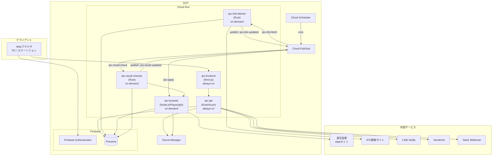
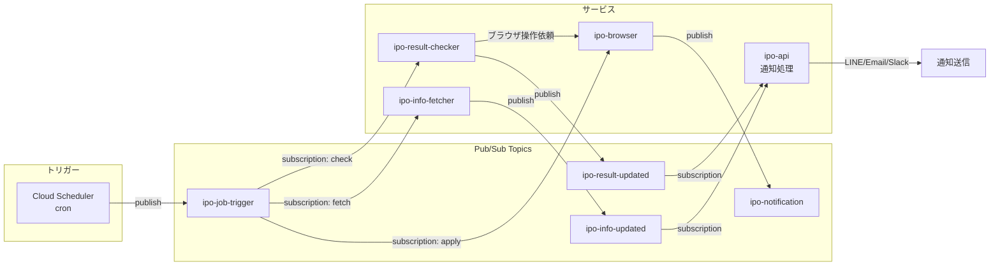
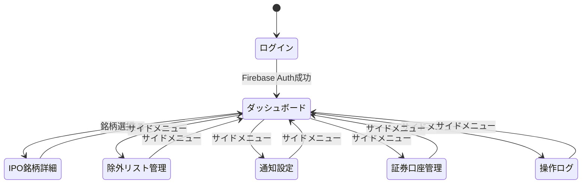
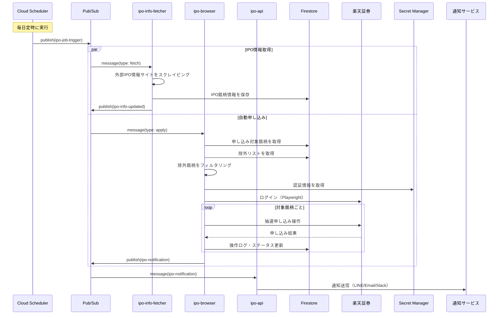
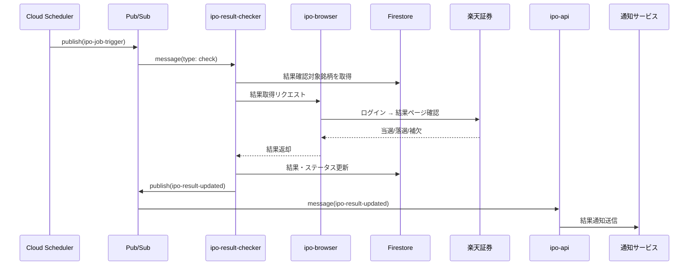
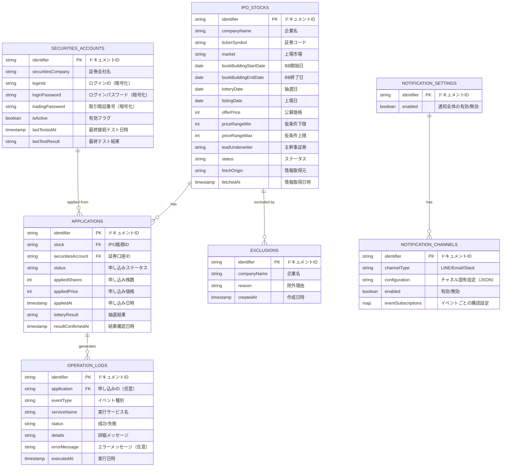
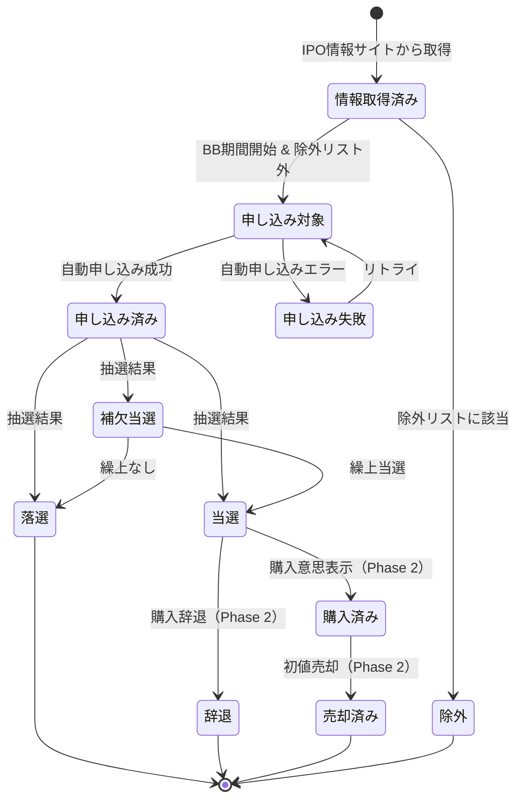
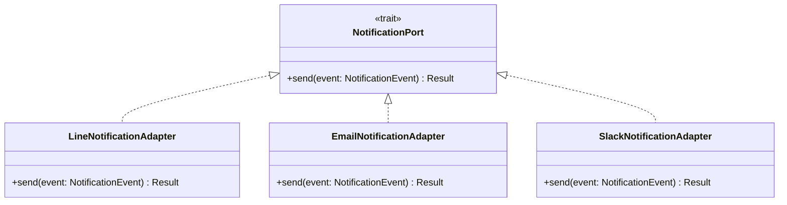
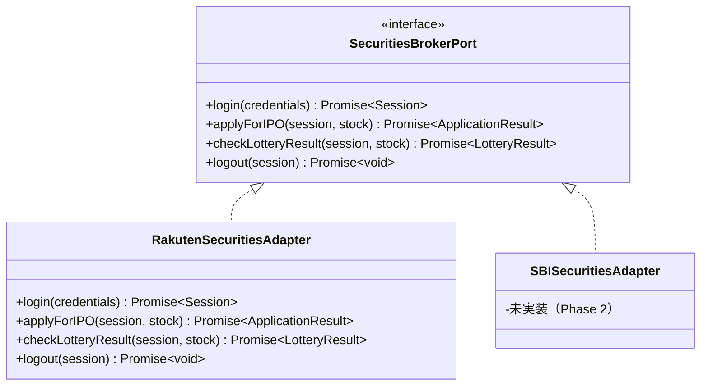

# 基本設計書

## 1. はじめに

### 1.1 目的

本文書は、IPO抽選申し込み自動化・進捗管理Webアプリケーション「IPOtto」の基本設計を定義する。システム全体のアーキテクチャ、サービス構成、技術スタック、画面設計、外部インターフェース、概念データモデルの概要を示す。

### 1.2 対象読者

- 開発者（自身）
- 将来的なコントリビューター

### 1.3 関連文書

- [要件定義書](../01-requirements/requirements-specification.md)
- [ペルソナ設計書](../13-persona/persona.md)

## 2. システム概要

IPOttoは、個人投資家向けのIPO抽選申し込み自動化Webアプリケーションである。以下の5つのマイクロサービスで構成され、Pub/Subによるイベント駆動アーキテクチャで疎結合に連携する。

- **ipo-api**: Web UI向けREST APIサーバー（Rust/Axum）
- **ipo-browser**: 証券会社サイトのブラウザ自動操作サービス（Node.js/Playwright）
- **ipo-info-fetcher**: 外部IPO情報サイトからの情報取得ジョブ（Rust）
- **ipo-result-checker**: 抽選結果確認ジョブ（Rust）
- **ipo-frontend**: ダッシュボードUI（Next.js）

認証にはFirebase Authentication、データストアにはFirestoreを採用し、GCPの無料枠を最大限に活用する。

## 3. システム構成図



### 3.1 イベントフロー



## 4. 技術スタック

| レイヤー | 技術 | バージョン | 選定理由 |
|---|---|---|---|
| フロントエンド | Next.js (React) | ^16.2.1 | SSR対応、React Server Components、Cloud Runとの親和性 |
| スタイリング | CSS Modules | - | Next.js標準サポート、スコープ付きCSS、追加依存なし |
| バックエンドAPI | Rust / Axum | latest stable | 高性能、型安全、Towerエコシステムとの親和性 |
| ブラウザ自動操作 | Node.js / Playwright | 22.x / latest | Playwrightの公式サポート言語。証券会社アダプターのマイクロサービスとして分離 |
| データストア | Firebase Firestore | - | 無料枠活用（1GiB保存、50K読取/日）、スキーマレスの柔軟性、GCPネイティブ |
| 認証 | Firebase Authentication | - | 無料枠活用、Google連携、トークン検証の容易さ |
| メッセージング | Cloud Pub/Sub | - | イベント駆動アーキテクチャの基盤。サービス間の疎結合を実現 |
| スケジューラ | Cloud Scheduler | - | マネージドcron。Pub/Subへのメッセージ発行でジョブをトリガー |
| 秘密情報管理 | GCP Secret Manager | - | 証券口座認証情報の暗号化管理 |
| インフラ | GCP Cloud Run | - | コンテナベースのサーバーレス。on-demandでコスト最適化 |
| IaC | Terraform | latest stable | GCPリソースのコード管理、再現性の確保 |
| CI/CD | GitHub Actions | - | リポジトリとの統合性 |

### 4.1 Rust依存クレート（主要）

| クレート | 用途 |
|---|---|
| axum | Webフレームワーク |
| tokio | 非同期ランタイム |
| serde / serde_json | シリアライズ/デシリアライズ |
| reqwest | HTTPクライアント（IPO情報スクレイピング、サービス間通信） |
| scraper | HTMLパーサー（IPO情報スクレイピング） |
| google-cloud-firestore または firestore-rs | Firestoreクライアント（設計時に評価して選定） |
| google-cloud-pubsub | Pub/Subクライアント |
| google-cloud-secretmanager | Secret Managerクライアント |
| tracing | 構造化ログ |
| anyhow / thiserror | エラーハンドリング |

## 5. 機能一覧

| ID | 機能名 | 概要 | 担当サービス | 関連要件 |
|---|---|---|---|---|
| SD-001 | IPO銘柄情報取得 | 外部IPO情報サイトから銘柄情報をスクレイピングし、Firestoreに保存する | ipo-info-fetcher | [REQ-001](../01-requirements/requirements-specification.md#req-001) | {#sd-001}
| SD-002 | IPO抽選自動申し込み | 楽天証券のWebサイトをPlaywrightで自動操作し、抽選申し込みを実行する | ipo-browser | [REQ-002](../01-requirements/requirements-specification.md#req-002) | {#sd-002}
| SD-003 | 抽選結果自動確認 | 楽天証券のWebサイトから当選/落選結果を自動取得する | ipo-result-checker, ipo-browser | [REQ-003](../01-requirements/requirements-specification.md#req-003) | {#sd-003}
| SD-004 | 進捗管理ダッシュボード | 全銘柄のステータス一覧、サマリー、フィルタリング | ipo-frontend, ipo-api | [REQ-004](../01-requirements/requirements-specification.md#req-004) | {#sd-004}
| SD-005 | 除外リスト管理 | 自動申し込み対象外銘柄のCRUD | ipo-frontend, ipo-api | [REQ-005](../01-requirements/requirements-specification.md#req-005) | {#sd-005}
| SD-006 | 通知送信 | アダプターパターンによるLINE/メール/Slack通知 | ipo-api | [REQ-006](../01-requirements/requirements-specification.md#req-006) | {#sd-006}
| SD-007 | 証券口座認証情報管理 | Secret Managerを利用した認証情報の暗号化保管・CRUD | ipo-api | [REQ-007](../01-requirements/requirements-specification.md#req-007) | {#sd-007}
| SD-008 | 操作ログ | 自動操作の実行履歴の記録・閲覧 | 全サービス, ipo-frontend | [REQ-008](../01-requirements/requirements-specification.md#req-008) | {#sd-008}
| SD-009 | 証券会社アダプター | 証券会社ごとのブラウザ操作を抽象化するアダプターパターン | ipo-browser | [REQ-009](../01-requirements/requirements-specification.md#req-009) | {#sd-009}
| SD-010 | 認証 | Firebase Authenticationによるログイン・トークン検証 | ipo-frontend, ipo-api | [REQ-NF-022](../01-requirements/requirements-specification.md) | {#sd-010}

## 6. 画面設計

### 6.1 画面一覧

| ID | 画面名 | 概要 | URLパターン |
|---|---|---|---|
| UI-001 | ログイン | Firebase Authenticationによるログイン | `/login` |
| UI-002 | ダッシュボード | 全IPO銘柄のステータス一覧、サマリー、フィルタリング | `/` |
| UI-003 | IPO銘柄詳細 | 銘柄の詳細情報、スケジュール、申し込み状況 | `/stocks/{stockId}` |
| UI-004 | 除外リスト管理 | 除外銘柄の一覧・追加・削除 | `/exclusions` |
| UI-005 | 通知設定 | 通知チャネル・イベントごとの有効/無効設定 | `/settings/notifications` |
| UI-006 | 証券口座管理 | 証券会社の認証情報登録・更新・削除・接続テスト | `/settings/accounts` |
| UI-007 | 操作ログ | 自動操作の実行履歴一覧、フィルタリング | `/logs` |

### 6.2 画面遷移図



### 6.3 ダッシュボード画面レイアウト概要

```
┌──────────────────────────────────────────────────┐
│ IPOtto                    [ユーザー名 ▼] │
├──────────┬───────────────────────────────────────┤
│          │  ステータスサマリー                      │
│ ダッシュ  │  ┌─────┐ ┌─────┐ ┌─────┐ ┌─────┐     │
│ ボード   │  │申込前│ │申込済│ │ 当選│ │ 落選│      │
│          │  │  5  │ │  3  │ │  1  │ │  8  │      │
│ 除外     │  └─────┘ └─────┘ └─────┘ └─────┘     │
│ リスト   │                                        │
│          │  IPO銘柄一覧              [ステータス ▼] │
│ 通知設定  │  ┌─────────────────────────────────┐  │
│          │  │ ○○(株)  楽天  申込済  03/28抽選  │  │
│ 証券口座  │  │ △△(株)  楽天  申込前  04/02締切  │  │
│          │  │ □□(株)  楽天  当選    04/05上場  │  │
│ 操作ログ  │  │ ◇◇(株)  楽天  落選    03/20抽選  │  │
│          │  └─────────────────────────────────┘  │
└──────────┴───────────────────────────────────────┘
```

## 7. 外部インターフェース

### 7.1 外部システム連携一覧

| ID | 連携先 | プロトコル | 方向 | 担当サービス | 概要 |
|---|---|---|---|---|---|
| IF-001 | 楽天証券Webサイト | HTTPS (ブラウザ自動操作) | 送受信 | ipo-browser | IPO抽選申し込み、結果確認 |
| IF-002 | IPO情報サイト | HTTPS (スクレイピング) | 受信 | ipo-info-fetcher | IPO銘柄情報の取得 |
| IF-003 | Firebase Authentication | HTTPS (SDK) | 送受信 | ipo-frontend, ipo-api | ユーザー認証・トークン検証 |
| IF-004 | Firestore | HTTPS (SDK) | 送受信 | ipo-api, ipo-info-fetcher, ipo-browser, ipo-result-checker | データの読み書き |
| IF-005 | Cloud Pub/Sub | HTTPS (SDK) | 送受信 | 全サービス | イベントメッセージの発行・購読 |
| IF-006 | GCP Secret Manager | HTTPS (SDK) | 受信 | ipo-api, ipo-browser | 証券口座認証情報の取得 |
| IF-007 | LINE Notify | HTTPS (REST API) | 送信 | ipo-api | LINE通知送信 |
| IF-008 | SendGrid | HTTPS (REST API) | 送信 | ipo-api | メール通知送信 |
| IF-009 | Slack Webhook | HTTPS (Webhook) | 送信 | ipo-api | Slack通知送信 |

### 7.2 連携シーケンス（IPO自動申し込み）



### 7.3 連携シーケンス（抽選結果確認）



## 8. 概念データモデル



### 8.1 IPO銘柄ステータス遷移



## 9. 共通処理方針

### 9.1 認証・認可

- Firebase Authenticationを使用し、Googleアカウントでのログインを提供する
- ipo-frontendでFirebase SDK経由でIDトークンを取得し、ipo-apiへのリクエストにBearerトークンとして付与する
- ipo-apiはFirebase Admin SDKでIDトークンを検証する
- 単一ユーザーのため、許可するユーザーのUID/メールアドレスを環境変数で設定し、それ以外のアクセスを拒否する

### 9.2 エラーハンドリング

- ipo-apiのエラーレスポンスは共通JSON形式で返却する:
  ```json
  {
    "error": {
      "code": "STOCK_NOT_FOUND",
      "message": "指定されたIPO銘柄が見つかりません"
    }
  }
  ```
- ブラウザ自動操作の失敗は、リトライ（最大3回、指数バックオフ）後にエラー通知を送信する
- 証券会社サイトのUI変更検知時は即座にアラート通知を送信し、以降のジョブ実行を停止する

### 9.3 ログ

- 全サービスで構造化ログ（JSON形式）を採用する
- Cloud Loggingに集約し、ログレベルはERROR / WARN / INFO / DEBUGを使い分ける
- 操作ログ（ユーザー向け）はFirestoreの`operation_logs`コレクションに永続化し、Web UIから閲覧可能とする
- リクエストIDを全ログに含め、サービス間のトレーサビリティを確保する

### 9.4 バリデーション

- ipo-apiのリクエストバリデーションはAxumのExtractorで実施する
- ipo-frontendでもUX向上のためバリデーションを実施するが、ipo-api側を正とする
- 証券口座の認証情報登録時は、接続テスト（実際のログイン試行）による検証を必須とする

### 9.5 通知アダプター



- 通知チャネルはPort/Adapterパターンで実装し、`NotificationPort` traitを各チャネルが実装する
- 新しい通知チャネルの追加は、trait実装の追加のみで対応可能とする

### 9.6 証券会社アダプター



- 証券会社の操作はインターフェースで抽象化し、証券会社ごとのPlaywright実装を差し替え可能にする
- ブラウザ操作のセレクタ（CSS/XPath）は外部設定ファイル（JSON）で管理し、UI変更時にコード修正なしで対応可能とする

## 10. 非機能設計方針

### 10.1 性能

- ipo-frontendはNext.jsのSSRでダッシュボードを事前レンダリングし、初期表示を高速化する
- FirestoreのクエリはインデックスをIPO銘柄のステータス・日付フィールドに設定し、一覧取得を最適化する
- ブラウザ自動操作は1銘柄あたり3分以内を目標とし、タイムアウトを設定する

### 10.2 スケーラビリティ

- 個人利用のため大規模なスケーラビリティは不要
- Cloud Runのon-demandインスタンスでコールドスタートを許容する（ジョブ実行は数分単位のため影響軽微）
- Firestoreの無料枠（50K読取/日）は個人利用では十分だが、使用量をモニタリングする

### 10.3 可用性

- スケジュールジョブの実行成功率99%以上を目標とする
- Cloud Runのヘルスチェックを設定し、異常時は自動再起動する
- ジョブ失敗時はPub/Subのリトライポリシー（指数バックオフ、最大3回）で自動リトライする
- 全ジョブ失敗後は通知を送信し、手動介入を促す

### 10.4 コスト最適化

- Firestoreの無料枠: 1GiB保存、50K読取/日、20K書込/日
- Firebase Authenticationの無料枠: 10K認証/月
- Cloud Runのon-demandモードで、ジョブ非実行時のコストをゼロに抑える
- Cloud Pub/Subの無料枠: 10GiBメッセージング/月
- Cloud Schedulerの無料枠: 3ジョブ/月

## 変更履歴

| バージョン | 日付 | 変更者 | 変更内容 |
|---|---|---|---|
| 1.0.0 | 2026-03-25 | lihs | 初版作成 |
