# ACL（腐敗防止層）設計書

> **IDの採番規則**: 本文書では `DD-xxx` 形式のIDを使用する。ACL層は DD-300〜DD-399 の範囲を使用する。

## 1. はじめに

### 1.1 目的

本文書は、外部サービスとの連携において、ドメインモデルの純粋性を保護するためのACL（Anti-Corruption Layer：腐敗防止層）の設計を定義する。

IPOttoでは以下の3つの外部サービス連携にACLを適用する。

1. **証券会社ブラウザ操作** — 楽天証券のWebサイト操作（Playwright）
2. **IPO情報スクレイピング** — 外部IPO情報サイトのHTMLパース
3. **通知サービス** — LINE Notify / SendGrid / Slack Webhook

いずれも外部サービスの仕様変更がドメイン層に波及しないよう、変換・分離・検知の仕組みを設計する。

### 1.2 関連文書

| 関連 | 文書 | 参照先 |
|---|---|---|
| 上流 | 基本設計書 | [system-design.md](../02-system-design/system-design.md)（IF-001〜IF-009） |
| 上流 | ドメイン層設計書 | [domain.md](./domain.md)（ポートインターフェース） |
| 同層 | ユースケース層設計書 | [use-case.md](./use-case.md) |
| 同層 | インフラストラクチャ層設計書 | [infrastructure.md](./infrastructure.md) |

### 1.3 ACLの設計原則

1. **ドメインモデルの保護**: 外部サービスのモデル（HTML構造、APIレスポンス形式）がドメインモデルに漏洩しないようにする
2. **変換の一元化**: 外部モデルとドメインモデルの変換ロジックをアダプターに集約する
3. **障害の分離**: 外部サービスの障害がドメイン層に波及しないようにする
4. **テスト容易性**: ポートインターフェースを介した疎結合により、テストダブルへの差し替えを容易にする
5. **可観測性**: 外部サービスとの通信状況を監視・追跡可能にする
6. **変更への耐性**: 外部サイトのUI変更を前提とした多層防御設計を行う

---

## 2. ポートとアダプターの全体像

### 2.1 アーキテクチャ概要

```mermaid
graph TD
    subgraph Domain["ドメイン層"]
        BrokerPort["BrokerOperationPort"]
        ScraperPort["IpoStockScraperPort"]
        NotifPort["NotificationPort"]
    end

    subgraph ACL["ACL（腐敗防止層）"]
        subgraph BrokerACL["証券会社ACL"]
            RakutenAdapter["RakutenBrokerAdapter"]
            SelectorResolver["SelectorResolver"]
            SelectorConfig["セレクタ設定<br>(YAML)"]
            PageObjects["Page Objects"]
            HealthChecker["セレクタヘルスチェッカー"]
        end

        subgraph ScraperACL["スクレイピングACL"]
            ExternalScraper["ExternalSiteScraperAdapter"]
            SecuritiesScraper["SecuritiesSiteScraperAdapter"]
            HtmlParser["HTMLパーサー"]
            StockTranslator["ScrapedStock変換器"]
        end

        subgraph NotifACL["通知ACL"]
            LineAdapter["LineNotificationAdapter"]
            EmailAdapter["EmailNotificationAdapter"]
            SlackAdapter["SlackNotificationAdapter"]
            MessageFormatter["メッセージフォーマッター"]
        end
    end

    subgraph External["外部サービス"]
        RakutenSite["楽天証券 Webサイト"]
        IpoSite["IPO情報サイト"]
        LineAPI["LINE Notify API"]
        SendGrid["SendGrid API"]
        SlackWebhook["Slack Webhook"]
    end

    BrokerPort -.->|impl| RakutenAdapter
    ScraperPort -.->|impl| ExternalScraper
    ScraperPort -.->|impl| SecuritiesScraper
    NotifPort -.->|impl| LineAdapter
    NotifPort -.->|impl| EmailAdapter
    NotifPort -.->|impl| SlackAdapter

    RakutenAdapter --> SelectorResolver
    SelectorResolver --> SelectorConfig
    RakutenAdapter --> PageObjects
    PageObjects --> RakutenSite
    HealthChecker --> PageObjects

    ExternalScraper --> HtmlParser
    HtmlParser --> IpoSite
    ExternalScraper --> StockTranslator
    SecuritiesScraper --> PageObjects

    LineAdapter --> MessageFormatter
    EmailAdapter --> MessageFormatter
    SlackAdapter --> MessageFormatter
    LineAdapter --> LineAPI
    EmailAdapter --> SendGrid
    SlackAdapter --> SlackWebhook
```

### 2.2 ポートとアダプター一覧

| ID | ポート（ドメイン層） | アダプター（ACL層） | 外部サービス | 変換内容 |
|---|---|---|---|---|
| DD-300 | BrokerOperationPort | RakutenBrokerAdapter | 楽天証券Webサイト | Playwright操作 → ドメインモデル（ApplicationResult, LotteryOutcome等） |
| DD-301 | IpoStockScraperPort | ExternalSiteScraperAdapter | 外部IPO情報サイト | HTML → ScrapedStock → IpoStock集約 |
| DD-302 | IpoStockScraperPort | SecuritiesSiteScraperAdapter | 楽天証券IPOページ | HTML → ScrapedStock → IpoStock集約（フォールバック） |
| DD-303 | NotificationPort | LineNotificationAdapter | LINE Notify API | NotificationEvent → LINE APIリクエスト |
| DD-304 | NotificationPort | EmailNotificationAdapter | SendGrid API | NotificationEvent → SendGrid APIリクエスト |
| DD-305 | NotificationPort | SlackNotificationAdapter | Slack Webhook | NotificationEvent → Slack Blockメッセージ |
| DD-306 | MailReaderPort | ImapMailReader / GmailApiMailReader | IMAP / Gmail API | メール本文 → ImageAuthenticationKeyword（2つのテキスト） |

---

## 3. 証券会社ACL（DD-300）

### 3.1 BrokerOperationPort インターフェース

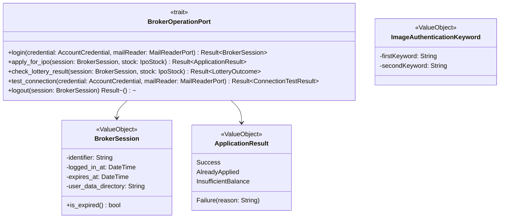

### 3.2 Page Object Model

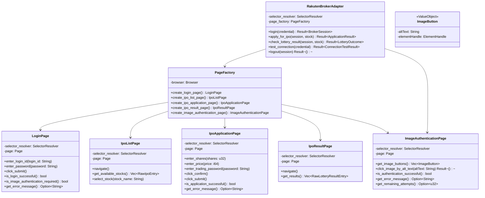

### 3.3 セレクタ管理

#### セレクタ設定ファイル構造

```yaml
# selectors/rakuten.yaml
version: "1.0.0"
last_verified: "2026-03-25"

login_page:
  url: "https://www.rakuten-sec.co.jp/..."
  username_field:
    - selector: "input[name='loginid']"
      strategy: "css"
      description: "ログインIDフィールド（name属性）"
    - selector: "#loginid"
      strategy: "css"
      description: "ログインIDフィールド（ID属性フォールバック）"
  password_field:
    - selector: "input[name='passwd']"
      strategy: "css"
      description: "パスワードフィールド（name属性）"
    - selector: "input[type='password']"
      strategy: "css"
      description: "パスワードフィールド（type属性フォールバック）"
  submit_button:
    - selector: "button[type='submit']"
      strategy: "css"
      description: "ログインボタン（type属性）"
    - selector: "text=ログイン"
      strategy: "text"
      description: "ログインボタン（テキストマッチフォールバック）"

image_authentication_page:
  url_pattern: "https://www.rakuten-sec.co.jp/..."
  image_buttons:
    - selector: "/html/body/main/div[1]/div[5]/button"
      strategy: "xpath"
      description: "画像認証ボタン（XPath）"
    - selector: "main button:has(img[alt])"
      strategy: "css"
      description: "alt属性付き画像を持つボタン（CSSフォールバック）"
  image_element:
    - selector: "img"
      strategy: "css"
      description: "ボタン内の画像要素（alt属性を読み取る）"
  authentication_success_indicator:
    - selector: ".auth-success"
      strategy: "css"
      description: "認証成功インジケーター"
  error_message:
    - selector: ".auth-error-message"
      strategy: "css"
      description: "認証エラーメッセージ"

ipo_list_page:
  url: "https://www.rakuten-sec.co.jp/..."
  stock_rows:
    - selector: "table.ipo-list tbody tr"
      strategy: "css"
      description: "IPO銘柄テーブルの行"
  company_name_cell:
    - selector: "td:nth-child(1)"
      strategy: "css"
      description: "企業名セル"

ipo_application_page:
  shares_field:
    - selector: "input[name='orderQty']"
      strategy: "css"
      description: "申し込み株数フィールド"
  price_field:
    - selector: "input[name='orderPrice']"
      strategy: "css"
      description: "申し込み価格フィールド"
  trading_password_field:
    - selector: "input[name='tradingPassword']"
      strategy: "css"
      description: "取引暗証番号フィールド"
  confirm_button:
    - selector: "button[type='submit']"
      strategy: "css"
      description: "確認ボタン"
  submit_button:
    - selector: "button.order-submit"
      strategy: "css"
      description: "注文確定ボタン"
    - selector: "text=注文する"
      strategy: "text"
      description: "注文確定ボタン（テキストマッチフォールバック）"

ipo_result_page:
  result_rows:
    - selector: "table.ipo-result tbody tr"
      strategy: "css"
      description: "抽選結果テーブルの行"
  result_status_cell:
    - selector: "td.status"
      strategy: "css"
      description: "当選/落選ステータスセル"
```

#### SelectorResolver

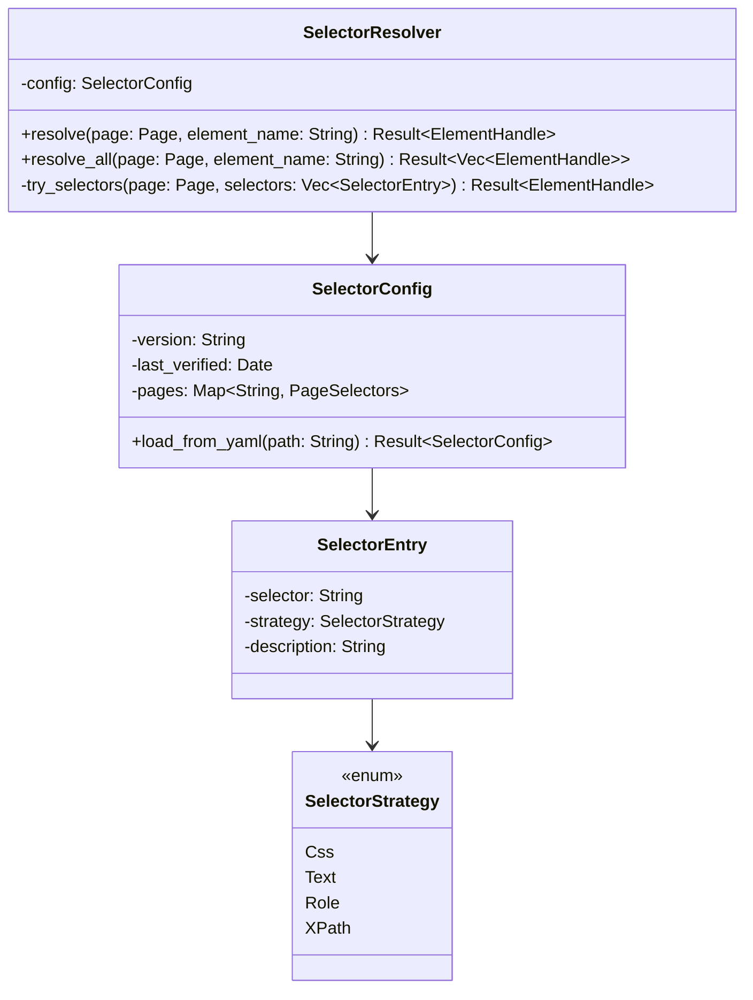

#### フォールバック解決フロー

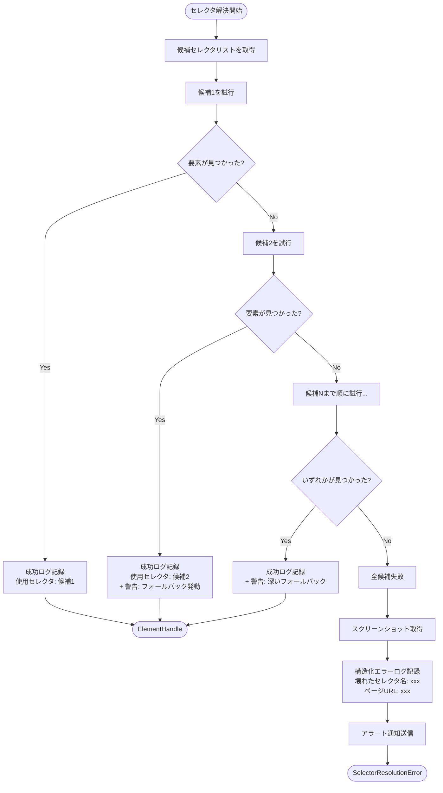

### 3.4 UI変更検知

#### 3.4.1 定期スモークテスト

Cloud Schedulerで1日1回実行し、主要ページの全セレクタ存在確認を行う。

```
// 擬似コード: スモークテスト

fn smoke_test(credential: &AccountCredential) -> SmokeTestReport {
    let mut report = SmokeTestReport::new();

    // ログインページのセレクタ確認
    let login_page = page_factory.create_login_page();
    for (element_name, selectors) in selector_config.login_page {
        let result = selector_resolver.resolve(&login_page, &element_name);
        report.add_entry(SmokeTestEntry {
            page: "login_page",
            element: element_name,
            found: result.is_ok(),
            used_selector: result.ok().map(|r| r.used_selector),
            fallback_used: result.ok().map(|r| r.fallback_depth > 0),
        });
    }

    // 同様にIPO一覧ページ、申し込みページ、結果ページも確認
    // ...

    report
}
```

#### 3.4.2 構造化エラーログ

セレクタ解決失敗時に記録するログの構造：

```
{
  "level": "ERROR",
  "event": "selector_resolution_failed",
  "page": "login_page",
  "element": "username_field",
  "attempted_selectors": [
    { "selector": "input[name='loginid']", "strategy": "css", "error": "ElementNotFound" },
    { "selector": "#loginid", "strategy": "css", "error": "ElementNotFound" }
  ],
  "page_url": "https://www.rakuten-sec.co.jp/...",
  "screenshot_path": "gs://ipo-screenshots/2026-03-25/login_page_error.png",
  "timestamp": "2026-03-25T10:00:00Z"
}
```

#### 3.4.3 スクリーンショット差分

- 操作成功時にベースラインスクリーンショットを保存する
- 次回操作時にベースラインと比較し、大きな差分（閾値超過）があればUI変更の可能性としてログに記録する
- ベースラインはCloud Storageに保存し、比較はPixelmatch相当のライブラリで実行する

### 3.5 外部モデル → ドメインモデル変換

#### ブラウザ操作結果の変換

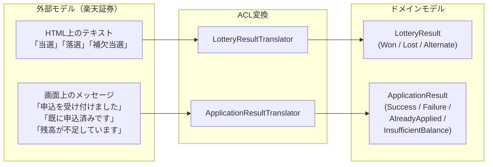

```
// 擬似コード: 変換テーブル

fn translate_lottery_result(raw_text: &str) -> Result<LotteryResult> {
    match raw_text.trim() {
        "当選" => Ok(LotteryResult::Won),
        "落選" => Ok(LotteryResult::Lost),
        "補欠当選" | "補欠" => Ok(LotteryResult::Alternate),
        unknown => Err(UnknownLotteryResultError {
            raw_value: unknown.to_string(),
            message: format!("未知の抽選結果テキスト: '{}'", unknown),
        }),
    }
}

fn translate_application_result(raw_message: &str) -> Result<ApplicationResult> {
    if raw_message.contains("受け付けました") || raw_message.contains("完了") {
        Ok(ApplicationResult::Success)
    } else if raw_message.contains("既に申込済み") {
        Ok(ApplicationResult::AlreadyApplied)
    } else if raw_message.contains("残高") && raw_message.contains("不足") {
        Ok(ApplicationResult::InsufficientBalance)
    } else {
        Ok(ApplicationResult::Failure(raw_message.to_string()))
    }
}
```

### 3.6 MailReaderPort インターフェース

画像認証のキーワードをメールから取得するためのポート。アダプターパターンにより IMAP / Gmail API を差し替え可能にする。

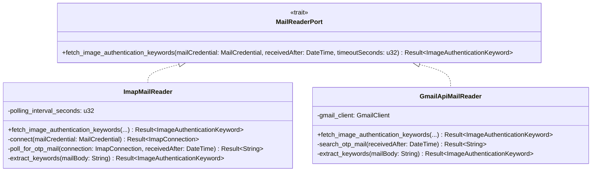

**動作仕様:**

| 項目 | 値 |
|---|---|
| ポーリング間隔 | 3秒 |
| タイムアウト | 120秒（2FA有効期限2分に合わせる） |
| メール検索条件 | 楽天証券からの新着メール（件名に「認証」を含む） |
| キーワード抽出 | メール本文から正規表現で2つのキーワードを抽出 |

**メールからのキーワード抽出（擬似コード）:**

```
fn extract_keywords(mail_body: &str) -> Result<ImageAuthenticationKeyword> {
    // 楽天証券の認証メール本文からキーワード2つを抽出
    // メール本文内に「+」区切りで2つのキーワードが含まれる
    let keywords: Vec<&str> = mail_body
        .lines()
        .find(|line| line.contains("+"))
        .ok_or(MailParseError::KeywordNotFound)?
        .split("+")
        .map(|s| s.trim())
        .collect();

    if keywords.len() != 2 {
        return Err(MailParseError::UnexpectedKeywordCount(keywords.len()));
    }

    Ok(ImageAuthenticationKeyword {
        first_keyword: keywords[0].to_string(),
        second_keyword: keywords[1].to_string(),
    })
}
```

### 3.7 認証フルフローシーケンス図（3段階防御線）

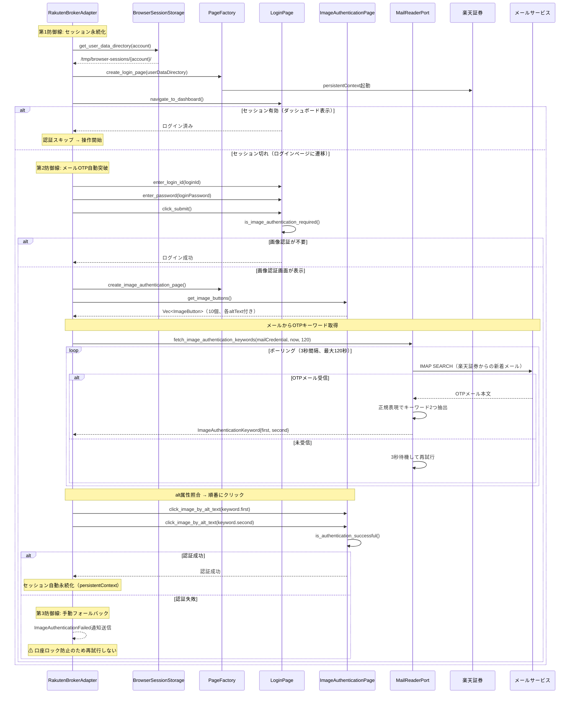

**安全制約:**

| 制約 | 理由 | 対応 |
|---|---|---|
| 画像認証は1回のみ試行 | 3回連続失敗で口座ロック | 失敗時は即座に手動フォールバックに移行 |
| メール取得タイムアウトは120秒 | 2FA有効期限が2分間 | タイムアウト時はImageAuthenticationFailed通知を送信 |
| 同一IPアドレスを維持 | リスクベース認証の追加トリガーを回避 | Cloud Runの固定IPを使用（可能な場合） |

---

## 4. スクレイピングACL（DD-301, DD-302）

### 4.1 変換パイプライン

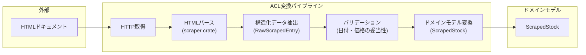

### 4.2 外部モデル → ドメインモデル変換

```
// 外部モデル: HTMLから抽出した生データ
struct RawScrapedEntry {
    company_name: String,          // "（株）テスト"
    ticker_symbol: Option<String>, // "1234" or empty
    market: String,                // "グロース"
    industry: String,              // "情報・通信業"
    bb_period: String,             // "2026/04/01〜2026/04/10"
    lottery_date: String,          // "2026/04/15"
    listing_date: String,          // "2026/04/25"
    price_range: String,           // "1,200円〜1,500円"
    offer_price: Option<String>,   // "1,400円" or empty
    lead_underwriter: String,      // "楽天証券"
    offered_shares: String,        // "100,000株"
}

// ACL変換: 生データ → ドメイン値オブジェクト
fn translate(raw: &RawScrapedEntry) -> Result<ScrapedStock> {
    ScrapedStock {
        company_name: raw.company_name.trim().to_string(),
        ticker_symbol: raw.ticker_symbol.as_ref()
            .filter(|s| !s.is_empty())
            .map(|s| s.to_string()),
        market: raw.market.clone(),
        industry: raw.industry.clone(),
        book_building_start_date: parse_date_from_range(&raw.bb_period, Position::Start)?,
        book_building_end_date: parse_date_from_range(&raw.bb_period, Position::End)?,
        lottery_date: parse_japanese_date(&raw.lottery_date)?,
        listing_date: parse_japanese_date(&raw.listing_date)?,
        price_range_min: parse_japanese_yen(&raw.price_range, Position::Start)?,
        price_range_max: parse_japanese_yen(&raw.price_range, Position::End)?,
        offer_price: raw.offer_price.as_ref()
            .map(|p| parse_japanese_yen_single(p)).transpose()?,
        lead_underwriter: raw.lead_underwriter.clone(),
        number_of_offered_shares: parse_japanese_shares(&raw.offered_shares)?,
    }
}
```

### 4.3 日本語特有のパース処理

| パース対象 | 入力例 | 出力 | パーサー |
|---|---|---|---|
| 日付範囲 | `"2026/04/01〜2026/04/10"` | `(Date(2026-04-01), Date(2026-04-10))` | `parse_date_from_range` |
| 日本語日付 | `"2026年4月15日"` / `"2026/04/15"` | `Date(2026-04-15)` | `parse_japanese_date` |
| 日本円 | `"1,200円〜1,500円"` | `(1200, 1500)` | `parse_japanese_yen` |
| 株数 | `"100,000株"` | `100000` | `parse_japanese_shares` |

### 4.4 フォールバック戦略

外部IPO情報サイトがメインソース、証券会社サイトがフォールバック。

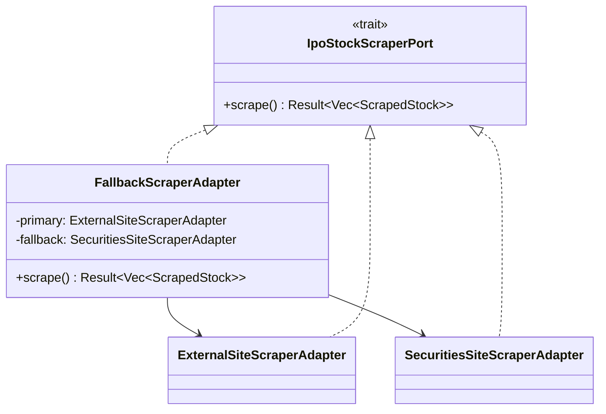

```
// 擬似コード: フォールバック

fn scrape(&self) -> Result<Vec<ScrapedStock>> {
    match self.primary.scrape() {
        Ok(stocks) if !stocks.is_empty() => {
            log::info!("外部サイトからIPO情報を取得: {}件", stocks.len());
            Ok(stocks)
        }
        Ok(_) => {
            log::warn!("外部サイトから0件。フォールバック先へ切り替え");
            self.fallback.scrape()
        }
        Err(error) => {
            log::error!("外部サイトのスクレイピング失敗: {}。フォールバック先へ切り替え", error);
            self.fallback.scrape()
        }
    }
}
```

---

## 5. 通知ACL（DD-303〜DD-305）

### 5.1 メッセージフォーマッター

通知イベントをチャネル固有のメッセージ形式に変換する。ドメインの `NotificationEvent` と外部APIのリクエスト形式の間を仲介する。

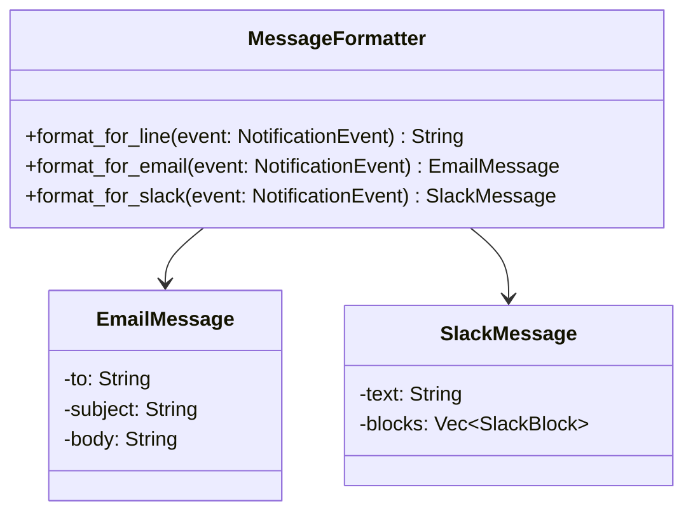

### 5.2 通知イベント → 外部APIリクエスト変換

| 通知イベント | LINE（テキスト） | Email（件名） | Slack（テキスト） |
|---|---|---|---|
| ApplicationCompleted | `[IPO申込完了] ○○(株) 楽天証券で100株申込済み` | `IPO抽選申し込み完了: ○○(株)` | `:white_check_mark: IPO申込完了` + Blockテンプレート |
| LotteryResultWon | `[当選] ○○(株) 当選しました！購入意思表示期限: YYYY/MM/DD` | `IPO抽選当選: ○○(株)` | `:tada: IPO当選` + Blockテンプレート |
| LotteryResultLost | `[落選] ○○(株)` | `IPO抽選落選: ○○(株)` | `:x: IPO落選` + Blockテンプレート |
| OperationError | `[エラー] ○○の操作に失敗しました: エラー内容` | `IPOtto エラー発生` | `:rotating_light: 操作エラー` + Blockテンプレート |
| StockUpdated | `[新規IPO] ○○(株) BB期間: YYYY/MM/DD〜YYYY/MM/DD` | `新規IPO銘柄: ○○(株)` | `:new: 新規IPO` + Blockテンプレート |

### 5.3 外部APIレスポンス → ドメインモデル変換

| 外部API | 成功判定 | エラー変換 |
|---|---|---|
| LINE Notify | HTTP 200 | 401 → 無効なトークン、429 → レート制限超過 |
| SendGrid | HTTP 202 | 401 → 無効なAPIキー、429 → レート制限超過 |
| Slack Webhook | HTTP 200 + `"ok"` | 404 → 無効なWebhook URL、429 → レート制限超過 |

### 5.4 障害分離

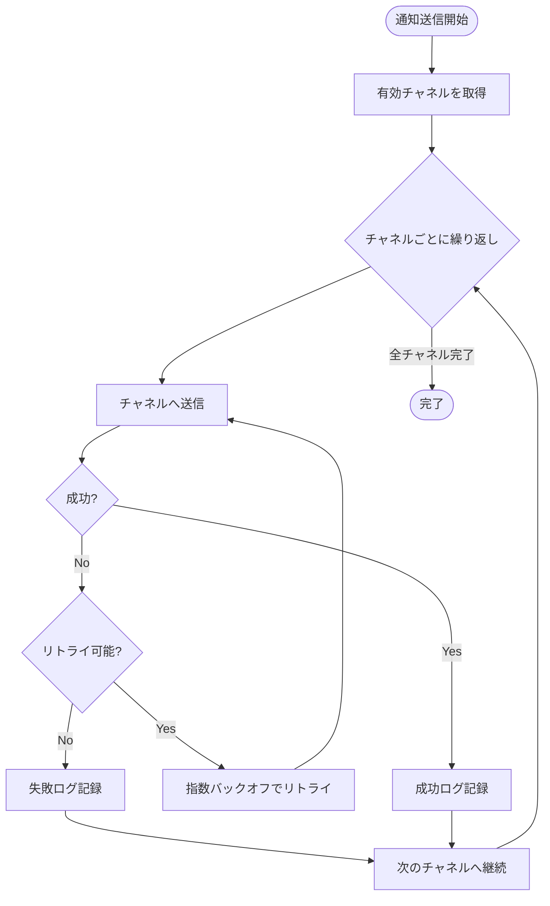

- 1つのチャネルの送信失敗が他のチャネルに影響しない
- 全チャネル失敗時は操作ログにエラーを記録するが、元の処理（申し込み等）はロールバックしない

---

## 6. 可観測性

### 6.1 メトリクス

| メトリクス | 収集対象 | 用途 |
|---|---|---|
| セレクタ解決成功率 | 各ページの各セレクタ | UI変更の兆候検知 |
| フォールバック発動回数 | SelectorResolver | 第1候補セレクタの劣化検知 |
| ブラウザ操作所要時間 | 各Page Object操作 | パフォーマンス劣化検知 |
| スクレイピング成功率 | ExternalSiteScraperAdapter, SecuritiesSiteScraperAdapter | ソース可用性の監視 |
| 通知送信成功率 | 各NotificationAdapter | チャネル可用性の監視 |

### 6.2 アラート条件

| 条件 | 重要度 | アクション |
|---|---|---|
| セレクタ全候補が失敗 | Critical | 即座に通知。該当操作を停止 |
| フォールバックセレクタのみで解決 | Warning | 通知。第1候補の確認・更新を促す |
| スクレイピング失敗（フォールバック発動） | Warning | 通知。メインソースの確認を促す |
| スクレイピング全ソース失敗 | Critical | 即座に通知。手動確認を促す |
| 通知送信3回連続失敗 | Warning | 操作ログに記録。チャネル設定の確認を促す |

---

## 7. テスト戦略

### 7.1 ACL層のテスト方針

| テスト種別 | 対象 | 手法 |
|---|---|---|
| 単体テスト | 変換ロジック（Translator） | 既知の入力パターンに対する変換結果の検証 |
| 単体テスト | SelectorResolver | モックページに対するセレクタ解決の検証 |
| 単体テスト | MessageFormatter | 通知イベントに対するメッセージ形式の検証 |
| 統合テスト | Page Object | ローカルHTMLモックに対するブラウザ操作の検証 |
| 単体テスト | ImageAuthenticationPage | モックHTMLに対する画像ボタン取得・alt属性照合の検証 |
| 単体テスト | MailReaderPort（モック） | 固定メール本文からのキーワード抽出の検証 |
| 統合テスト | 認証フルフロー | セッション有効/切れ/画像認証の各パターンをモックで検証 |
| E2Eテスト（手動） | RakutenBrokerAdapter | 実際の楽天証券サイトに対する操作検証（テスト環境がないため頻度は低い） |

### 7.2 HTMLモックによるテスト

証券会社サイトの重要ページのHTMLスナップショットを保存し、テスト時にローカルサーバーでホストする。

```
tests/fixtures/html/
  ├── rakuten/
  │    ├── login_page_v1.html
  │    ├── ipo_list_page_v1.html
  │    ├── ipo_application_page_v1.html
  │    ├── ipo_result_page_won.html
  │    ├── ipo_result_page_lost.html
  │    ├── ipo_result_page_alternate.html
  │    ├── image_authentication_page_v1.html
  │    └── image_authentication_page_error.html
  └── ipo_sites/
       ├── external_site_v1.html
       └── external_site_empty.html
```

---

## 変更履歴

| バージョン | 日付 | 変更者 | 変更内容 |
|---|---|---|---|
| 1.0.0 | 2026-03-25 | lihs | 初版作成 |
| 1.1.0 | 2026-03-26 | lihs | 画像認証対応を追加（DD-306 MailReaderPort、ImageAuthenticationPage、認証フルフローシーケンス図） |
