# 詳細設計書

## 1. はじめに

### 1.1 目的

本文書は、IPOttoの横断的な技術設計を定義する。5マイクロサービスのモジュール構成、サービス間のクラス設計、主要処理のシーケンス設計、エラー処理設計、および状態管理を記述する。

### 1.2 対応する基本設計項目

> [基本設計書](../02-system-design/system-design.md) — システム構成、技術スタック、機能一覧

> **ID体系**: 本文書は DD-400〜DD-499 の範囲を使用する。

## 2. クラス設計

### 2.1 サービス間の依存関係

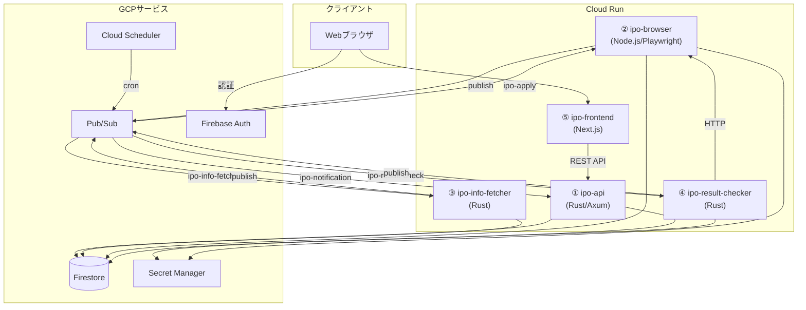

### 2.2 各サービスのモジュール構成

#### ① ipo-api（Rust/Axum）

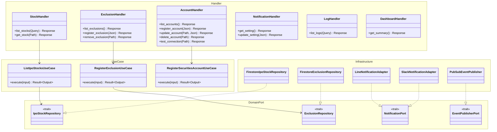

#### ② ipo-browser（Node.js/Playwright）

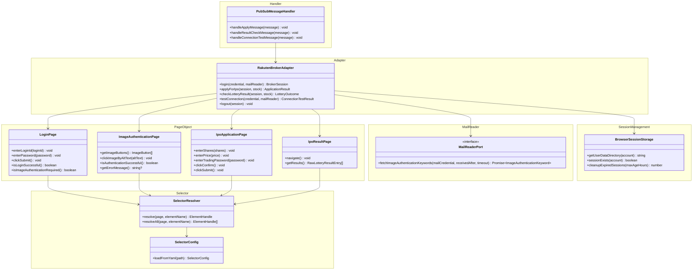

#### ③ ipo-info-fetcher（Rust）

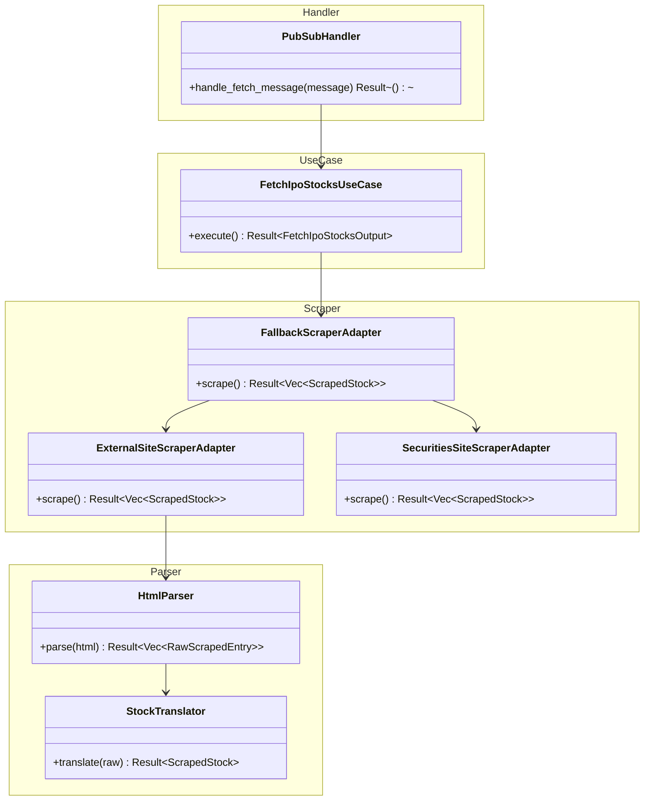

#### ④ ipo-result-checker（Rust）

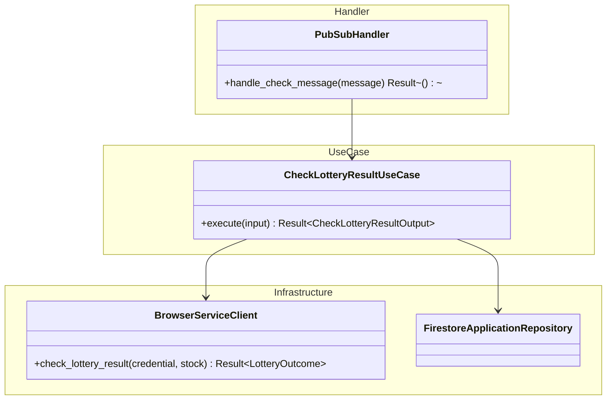

#### ⑤ ipo-frontend（Next.js）

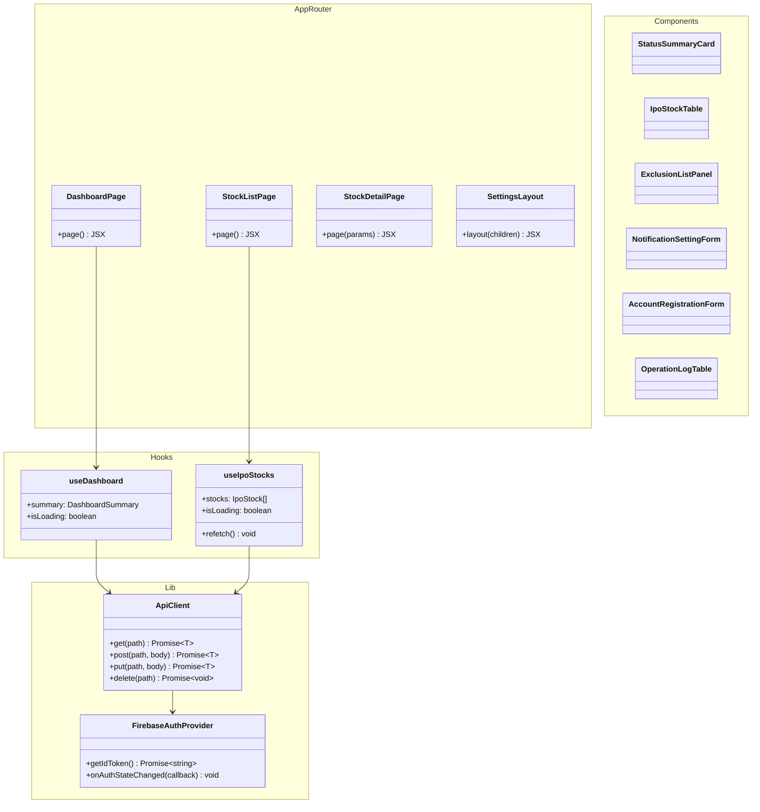

### 2.3 各クラスの責務

| クラス/モジュール | サービス | レイヤー | 責務 |
|---|---|---|---|
| StockHandler | ipo-api | ハンドラー | HTTPリクエストの受付、入力バリデーション、レスポンス返却 |
| RegisterExclusionUseCase | ipo-api | ユースケース | 除外銘柄登録のビジネスフロー実行 |
| ApplicationEligibilityService | ipo-api | ドメインサービス | 銘柄の申し込み適格性判定 |
| IpoStockRepository (trait) | ipo-api | ドメインポート | IPO銘柄の永続化インターフェース |
| FirestoreIpoStockRepository | ipo-api | インフラ | Firestoreへの具体的な読み書き |
| PubSubEventPublisher | ipo-api | インフラ | Pub/Subへのイベント発行 |
| RakutenBrokerAdapter | ipo-browser | アダプター | 楽天証券固有のPlaywright操作を実装 |
| LoginPage | ipo-browser | Page Object | ログインページの要素操作をカプセル化 |
| SelectorResolver | ipo-browser | セレクタ | YAML設定からセレクタを解決、フォールバック実行 |
| FallbackScraperAdapter | ipo-info-fetcher | スクレイパー | メイン→フォールバックの切り替え制御 |
| HtmlParser | ipo-info-fetcher | パーサー | HTML文字列から構造化データを抽出 |
| StockTranslator | ipo-info-fetcher | パーサー | 生データ→ドメイン値オブジェクトへの変換 |
| ApiClient | ipo-frontend | Lib | ipo-apiへのHTTPリクエスト、トークン付与 |
| FirebaseAuthProvider | ipo-frontend | Lib | Firebase Auth SDK のラッパー |

## 3. シーケンス設計

### 3.1 DD-400: 自動申し込みフルフロー

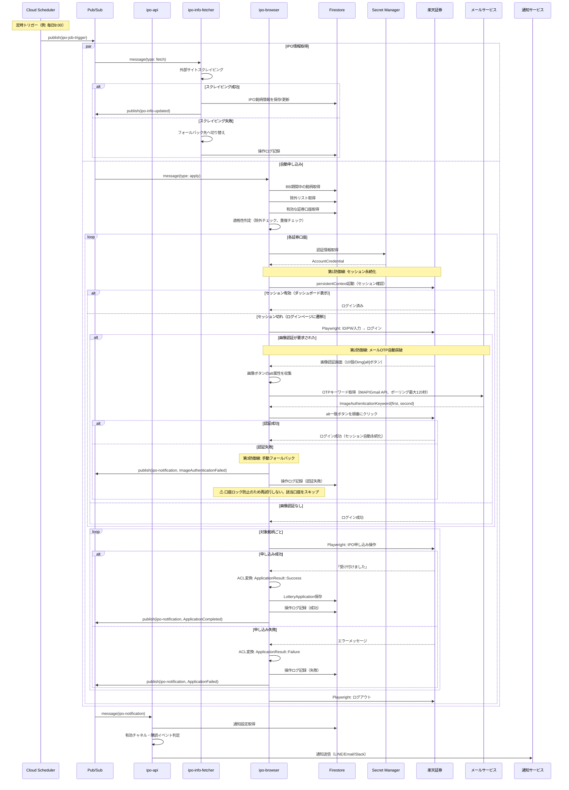

### 3.2 DD-401: 証券口座登録 + 接続テスト

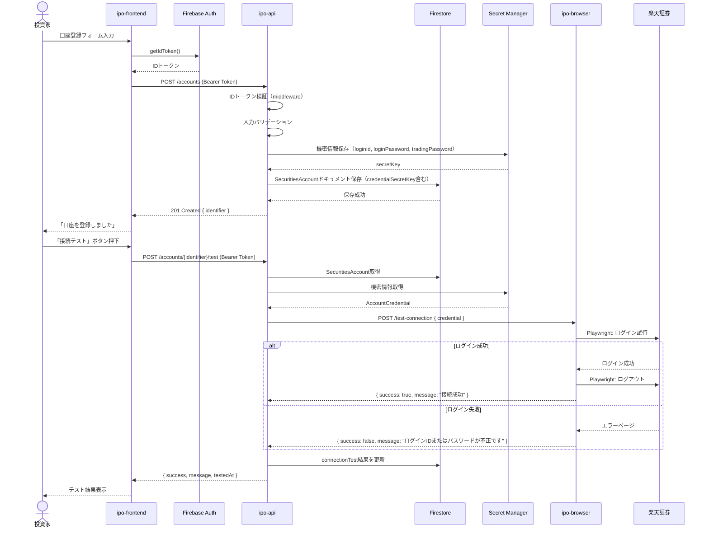

### 3.3 DD-402: ダッシュボード表示

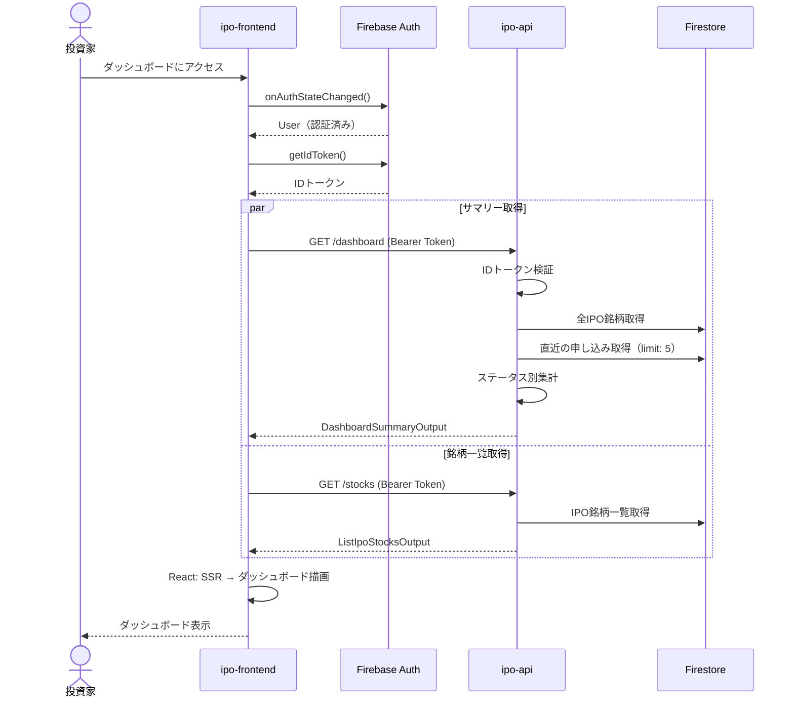

### 3.4 DD-403: エラー時の通知フロー

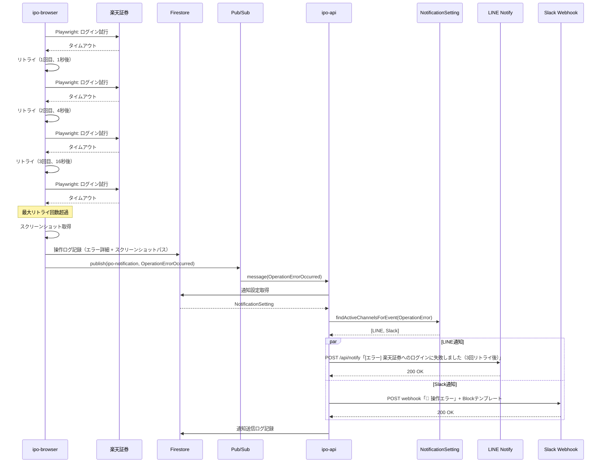

## 4. 処理フロー

### 4.1 申し込み適格性判定フロー

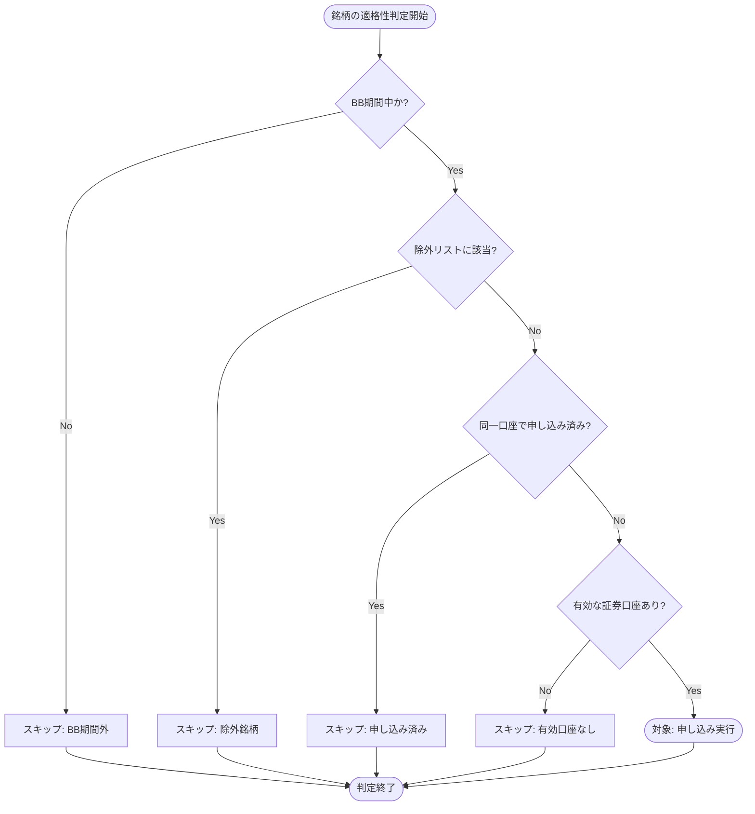

## 5. データ構造

### 5.1 主要な型定義（Rust）

```rust
// ── エラー型 ──

// ドメイン層エラー（thiserror）
#[derive(Debug, thiserror::Error)]
enum DomainError {
    #[error("無効なステータス遷移: {from} -> {to}")]
    InvalidStatusTransition { from: String, to: String },
    #[error("重複申し込み: stock={stock}, account={account}")]
    DuplicateApplication { stock: String, account: String },
    #[error("無効な企業名: {reason}")]
    InvalidCompanyName { reason: String },
    #[error("機密情報が不完全です")]
    IncompleteCredential,
    #[error("有効な通知チャネルがありません")]
    NoActiveChannel,
    #[error("通知チャネルタイプが重複しています: {channel_type}")]
    DuplicateChannelType { channel_type: String },
    #[error("無効なスケジュール: {reason}")]
    InvalidSchedule { reason: String },
    #[error("無効な仮条件: {reason}")]
    InvalidPriceRange { reason: String },
}

// インフラ層エラー（thiserror）
#[derive(Debug, thiserror::Error)]
enum InfrastructureError {
    #[error("Firestoreエラー: {message}")]
    Firestore { message: String },
    #[error("Secret Managerエラー: {message}")]
    SecretManager { message: String },
    #[error("Pub/Subエラー: {message}")]
    PubSub { message: String },
    #[error("ブラウザ操作エラー: {message}")]
    BrowserOperation { message: String },
    #[error("スクレイピングエラー: {message}")]
    Scraping { message: String },
    #[error("通知送信エラー: channel={channel_type}, message={message}")]
    NotificationSend { channel_type: String, message: String },
}

// APIレスポンスエラー
struct ApiErrorResponse {
    error: ApiErrorBody,
}

struct ApiErrorBody {
    code: String,       // "INVALID_STATUS_TRANSITION"
    message: String,    // ユーザー向けメッセージ
}
```

### 5.2 主要な型定義（TypeScript / ipo-browser）

```typescript
// ── ブラウザ操作の型 ──

interface BrokerOperationPort {
  login(credential: AccountCredential, mailReader: MailReaderPort): Promise<BrokerSession>;
  applyForIpo(session: BrokerSession, stock: IpoStockReference): Promise<ApplicationResult>;
  checkLotteryResult(session: BrokerSession, stock: IpoStockReference): Promise<LotteryOutcomeResult>;
  testConnection(credential: AccountCredential, mailReader: MailReaderPort): Promise<ConnectionTestResult>;
  logout(session: BrokerSession): Promise<void>;
}

interface AccountCredential {
  readonly loginId: string;
  readonly loginPassword: string;
  readonly tradingPassword: string;
  readonly mailCredential: MailCredential;
}

interface MailCredential {
  readonly mailAddress: string;
  readonly mailPassword: string;
  readonly imapHost: string;
  readonly imapPort: number;
}

interface BrokerSession {
  readonly identifier: string;
  readonly loggedInAt: string;
  readonly userDataDirectory: string;
}

// ── 画像認証関連の型 ──

interface ImageAuthenticationKeyword {
  readonly firstKeyword: string;
  readonly secondKeyword: string;
}

interface ImageButton {
  readonly altText: string;
  readonly elementHandle: ElementHandle;
}

interface MailReaderPort {
  fetchImageAuthenticationKeywords(
    mailCredential: MailCredential,
    receivedAfter: Date,
    timeoutSeconds: number
  ): Promise<ImageAuthenticationKeyword>;
}

interface BrowserSessionStorage {
  getUserDataDirectory(account: string): string;
  sessionExists(account: string): boolean;
  cleanupExpiredSessions(maxAgeHours: number): Promise<number>;
}

type ApplicationResult =
  | { status: "success" }
  | { status: "failure"; reason: string }
  | { status: "already_applied" }
  | { status: "insufficient_balance" };

type LotteryOutcomeResult =
  | { status: "won" }
  | { status: "lost" }
  | { status: "alternate" }
  | { status: "not_yet_available" };

// ── セレクタ設定の型 ──

interface SelectorConfig {
  version: string;
  lastVerified: string;
  [pageName: string]: PageSelectors | string;
}

interface PageSelectors {
  url?: string;
  [elementName: string]: SelectorEntry[] | string | undefined;
}

interface SelectorEntry {
  selector: string;
  strategy: "css" | "text" | "role" | "xpath";
  description: string;
}
```

## 6. エラー処理設計

### 6.1 エラー分類

| 分類 | 説明 | HTTPステータス | ログレベル | 発生源 |
|---|---|---|---|---|
| バリデーションエラー | 入力値の不正 | 400 | WARN | ハンドラー層 |
| ドメインルール違反 | ビジネスルールへの違反 | 409 / 422 | WARN | ドメイン層 |
| リソース未検出 | 対象が存在しない | 404 | INFO | ユースケース層 |
| 認証エラー | IDトークンの不正・期限切れ | 401 | WARN | ミドルウェア |
| 認可エラー | 許可されていないユーザー | 403 | WARN | ミドルウェア |
| 外部サービスエラー | ブラウザ操作・スクレイピング・通知の失敗 | 503 | ERROR | インフラ層 |
| システムエラー | 予期しないエラー | 500 | ERROR | 全層 |

### 6.2 エラーハンドリング方針

#### レイヤー別の責務

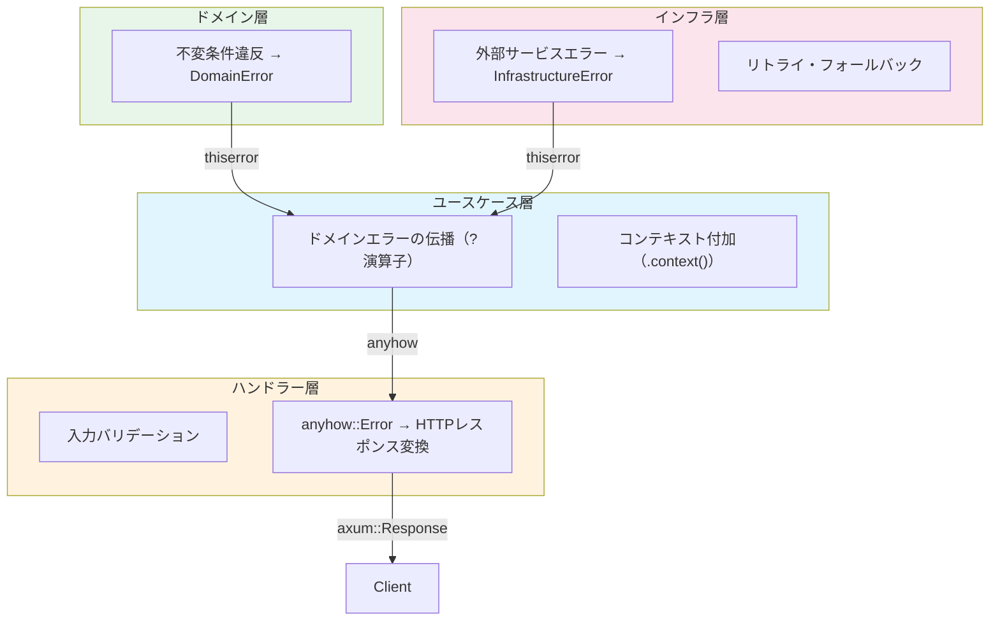

#### エラー変換フロー（Rust擬似コード）

```rust
// ハンドラー層: エラーをHTTPレスポンスに変換
impl IntoResponse for AppError {
    fn into_response(self) -> Response {
        let error = self.0;

        // ドメインエラーの判定
        if let Some(domain_error) = error.downcast_ref::<DomainError>() {
            return match domain_error {
                DomainError::InvalidStatusTransition { .. } =>
                    (StatusCode::CONFLICT, json_error("INVALID_STATUS_TRANSITION", &domain_error.to_string())),
                DomainError::DuplicateApplication { .. } =>
                    (StatusCode::CONFLICT, json_error("DUPLICATE_APPLICATION", &domain_error.to_string())),
                DomainError::InvalidCompanyName { .. } =>
                    (StatusCode::BAD_REQUEST, json_error("INVALID_COMPANY_NAME", &domain_error.to_string())),
                DomainError::IncompleteCredential =>
                    (StatusCode::BAD_REQUEST, json_error("INCOMPLETE_CREDENTIAL", &domain_error.to_string())),
                DomainError::NoActiveChannel =>
                    (StatusCode::UNPROCESSABLE_ENTITY, json_error("NO_ACTIVE_CHANNEL", &domain_error.to_string())),
                _ =>
                    (StatusCode::BAD_REQUEST, json_error("DOMAIN_ERROR", &domain_error.to_string())),
            }.into_response();
        }

        // インフラエラーの判定
        if let Some(infra_error) = error.downcast_ref::<InfrastructureError>() {
            tracing::error!(error = %infra_error, "インフラストラクチャエラー");
            return (StatusCode::SERVICE_UNAVAILABLE, json_error("SERVICE_UNAVAILABLE", "外部サービスとの通信に失敗しました"))
                .into_response();
        }

        // 予期しないエラー
        tracing::error!(error = %error, "予期しないエラー");
        (StatusCode::INTERNAL_SERVER_ERROR, json_error("INTERNAL_ERROR", "内部エラーが発生しました"))
            .into_response()
    }
}
```

### 6.3 エラーコード一覧

| エラーコード | HTTPステータス | 説明 | 対処方法 |
|---|---|---|---|
| `INVALID_STATUS_TRANSITION` | 409 | 許可されていないステータス遷移 | 現在のステータスを確認してください |
| `DUPLICATE_APPLICATION` | 409 | 同一銘柄・口座で申し込み済み | 既に申し込まれています |
| `INVALID_COMPANY_NAME` | 400 | 企業名が無効 | 1〜200文字で入力してください |
| `INCOMPLETE_CREDENTIAL` | 400 | 機密情報が不完全 | 全項目を入力してください |
| `NO_ACTIVE_CHANNEL` | 422 | 有効な通知チャネルがない | 少なくとも1つのチャネルを有効にしてください |
| `DUPLICATE_CHANNEL_TYPE` | 409 | 同一チャネルタイプが重複 | 各チャネルタイプは1つまでです |
| `STOCK_NOT_FOUND` | 404 | IPO銘柄が存在しない | 銘柄IDを確認してください |
| `ACCOUNT_NOT_FOUND` | 404 | 証券口座が存在しない | 口座IDを確認してください |
| `EXCLUSION_NOT_FOUND` | 404 | 除外銘柄が存在しない | 除外IDを確認してください |
| `BROWSER_OPERATION_FAILED` | 503 | ブラウザ操作に失敗 | 証券会社サイトの状態を確認してください |
| `SCRAPING_FAILED` | 503 | スクレイピングに失敗 | IPO情報サイトの状態を確認してください |
| `IMAGE_AUTHENTICATION_FAILED` | 503 | 画像認証の自動突破に失敗 | 手動でログインし画像認証を完了してください |
| `MAIL_RETRIEVAL_FAILED` | 503 | 認証メールの取得に失敗 | メール設定を確認してください |
| `MAIL_RETRIEVAL_TIMEOUT` | 503 | 認証メールの取得がタイムアウト | メール受信の遅延が考えられます。手動で対応してください |
| `ACCOUNT_LOCKED` | 403 | 証券口座がロックされた | 証券会社に連絡して口座ロックを解除してください |
| `INVALID_MAIL_ADDRESS` | 400 | メールアドレスが無効 | 有効なメールアドレスを入力してください |
| `SESSION_EXPIRED` | — | セッションが切れた（内部エラー） | 自動的にメールOTP認証でリトライされます |
| `UNAUTHORIZED` | 401 | 認証に失敗 | 再ログインしてください |
| `FORBIDDEN` | 403 | アクセス権限がない | 許可されたユーザーではありません |
| `INTERNAL_ERROR` | 500 | 予期しないエラー | 管理者に連絡してください |

## 7. 状態管理

### 7.1 IPO銘柄ステータス遷移

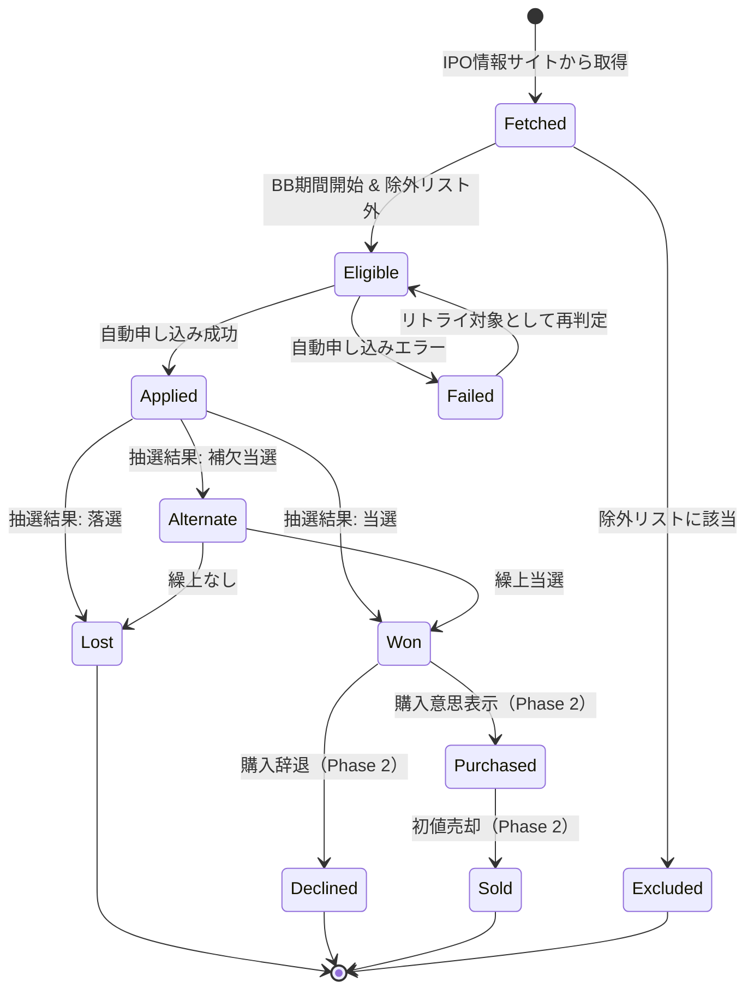

### 7.2 IPO銘柄ステータス遷移表

| 現在の状態 | イベント | 次の状態 | 条件 | 実行者 |
|---|---|---|---|---|
| — | IPO情報取得 | Fetched | 外部サイトからの情報取得成功 | ipo-info-fetcher |
| Fetched | BB期間開始 & 適格性判定 | Eligible | BB期間中かつ除外リスト外 | ipo-browser |
| Fetched | 除外リスト一致 | Excluded | 企業名が除外リストと完全一致 | ipo-browser |
| Eligible | 自動申し込み成功 | Applied | 証券会社サイトで申し込み完了 | ipo-browser |
| Eligible | 自動申し込みエラー | Failed | 申し込み操作が失敗 | ipo-browser |
| Failed | リトライ | Eligible | 次回スケジュール実行時に再判定 | ipo-browser |
| Applied | 当選 | Won | 抽選結果が「当選」 | ipo-result-checker |
| Applied | 落選 | Lost | 抽選結果が「落選」 | ipo-result-checker |
| Applied | 補欠当選 | Alternate | 抽選結果が「補欠当選」 | ipo-result-checker |
| Alternate | 繰上当選 | Won | 補欠からの繰上 | ipo-result-checker |
| Alternate | 繰上なし | Lost | 繰上期間終了 | ipo-result-checker |
| Won | 購入意思表示 | Purchased | Phase 2 | — |
| Won | 購入辞退 | Declined | Phase 2 | — |
| Purchased | 初値売却 | Sold | Phase 2 | — |

### 7.3 申し込みステータス遷移

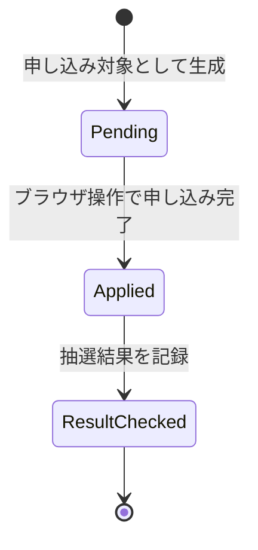

| 現在の状態 | イベント | 次の状態 | 条件 |
|---|---|---|---|
| — | 適格性判定通過 | Pending | 対象銘柄として選出 |
| Pending | 申し込み完了 | Applied | 証券会社サイトで申し込み操作成功 |
| Applied | 結果確認 | ResultChecked | 抽選結果（Won/Lost/Alternate）を記録 |

## 変更履歴

| バージョン | 日付 | 変更者 | 変更内容 |
|---|---|---|---|
| 1.0.0 | 2026-03-25 | lihs | 初版作成 |
