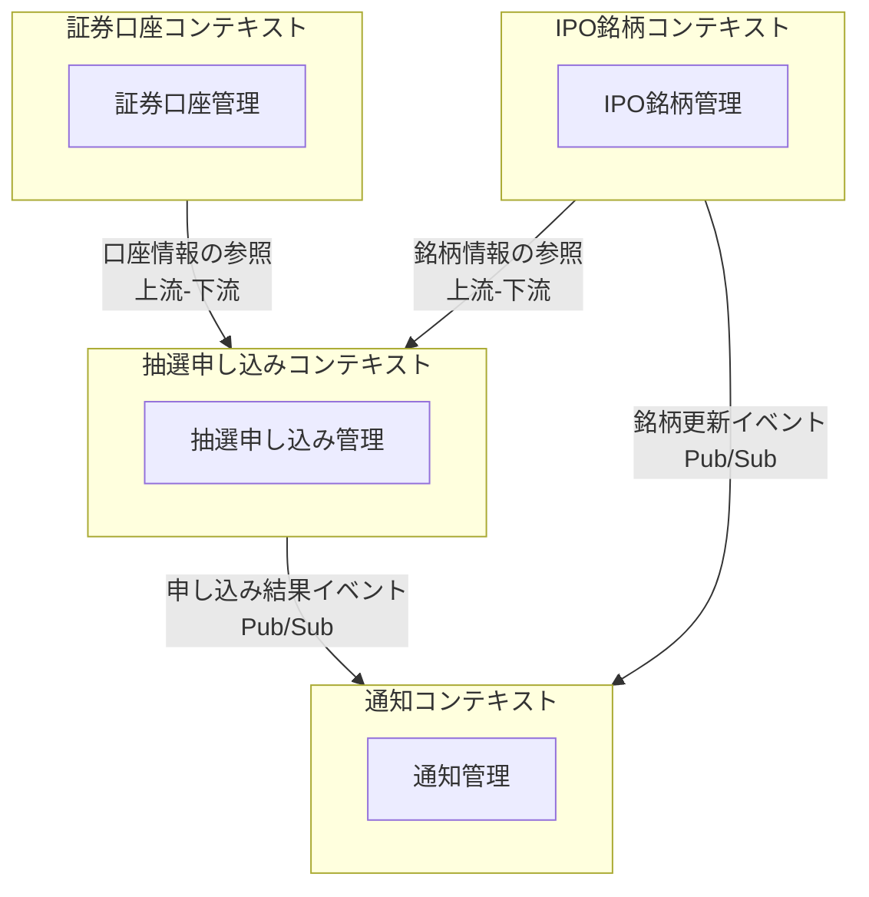
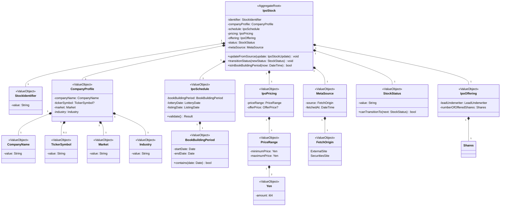
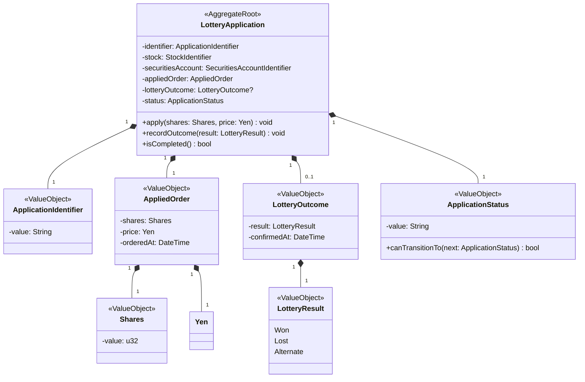
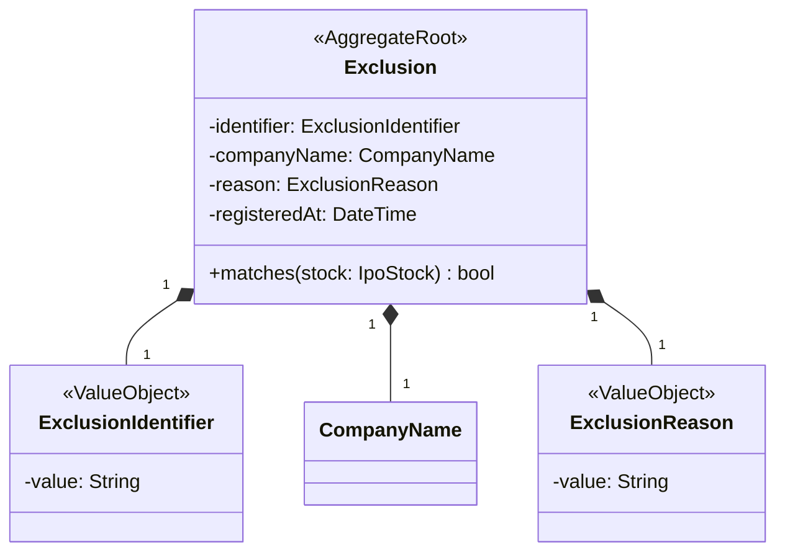
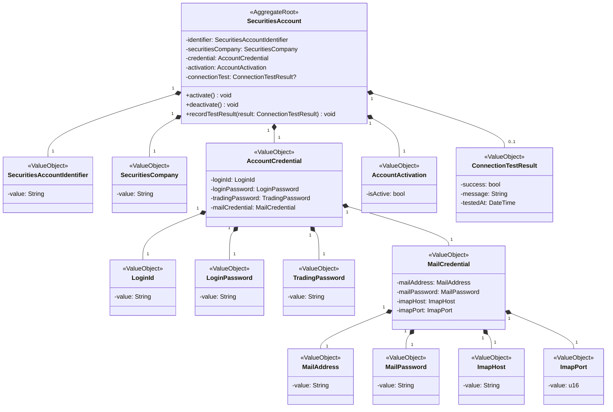
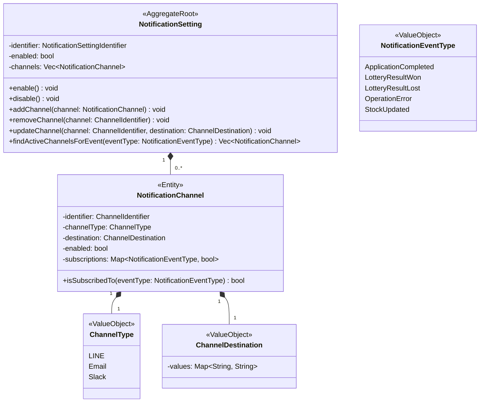
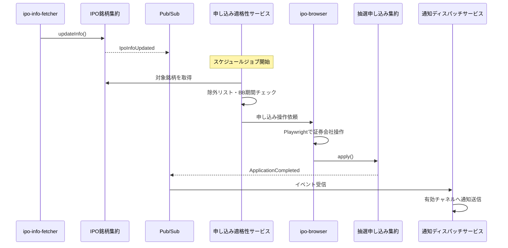

# ドメイン層設計書

## 1. はじめに

### 1.1 目的

本文書は、IPOttoのドメイン層における設計を定義する。ドメイン駆動設計（DDD）の戦略的・戦術的パターンに基づき、境界づけられたコンテキスト、集約、エンティティ、値オブジェクト、ドメインサービス、ドメインイベント、リポジトリインターフェース、および仕様/ポリシーの設計を記述する。

IPO抽選申し込みの自動化という業務ドメインをモデル化し、証券会社のUI変更や将来の証券会社追加に耐えうる、変更に強いドメインモデルを構築することを目指す。

### 1.2 関連文書

**上流文書（入力）:**

- [要件定義書](../01-requirements/requirements-specification.md) — ビジネス要件・機能要件の定義
- [基本設計書](../02-system-design/system-design.md) — システム全体のアーキテクチャ方針

**同層文書（詳細設計）:**

- [詳細設計書](detailed-design.md) — クラス設計・処理フロー等の技術的詳細
- [ユースケース設計書](use-case.md) — ユースケースごとの処理フロー
- [ACL設計書](acl.md) — 腐敗防止層の設計

**下流文書（出力）:**

- [インフラストラクチャ層設計書](infrastructure.md) — インフラストラクチャ層の実装設計

> **注記:** 本文書のID（`DD-xxx`）は詳細設計書群で共通の採番体系を使用する。ドメイン層は DD-001〜DD-099 の範囲を使用する。

## 2. 境界づけられたコンテキスト

### 2.1 コンテキストマップ

### 2.2 コンテキスト定義

| ID | コンテキスト名 | 責務 | 上流下流関係 |
|---|---|---|---|
| DD-001 | IPO銘柄コンテキスト | IPO銘柄情報の取得・管理、銘柄ステータス管理、除外リスト管理 | 抽選申し込みコンテキスト・通知コンテキストの上流 |
| DD-002 | 抽選申し込みコンテキスト | 抽選申し込みの実行・結果管理、申し込みステータス管理 | IPO銘柄コンテキスト・証券口座コンテキストの下流、通知コンテキストの上流 |
| DD-003 | 通知コンテキスト | 通知チャネル管理、イベントに基づく通知送信 | IPO銘柄コンテキスト・抽選申し込みコンテキストの下流 |
| DD-004 | 証券口座コンテキスト | 証券会社の認証情報管理、接続テスト | 抽選申し込みコンテキストの上流 |

## 3. ユビキタス言語

| 用語 | 英語名 | 定義 | コンテキスト | 関連要件 |
|---|---|---|---|---|
| IPO銘柄 | IpoStock | 新規公開株の銘柄情報。企業名、公募価格、スケジュール等を含む | IPO銘柄 | [REQ-001](../01-requirements/requirements-specification.md#req-001) |
| ブックビルディング期間 | BookBuildingPeriod | IPOの需要申告を受け付ける期間。この期間内に抽選申し込みを行う | IPO銘柄 | [REQ-001](../01-requirements/requirements-specification.md#req-001) |
| 仮条件 | PriceRange | IPOの仮条件として提示される価格帯（下限〜上限） | IPO銘柄 | [REQ-001](../01-requirements/requirements-specification.md#req-001) |
| 除外銘柄 | Exclusion | 自動申し込みの対象外とする銘柄。インサイダー規制対応等で使用 | IPO銘柄 | [REQ-005](../01-requirements/requirements-specification.md#req-005) |
| 抽選申し込み | LotteryApplication | 証券会社を通じてIPO株の抽選に申し込むこと | 抽選申し込み | [REQ-002](../01-requirements/requirements-specification.md#req-002) |
| 抽選結果 | LotteryResult | 抽選の結果。当選/落選/補欠当選のいずれか | 抽選申し込み | [REQ-003](../01-requirements/requirements-specification.md#req-003) |
| 証券口座 | SecuritiesAccount | 証券会社の口座情報。ログインID、パスワード、取引暗証番号を含む | 証券口座 | [REQ-007](../01-requirements/requirements-specification.md#req-007) |
| 通知チャネル | NotificationChannel | 通知の送信先（LINE、メール、Slack） | 通知 | [REQ-006](../01-requirements/requirements-specification.md#req-006) |
| 通知イベント | NotificationEvent | 通知を発火させるイベント（申し込み完了、抽選結果、エラー等） | 通知 | [REQ-006](../01-requirements/requirements-specification.md#req-006) |
| 操作ログ | OperationLog | 自動操作の実行履歴（日時、操作内容、結果、エラー詳細） | 横断 | [REQ-008](../01-requirements/requirements-specification.md#req-008) |
| 画像認証 | ImageAuthentication | 楽天証券のログイン時に求められる2段階認証。10個の絵文字画像から指定2つを順番にクリックする方式 | 証券口座 | [REQ-007](../01-requirements/requirements-specification.md#req-007) |
| 画像認証キーワード | ImageAuthenticationKeyword | メールで送信される2つのテキスト。画面上の画像の`alt`属性と照合して認証を突破する | 証券口座 | [REQ-007](../01-requirements/requirements-specification.md#req-007) |
| メール認証情報 | MailCredential | 画像認証キーワードを受信するメールアカウントの認証情報（メールアドレス、パスワード、IMAP接続先） | 証券口座 | [REQ-007](../01-requirements/requirements-specification.md#req-007) |
| セッション永続化 | SessionPersistence | ブラウザセッション（Cookie等）をファイルシステムに保存し、2段階認証の再要求を回避する仕組み | 証券口座 | [REQ-007](../01-requirements/requirements-specification.md#req-007) |

## 4. 集約設計

### 4.1 集約一覧

| ID | 集約名 | 集約ルート | 不変条件 | コンテキスト | 関連要件 |
|---|---|---|---|---|---|
| DD-010 | IPO銘柄集約 | IpoStock | ブックビルディング開始日 ≤ 終了日 ≤ 抽選日 ≤ 上場日。ステータスは定義済み遷移ルールに従うこと | IPO銘柄 | [REQ-001](../01-requirements/requirements-specification.md#req-001) |
| DD-011 | 除外銘柄集約 | Exclusion | 企業名が空でないこと。除外理由が空でないこと | IPO銘柄 | [REQ-005](../01-requirements/requirements-specification.md#req-005) |
| DD-012 | 抽選申し込み集約 | LotteryApplication | 申し込み済みの銘柄に対して重複申し込みしないこと。ステータスは定義済み遷移ルールに従うこと | 抽選申し込み | [REQ-002](../01-requirements/requirements-specification.md#req-002), [REQ-003](../01-requirements/requirements-specification.md#req-003) |
| DD-013 | 証券口座集約 | SecuritiesAccount | 証券会社名が空でないこと。Secret Manager参照キーが設定されていること | 証券口座 | [REQ-007](../01-requirements/requirements-specification.md#req-007) |
| DD-014 | 通知設定集約 | NotificationSetting | 少なくとも1つの有効な通知チャネルが存在すること（通知有効時） | 通知 | [REQ-006](../01-requirements/requirements-specification.md#req-006) |

### 4.2 集約構造図

#### IPO銘柄集約（DD-010）

#### 抽選申し込み集約（DD-012）

#### 除外銘柄集約（DD-011）

#### 証券口座集約（DD-013）

#### 通知設定集約（DD-014）

### 4.3 集約詳細

#### 4.3.1 IPO銘柄集約（DD-010）

##### 不変条件リスト

| No. | 不変条件 | 検証タイミング | 違反時の振る舞い |
|---|---|---|---|
| 1 | BB開始日 ≤ BB終了日 ≤ 抽選日 ≤ 上場日 | 銘柄情報の作成・更新時 | ドメイン例外 `InvalidScheduleError` を送出 |
| 2 | 仮条件の下限 ≤ 上限 | 銘柄情報の作成・更新時 | ドメイン例外 `InvalidPriceRangeError` を送出 |
| 3 | ステータス遷移は定義済みルールに従う | ステータス変更時 | ドメイン例外 `InvalidStatusTransitionError` を送出 |
| 4 | 企業名は空でないこと | 銘柄作成時 | ドメイン例外 `InvalidCompanyNameError` を送出 |

##### トランザクション境界

- IPO銘柄集約の操作は、1つの集約ルート（IpoStock）に対して1トランザクション（Firestoreドキュメント単位）で完結させる
- 抽選申し込みコンテキストとの整合性はドメインイベント（Pub/Sub）による結果整合性で担保する

#### 4.3.2 抽選申し込み集約（DD-012）

##### 不変条件リスト

| No. | 不変条件 | 検証タイミング | 違反時の振る舞い |
|---|---|---|---|
| 1 | 同一銘柄・同一証券口座の組み合わせで重複申し込みしない | 申し込み作成時 | ドメイン例外 `DuplicateApplicationError` を送出 |
| 2 | 申し込み株数は1以上 | 申し込み作成時 | ドメイン例外 `InvalidSharesError` を送出 |
| 3 | ステータス遷移は定義済みルールに従う | ステータス変更時 | ドメイン例外 `InvalidStatusTransitionError` を送出 |
| 4 | 抽選結果の記録は「申し込み済み」ステータスの場合のみ可能 | 結果記録時 | ドメイン例外 `InvalidStatusTransitionError` を送出 |

##### トランザクション境界

- 抽選申し込み集約の操作は、1つの集約ルート（LotteryApplication）に対して1トランザクション（Firestoreドキュメント単位）で完結させる
- IPO銘柄コンテキストの参照はStockIdentifierによる疎結合な参照とし、集約間のトランザクションは分離する

#### 4.3.3 証券口座集約（DD-013）

##### 不変条件リスト

| No. | 不変条件 | 検証タイミング | 違反時の振る舞い |
|---|---|---|---|
| 1 | 証券会社名は空でないこと | 口座作成時 | ドメイン例外 `InvalidSecuritiesCompanyError` を送出 |
| 2 | 機密情報（ログインID、ログインパスワード、取引暗証番号、メール認証情報）が全て設定されていること | 口座作成・更新時 | ドメイン例外 `IncompleteCredentialError` を送出 |
| 3 | メール認証情報のメールアドレスが有効な形式であること | 口座作成・更新時 | ドメイン例外 `InvalidMailAddressError` を送出 |
| 4 | メール認証情報のIMAPポートが1〜65535の範囲であること | 口座作成・更新時 | ドメイン例外 `InvalidImapPortError` を送出 |

##### トランザクション境界

- 証券口座集約の操作は、1つの集約ルート（SecuritiesAccount）に対して1トランザクション（Firestoreドキュメント単位）で完結させる

#### 4.3.4 通知設定集約（DD-014）

##### 不変条件リスト

| No. | 不変条件 | 検証タイミング | 違反時の振る舞い |
|---|---|---|---|
| 1 | 通知が有効な場合、少なくとも1つの有効なチャネルが存在すること | 通知有効化時 | ドメイン例外 `NoActiveChannelError` を送出 |
| 2 | 同一チャネルタイプは1つまで | チャネル追加時 | ドメイン例外 `DuplicateChannelTypeError` を送出 |

##### トランザクション境界

- 通知設定集約は NotificationSetting と配下の NotificationChannel を1トランザクションで操作する
- Firestoreではサブコレクションまたは埋め込みドキュメントとして管理する

## 5. エンティティ

| ID | 名前 | 所属集約 | 識別子型 | ライフサイクル |
|---|---|---|---|---|
| DD-020 | IpoStock | IPO銘柄集約 | StockIdentifier（String） | 情報取得時に作成 → ステータス遷移 → 上場完了または除外で終了 |
| DD-021 | Exclusion | 除外銘柄集約 | ExclusionIdentifier（String） | 投資家が追加 → 削除で終了 |
| DD-022 | LotteryApplication | 抽選申し込み集約 | ApplicationIdentifier（String） | 自動申し込み時に作成 → 結果確認で完了 |
| DD-023 | SecuritiesAccount | 証券口座集約 | SecuritiesAccountIdentifier（String） | 投資家が登録 → 更新 → 削除で終了 |
| DD-024 | NotificationSetting | 通知設定集約 | NotificationSettingIdentifier（String） | システム初期化時に作成。削除なし |
| DD-025 | NotificationChannel | 通知設定集約 | ChannelIdentifier（String） | 投資家が追加 → 更新 → 削除で終了 |

## 6. 値オブジェクト

| ID | 名前 | 所属集約 | 等価性基準 | バリデーションルール |
|---|---|---|---|---|
| DD-030 | StockIdentifier | IPO銘柄 | 文字列値の一致 | 空でないこと |
| DD-031 | CompanyProfile | IPO銘柄 | 全フィールドの一致 | companyNameが空でないこと |
| DD-032 | CompanyName | IPO銘柄 | 文字列値の一致 | 1文字以上200文字以下 |
| DD-033 | TickerSymbol | IPO銘柄 | 文字列値の一致 | 4桁の数字（上場前は未設定可） |
| DD-034 | Market | IPO銘柄 | 文字列値の一致 | 定義済み市場名（プライム/スタンダード/グロース）のいずれか |
| DD-035 | Industry | IPO銘柄 | 文字列値の一致 | 空でないこと |
| DD-036 | IpoSchedule | IPO銘柄 | 全フィールドの一致 | BB開始日 ≤ BB終了日 ≤ 抽選日 ≤ 上場日 |
| DD-037 | BookBuildingPeriod | IPO銘柄 | 開始日と終了日の一致 | 開始日 ≤ 終了日 |
| DD-038 | IpoPricing | IPO銘柄 | 全フィールドの一致 | priceRangeが有効であること |
| DD-039 | PriceRange | IPO銘柄 | 下限と上限の一致 | 下限 > 0、下限 ≤ 上限 |
| DD-040 | Yen | 共通 | 金額値の一致 | 0以上の整数 |
| DD-041 | IpoOffering | IPO銘柄 | 全フィールドの一致 | leadUnderwriterが空でないこと |
| DD-042 | StockStatus | IPO銘柄 | ステータス値の一致 | Fetched / Eligible / Applied / Won / Lost / Alternate / Purchased / Declined / Sold / Excluded / Failed のいずれか |
| DD-043 | MetaSource | IPO銘柄 | 全フィールドの一致 | sourceが有効な列挙値であること |
| DD-044 | FetchOrigin | IPO銘柄 | 列挙値の一致 | ExternalSite / SecuritiesSite のいずれか |
| DD-045 | ApplicationIdentifier | 抽選申し込み | 文字列値の一致 | 空でないこと |
| DD-046 | AppliedOrder | 抽選申し込み | 全フィールドの一致 | sharesが1以上、priceが0以上 |
| DD-047 | Shares | 抽選申し込み | 株数値の一致 | 1以上の整数（100株単位が一般的） |
| DD-048 | LotteryOutcome | 抽選申し込み | 全フィールドの一致 | resultが有効な列挙値であること |
| DD-049 | LotteryResult | 抽選申し込み | 列挙値の一致 | Won / Lost / Alternate のいずれか |
| DD-050 | ApplicationStatus | 抽選申し込み | ステータス値の一致 | Pending / Applied / ResultChecked のいずれか |
| DD-051 | ExclusionIdentifier | 除外銘柄 | 文字列値の一致 | 空でないこと |
| DD-052 | ExclusionReason | 除外銘柄 | 文字列値の一致 | 空でないこと |
| DD-053 | SecuritiesAccountIdentifier | 証券口座 | 文字列値の一致 | 空でないこと |
| DD-054 | SecuritiesCompany | 証券口座 | 文字列値の一致 | 定義済み証券会社名のいずれか。Phase 1 MVP は `Rakuten`、Phase 8 で `Nomura` を追加（[野村證券アダプター詳細設計書](./nomura-broker-adapter.md) DD-201 参照） |
| DD-055 | AccountCredential | 証券口座 | 全フィールドの一致 | loginId、loginPassword、tradingPassword、mailCredentialが全て設定されていること。**注**: Phase 8 で broker 別構造への可変化を検討（[DD-202](./nomura-broker-adapter.md#21-ドメイン層) 参照） |
| DD-056 | LoginId | 証券口座 | 文字列値の一致 | 空でないこと |
| DD-056a | LoginPassword | 証券口座 | 文字列値の一致 | 空でないこと |
| DD-056b | TradingPassword | 証券口座 | 文字列値の一致 | 空でないこと |
| DD-057 | AccountActivation | 証券口座 | isActive値の一致 | booleanであること |
| DD-058 | ConnectionTestResult | 証券口座 | 全フィールドの一致 | testedAtが設定されていること |
| DD-059 | ChannelType | 通知 | 列挙値の一致 | LINE / Email / Slack のいずれか |
| DD-060 | ChannelDestination | 通知 | 設定値マップの一致 | チャネルタイプに応じた必須キーが存在すること（LINE: token、Email: address、Slack: webhookUrl） |
| DD-061 | NotificationEventType | 通知 | 列挙値の一致 | ApplicationCompleted / LotteryResultWon / LotteryResultLost / OperationError / StockUpdated のいずれか |
| DD-062 | MailCredential | 証券口座 | 全フィールドの一致 | mailAddress、mailPassword、imapHost、imapPortが全て設定されていること |
| DD-063 | MailAddress | 証券口座 | 文字列値の一致 | 有効なメールアドレス形式であること |
| DD-064 | MailPassword | 証券口座 | 文字列値の一致 | 空でないこと |
| DD-065 | ImapHost | 証券口座 | 文字列値の一致 | 空でないこと |
| DD-066 | ImapPort | 証券口座 | 数値の一致 | 1〜65535の範囲 |

## 7. ドメインサービス

| ID | 名前 | 責務 | 関連集約 |
|---|---|---|---|
| DD-070 | ApplicationEligibilityService | 銘柄が申し込み対象かどうかを判定する。BB期間内であるか、除外リストに含まれていないか、既に申し込み済みでないかを検証する | IPO銘柄集約、除外銘柄集約、抽選申し込み集約 |
| DD-071 | NotificationDispatchService | 通知イベントに基づき、有効な通知チャネルに通知を送信する。チャネルごとの送信処理は通知ポートに委譲する | 通知設定集約 |

## 8. ドメインイベント

### 8.1 イベント一覧

| ID | イベント名 | 発行元集約 | トリガー条件 | ペイロード | 購読者 |
|---|---|---|---|---|---|
| DD-080 | IpoInfoUpdated | IPO銘柄集約 | 外部サイトからIPO情報が更新されたとき | identifier, companyName, bookBuildingPeriod, lotteryDate, listingDate, updatedAt | 通知コンテキスト |
| DD-081 | ApplicationCompleted | 抽選申し込み集約 | 抽選申し込みが成功したとき | identifier, stock, securitiesAccount, appliedShares, appliedPrice, appliedAt | 通知コンテキスト |
| DD-082 | ApplicationFailed | 抽選申し込み集約 | 抽選申し込みが失敗したとき | identifier, stock, securitiesAccount, errorMessage, failedAt | 通知コンテキスト |
| DD-083 | LotteryResultConfirmed | 抽選申し込み集約 | 抽選結果が確認されたとき | identifier, stock, lotteryResult, confirmedAt | 通知コンテキスト |
| DD-084 | OperationErrorOccurred | 横断 | 自動操作中にエラーが発生したとき | serviceName, operationType, errorMessage, occurredAt | 通知コンテキスト |
| DD-085 | ImageAuthenticationFailed | 抽選申し込み集約 | 画像認証の自動突破に失敗し手動介入が必要なとき | securitiesAccount, failureReason, attemptCount, occurredAt | 通知コンテキスト |

### 8.2 イベントフロー図

## 9. リポジトリインターフェース

### 9.1 リポジトリ一覧

| ID | インターフェース名 | 対象集約 | 主要操作 |
|---|---|---|---|
| DD-090 | IpoStockRepository | IPO銘柄集約 | findById, save, findAll, findByStatus, findInBookBuildingPeriod |
| DD-091 | ExclusionRepository | 除外銘柄集約 | findById, save, delete, findAll, existsByCompanyName |
| DD-092 | LotteryApplicationRepository | 抽選申し込み集約 | findById, save, findByStock, findByStatus, existsByStockAndAccount |
| DD-093 | SecuritiesAccountRepository | 証券口座集約 | findById, save, delete, findAll, findBySecuritiesCompany |
| DD-094 | NotificationSettingRepository | 通知設定集約 | findById, save, findDefault |
| DD-095 | OperationLogRepository | 操作ログ | save, findAll, findByDateRange, findByEventType |

### 9.2 インターフェース定義

```mermaid
classDiagram
    class IpoStockRepository {
        <<trait>>
        +find_by_id(identifier: StockIdentifier) Result~Option~IpoStock~~
        +save(stock: IpoStock) Result~()~
        +find_all() Result~Vec~IpoStock~~
        +find_by_status(status: StockStatus) Result~Vec~IpoStock~~
        +find_in_book_building_period(date: Date) Result~Vec~IpoStock~~
    }

    class ExclusionRepository {
        <<trait>>
        +find_by_id(identifier: ExclusionIdentifier) Result~Option~Exclusion~~
        +save(exclusion: Exclusion) Result~()~
        +delete(identifier: ExclusionIdentifier) Result~()~
        +find_all() Result~Vec~Exclusion~~
        +exists_by_company_name(company_name: CompanyName) Result~bool~
    }

    class LotteryApplicationRepository {
        <<trait>>
        +find_by_id(identifier: ApplicationIdentifier) Result~Option~LotteryApplication~~
        +save(application: LotteryApplication) Result~()~
        +find_by_stock(stock: StockIdentifier) Result~Vec~LotteryApplication~~
        +find_by_status(status: ApplicationStatus) Result~Vec~LotteryApplication~~
        +exists_by_stock_and_account(stock: StockIdentifier, account: SecuritiesAccountIdentifier) Result~bool~
    }

    class SecuritiesAccountRepository {
        <<trait>>
        +find_by_id(identifier: SecuritiesAccountIdentifier) Result~Option~SecuritiesAccount~~
        +save(account: SecuritiesAccount) Result~()~
        +delete(identifier: SecuritiesAccountIdentifier) Result~()~
        +find_all() Result~Vec~SecuritiesAccount~~
        +find_active() Result~Vec~SecuritiesAccount~~
    }

    class NotificationSettingRepository {
        <<trait>>
        +find_by_id(identifier: NotificationSettingIdentifier) Result~Option~NotificationSetting~~
        +save(setting: NotificationSetting) Result~()~
        +find_default() Result~NotificationSetting~
    }
```

> **注記:** リポジトリの実装詳細は [インフラストラクチャ層設計書](infrastructure.md) に記述する。本文書ではドメイン層から見たインターフェース（Rust trait）のみを定義する。

## 10. 仕様/ポリシー

| ID | 仕様名 | 対象 | ビジネスルール |
|---|---|---|---|
| DD-096 | ApplicationEligibilitySpecification | IPO銘柄 | 以下の全条件を満たす場合に申し込み対象と判定する: (1) 現在日時がBB期間内、(2) 除外リストに含まれていない、(3) 同一証券口座で申し込み済みでない |
| DD-097 | ExclusionMatchSpecification | IPO銘柄 × 除外リスト | 銘柄の企業名が除外リストの企業名と一致する場合に除外対象と判定する。部分一致ではなく完全一致とする |
| DD-098 | StatusTransitionPolicy | IPO銘柄、抽選申し込み | ステータス遷移は基本設計書の状態遷移図（[8.1 IPO銘柄ステータス遷移](../02-system-design/system-design.md)）に定義されたルールに従う。未定義の遷移は禁止する |
| DD-099 | RetryPolicy | 抽選申し込み | 自動操作失敗時のリトライポリシー。最大3回、指数バックオフ（初回1秒、最大30秒）。3回失敗後はOperationErrorOccurredイベントを発行して停止する |

## 変更履歴

| バージョン | 日付 | 変更者 | 変更内容 |
|---|---|---|---|
| 1.0.0 | 2026-03-25 | lihs | 初版作成 |
