# インフラストラクチャ層設計書

> **ID体系について**: 本文書では `DD-xxx` 形式のIDを使用する。インフラストラクチャ層は DD-200〜DD-299 の範囲を使用する。

## 1. はじめに

### 1.1 目的

本文書は、ドメイン層で定義されたリポジトリインターフェースおよびポートに対するインフラストラクチャ層の具体的な実装方針を定義する。Firestoreへの永続化、Pub/Subへのイベント発行、Secret Managerによる機密情報管理、通知チャネルアダプターの実装詳細を記述する。

### 1.2 関連文書

| 関係 | 文書 | 参照内容 |
|---|---|---|
| 上流 | [ドメイン層設計書](./domain.md) | リポジトリインターフェース（DD-090〜DD-095）、ドメインモデル定義 |
| 上流 | [ユースケース層設計書](./use-case.md) | トランザクション境界、ポート定義 |
| 同層 | [ACL設計書](./acl.md) | 腐敗防止層の設計（証券会社アダプター） |
| 関連 | [基本設計書](../02-system-design/system-design.md) | システム構成、技術スタック |

## 2. レイヤー構成における位置づけ

### 2.1 ヘキサゴナルアーキテクチャにおける位置

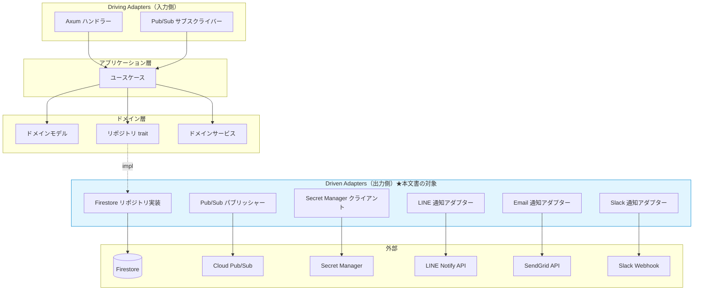

### 2.2 コンポーネント一覧

| ID | 名前 | 種別 | 実装ポート | 概要 |
|---|---|---|---|---|
| DD-200 | FirestoreIpoStockRepository | リポジトリ実装 | IpoStockRepository | IPO銘柄集約のFirestore永続化 |
| DD-201 | FirestoreExclusionRepository | リポジトリ実装 | ExclusionRepository | 除外銘柄集約のFirestore永続化 |
| DD-202 | FirestoreLotteryApplicationRepository | リポジトリ実装 | LotteryApplicationRepository | 抽選申し込み集約のFirestore永続化 |
| DD-203 | FirestoreSecuritiesAccountRepository | リポジトリ実装 | SecuritiesAccountRepository | 証券口座集約のFirestore永続化 + Secret Manager連携 |
| DD-204 | FirestoreNotificationSettingRepository | リポジトリ実装 | NotificationSettingRepository | 通知設定集約のFirestore永続化（サブコレクション含む） |
| DD-205 | FirestoreOperationLogRepository | リポジトリ実装 | OperationLogRepository | 操作ログのFirestore永続化 |
| DD-210 | PubSubEventPublisher | メッセージング | EventPublisherPort | Cloud Pub/Subへのイベント発行 |
| DD-220 | SecretManagerCredentialStore | 機密情報管理 | CredentialStorePort | Secret Managerによる機密情報の保管・取得 |
| DD-230 | LineNotificationAdapter | 通知 | NotificationPort | LINE Notify APIへの通知送信 |
| DD-231 | EmailNotificationAdapter | 通知 | NotificationPort | SendGrid APIへのメール送信 |
| DD-232 | SlackNotificationAdapter | 通知 | NotificationPort | Slack Webhookへの通知送信 |
| DD-240 | ImapMailReader | メール読み取り | MailReaderPort | IMAPプロトコルによるOTPメール取得 |
| DD-241 | GmailApiMailReader | メール読み取り | MailReaderPort | Gmail APIによるOTPメール取得 |
| DD-242 | BrowserSessionStorage | セッション管理 | — | Playwright persistentContextのuserDataDir管理 |

## 3. リポジトリ実装

### 3.1 Firestoreコレクション設計

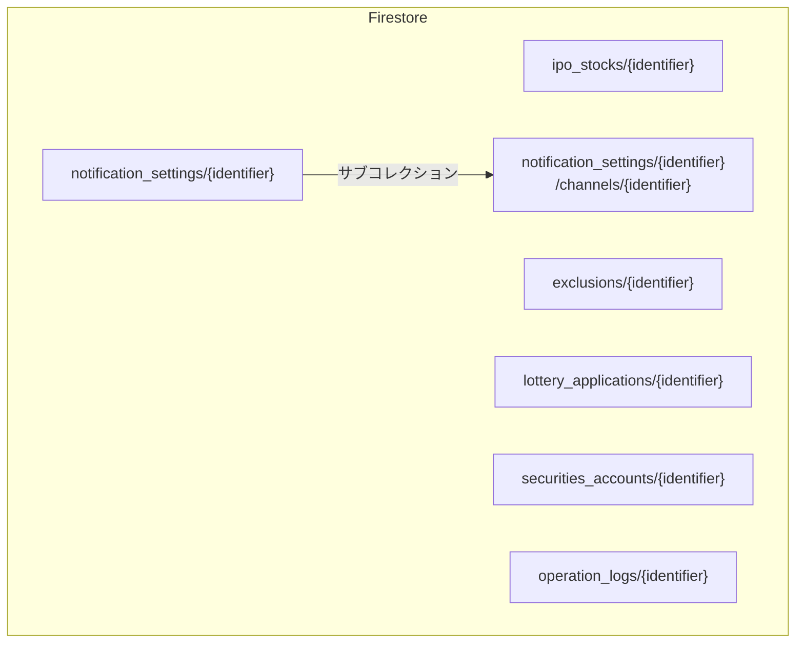

#### コレクション一覧

| コレクション名 | 対応集約 | ドキュメントID生成 | 概要 |
|---|---|---|---|
| `ipo_stocks` | IpoStock | 自動生成（UUID v4） | IPO銘柄情報 |
| `exclusions` | Exclusion | 自動生成（UUID v4） | 除外銘柄 |
| `lottery_applications` | LotteryApplication | 自動生成（UUID v4） | 抽選申し込み |
| `securities_accounts` | SecuritiesAccount | 自動生成（UUID v4） | 証券口座（機密情報はSecret Managerに分離） |
| `notification_settings` | NotificationSetting | 固定値（`default`） | 通知設定（単一ユーザーのため1ドキュメント） |
| `notification_settings/{id}/channels` | NotificationChannel | 自動生成（UUID v4） | 通知チャネル（サブコレクション） |
| `operation_logs` | OperationLog | 自動生成（UUID v4） | 操作ログ |

### 3.2 ドキュメントスキーマ

#### ipo_stocks

```
{
  identifier: string,
  companyProfile: {
    companyName: string,
    tickerSymbol: string | null,
    market: string,
    industry: string
  },
  schedule: {
    bookBuildingPeriod: {
      startDate: timestamp,
      endDate: timestamp
    },
    lotteryDate: timestamp,
    listingDate: timestamp
  },
  pricing: {
    priceRange: {
      minimumPrice: number,
      maximumPrice: number
    },
    offerPrice: number | null
  },
  offering: {
    leadUnderwriter: string,
    numberOfOfferedShares: number
  },
  status: string,
  metaSource: {
    source: string,
    fetchedAt: timestamp
  },
  createdAt: timestamp,
  updatedAt: timestamp
}
```

#### lottery_applications

```
{
  identifier: string,
  stock: string,
  securitiesAccount: string,
  appliedOrder: {
    shares: number,
    price: number,
    orderedAt: timestamp
  },
  lotteryOutcome: {
    result: string,
    confirmedAt: timestamp
  } | null,
  status: string,
  createdAt: timestamp,
  updatedAt: timestamp
}
```

#### exclusions

```
{
  identifier: string,
  companyName: string,
  reason: string,
  registeredAt: timestamp
}
```

#### securities_accounts

```
{
  identifier: string,
  securitiesCompany: string,
  credentialSecretKey: string,       // Secret Managerの参照キー
  activation: {
    isActive: boolean
  },
  connectionTest: {
    success: boolean,
    message: string,
    testedAt: timestamp
  } | null,
  createdAt: timestamp,
  updatedAt: timestamp
}
```

> **注記:** `credentialSecretKey` はインフラ層固有のフィールドであり、ドメイン層の `AccountCredential` には存在しない。リポジトリ実装がドメインモデルと永続化モデルの間を変換する。

#### notification_settings

```
{
  identifier: string,
  enabled: boolean,
  createdAt: timestamp,
  updatedAt: timestamp
}
```

#### notification_settings/{identifier}/channels/{identifier}

```
{
  identifier: string,
  channelType: string,
  destination: map<string, string>,
  enabled: boolean,
  subscriptions: map<string, boolean>,
  createdAt: timestamp,
  updatedAt: timestamp
}
```

#### operation_logs

```
{
  identifier: string,
  application: string | null,
  eventType: string,
  serviceName: string,
  status: string,
  message: string,
  errorMessage: string | null,
  executedAt: timestamp
}
```

### 3.3 Firestoreインデックス設計

| コレクション | フィールド | インデックス種別 | 用途 |
|---|---|---|---|
| `ipo_stocks` | `status`, `updatedAt` | 複合（ASC, DESC） | ステータス別の銘柄一覧取得 |
| `ipo_stocks` | `schedule.bookBuildingPeriod.startDate`, `schedule.bookBuildingPeriod.endDate` | 複合（ASC, ASC） | BB期間中の銘柄取得 |
| `ipo_stocks` | `schedule.listingDate` | 単一（ASC） | 上場日が近い銘柄の取得 |
| `lottery_applications` | `status`, `createdAt` | 複合（ASC, DESC） | ステータス別の申し込み一覧 |
| `lottery_applications` | `stock` | 単一（ASC） | 銘柄別の申し込み検索 |
| `operation_logs` | `executedAt` | 単一（DESC） | 操作ログの時系列取得 |
| `operation_logs` | `eventType`, `executedAt` | 複合（ASC, DESC） | イベント種別でフィルタした操作ログ取得 |

### 3.4 ドメインモデル ⇔ 永続化モデル マッピング

| ドメインモデル | 永続化モデル | マッピング方針 |
|---|---|---|
| IpoStock（集約ルート） | `ipo_stocks` ドキュメント | 値オブジェクトを埋め込みマップに展開 |
| CompanyProfile（値オブジェクト） | `companyProfile` マップ | 複数フィールドに展開 |
| IpoSchedule（値オブジェクト） | `schedule` マップ | ネストしたマップに展開 |
| IpoPricing（値オブジェクト） | `pricing` マップ | ネストしたマップに展開 |
| IpoOffering（値オブジェクト） | `offering` マップ | ネストしたマップに展開 |
| MetaSource（値オブジェクト） | `metaSource` マップ | 複数フィールドに展開 |
| LotteryApplication（集約ルート） | `lottery_applications` ドキュメント | 値オブジェクトを埋め込みマップに展開 |
| AppliedOrder（値オブジェクト） | `appliedOrder` マップ | 複数フィールドに展開 |
| LotteryOutcome（値オブジェクト） | `lotteryOutcome` マップ（nullable） | null許容のマップに展開 |
| SecuritiesAccount（集約ルート） | `securities_accounts` ドキュメント + Secret Manager | 機密情報はSecret Managerに分離 |
| AccountCredential（値オブジェクト） | Secret Managerのシークレット値（JSON） | リポジトリ実装がSecret Managerとの変換を担当 |
| NotificationSetting（集約ルート） | `notification_settings` ドキュメント | チャネルはサブコレクションに分離 |
| NotificationChannel（エンティティ） | `channels` サブコレクション | 1チャネル = 1サブドキュメント |

### 3.5 マッピング方針

#### Data Mapper パターン

ドメインモデルと永続化モデルの間には Data Mapper パターンを採用し、双方の独立性を維持する。

```
// Rust擬似コード

struct IpoStockDocument {
    identifier: String,
    company_profile: CompanyProfileDocument,
    schedule: ScheduleDocument,
    pricing: PricingDocument,
    offering: OfferingDocument,
    status: String,
    meta_source: MetaSourceDocument,
    created_at: Timestamp,
    updated_at: Timestamp,
}

impl IpoStockDocument {
    fn to_domain(&self) -> Result<IpoStock> {
        IpoStock::reconstruct(
            stock_id: StockIdentifier::new(self.identifier.clone()),
            company_profile: CompanyProfile::new(
                company_name: CompanyName::new(self.company_profile.company_name.clone())?,
                ticker_symbol: self.company_profile.ticker_symbol.as_ref()
                    .map(|s| TickerSymbol::new(s.clone())).transpose()?,
                market: Market::new(self.company_profile.market.clone())?,
                industry: Industry::new(self.company_profile.industry.clone())?,
            )?,
            // ... 他のフィールドも同様
        )
    }

    fn from_domain(stock: &IpoStock) -> Self {
        IpoStockDocument {
            identifier: stock.stock_id.value().to_string(),
            company_profile: CompanyProfileDocument {
                company_name: stock.company_profile.company_name.value().to_string(),
                ticker_symbol: stock.company_profile.ticker_symbol
                    .as_ref().map(|s| s.value().to_string()),
                market: stock.company_profile.market.value().to_string(),
                industry: stock.company_profile.industry.value().to_string(),
            },
            // ... 他のフィールドも同様
            updated_at: Timestamp::now(),
        }
    }
}
```

#### 証券口座の機密情報マッピング

```
// Rust擬似コード: SecuritiesAccountRepository の実装

impl SecuritiesAccountRepository for FirestoreSecuritiesAccountRepository {
    fn save(&self, account: &SecuritiesAccount) -> Result<()> {
        // 1. 機密情報をSecret Managerに保存
        let secret_key = format!("account-{}", account.identifier.value());
        let credential_json = serde_json::to_string(&CredentialPayload {
            login_id: account.credential.login_id.value(),
            login_password: account.credential.login_password.value(),
            trading_password: account.credential.trading_password.value(),
        })?;
        self.credential_store.save(&secret_key, &credential_json)?;

        // 2. Firestoreにはメタデータ + Secret Manager参照キーを保存
        let document = SecuritiesAccountDocument {
            identifier: account.identifier.value().to_string(),
            securities_company: account.securities_company.value().to_string(),
            credential_secret_key: secret_key,
            activation: ActivationDocument {
                is_active: account.activation.is_active,
            },
            connection_test: account.connection_test.as_ref().map(|t| {
                ConnectionTestDocument {
                    success: t.success,
                    message: t.message.clone(),
                    tested_at: t.tested_at,
                }
            }),
            // ...
        };
        self.firestore.upsert("securities_accounts", &document)?;

        Ok(())
    }

    fn find_by_id(&self, account_id: &SecuritiesAccountIdentifier) -> Result<Option<SecuritiesAccount>> {
        // 1. Firestoreからメタデータを取得
        let document = self.firestore
            .get("securities_accounts", account_id.value())?;
        let Some(document) = document else { return Ok(None) };

        // 2. Secret Managerから機密情報を取得
        let credential_json = self.credential_store
            .get(&document.credential_secret_key)?;
        let payload: CredentialPayload = serde_json::from_str(&credential_json)?;

        // 3. ドメインモデルに変換
        let credential = AccountCredential::new(
            login_id: LoginId::new(payload.login_id)?,
            login_password: LoginPassword::new(payload.login_password)?,
            trading_password: TradingPassword::new(payload.trading_password)?,
        )?;

        Ok(Some(document.to_domain(credential)?))
    }

    fn delete(&self, account_id: &SecuritiesAccountIdentifier) -> Result<()> {
        // 1. Firestoreからメタデータを取得
        let document = self.firestore
            .get("securities_accounts", account_id.value())?
            .ok_or(AccountNotFoundException)?;

        // 2. Secret Managerから機密情報を削除
        self.credential_store.delete(&document.credential_secret_key)?;

        // 3. Firestoreからドキュメントを削除
        self.firestore.delete("securities_accounts", account_id.value())?;

        Ok(())
    }
}
```

### 3.6 通知設定のサブコレクション管理

```
// Rust擬似コード: NotificationSettingRepository の実装

impl NotificationSettingRepository for FirestoreNotificationSettingRepository {
    fn save(&self, setting: &NotificationSetting) -> Result<()> {
        // 1. 親ドキュメントを保存
        let parent_document = NotificationSettingDocument::from_domain(setting);
        self.firestore.upsert("notification_settings", &parent_document)?;

        // 2. 既存チャネルを全削除
        let parent_path = format!("notification_settings/{}", setting.setting_id.value());
        self.firestore.delete_collection(&format!("{}/channels", parent_path))?;

        // 3. チャネルをサブコレクションとして保存
        for channel in &setting.channels {
            let channel_document = ChannelDocument::from_domain(channel);
            self.firestore.set(
                &format!("{}/channels", parent_path),
                channel.channel_id.value(),
                &channel_document,
            )?;
        }

        Ok(())
    }

    fn find_default(&self) -> Result<NotificationSetting> {
        // 1. 親ドキュメントを取得
        let parent_document = self.firestore
            .get("notification_settings", "default")?
            .ok_or(NotificationSettingNotFoundError)?;

        // 2. サブコレクションからチャネルを取得
        let channel_documents = self.firestore
            .list("notification_settings/default/channels")?;

        // 3. ドメインモデルに変換
        parent_document.to_domain(channel_documents)
    }
}
```

## 4. トランザクション管理

### 4.1 トランザクション方針

| パターン | 説明 | 適用ケース |
|---|---|---|
| ドキュメント単位 | Firestoreの単一ドキュメントへの書き込みはアトミック | 単一集約への操作（ほとんどのユースケース） |
| バッチ書き込み | 最大500ドキュメントをアトミックに書き込み | 通知設定の親ドキュメント + サブコレクション更新 |
| 結果整合性 | Firestoreへの書き込み後にPub/Subへイベント発行 | サービス間の連携 |

### 4.2 Firestore固有の考慮事項

| 項目 | 方針 |
|---|---|
| 楽観的ロック | Firestoreのトランザクション機能を使用。同時更新時はリトライ |
| ドキュメントサイズ制限 | 1ドキュメント最大1MiB。操作ログは個別ドキュメントとして保存 |
| 書き込みレート制限 | 1ドキュメントあたり1回/秒。個人利用では問題なし |
| バッチ上限 | 1バッチ最大500操作。通知チャネル数（3件以下）では問題なし |

## 5. メッセージキュー / イベントバス

### 5.1 Pub/Subトピック・サブスクリプション一覧

| ID | トピック名 | プロデューサー | サブスクリプション | コンシューマー | リトライ方針 |
|---|---|---|---|---|---|
| DD-210 | `ipo-job-trigger` | Cloud Scheduler | `ipo-info-fetch-sub` | ipo-info-fetcher | 最大3回、指数バックオフ |
| DD-210 | `ipo-job-trigger` | Cloud Scheduler | `ipo-apply-sub` | ipo-browser | 最大3回、指数バックオフ |
| DD-210 | `ipo-job-trigger` | Cloud Scheduler | `ipo-result-check-sub` | ipo-result-checker | 最大3回、指数バックオフ |
| DD-211 | `ipo-info-updated` | ipo-info-fetcher | `ipo-info-updated-notify-sub` | ipo-api（通知処理） | 最大3回、指数バックオフ |
| DD-212 | `ipo-result-updated` | ipo-result-checker | `ipo-result-updated-notify-sub` | ipo-api（通知処理） | 最大3回、指数バックオフ |
| DD-213 | `ipo-notification` | ipo-browser | `ipo-notification-sub` | ipo-api（通知処理） | 最大5回、指数バックオフ |

### 5.2 メッセージ形式

```
// Pub/Subメッセージの共通エンベロープ

{
  "messageId": "uuid-v4",
  "eventType": "ipo.stock.updated",
  "aggregateId": "stock-123",
  "aggregateType": "IpoStock",
  "payload": {
    // イベント固有のデータ
  },
  "metadata": {
    "timestamp": "2026-03-25T10:00:00Z",
    "version": 1,
    "correlationId": "uuid-v4",
    "serviceName": "ipo-info-fetcher"
  }
}
```

### 5.3 デッドレターキュー設定

| 設定項目 | 値 | 説明 |
|---|---|---|
| デッドレタートピック名 | `ipo-dead-letter` | リトライ上限超過メッセージの退避先 |
| メッセージ保持期間 | 7日 | デッドレターキュー内のメッセージ保持期間 |
| アラート閾値 | 1件 | デッドレターキューにメッセージが到達した時点でアラート |
| 再処理手順 | 手動でメッセージ内容を確認し、原因を特定後に再発行 | Cloud Consoleからメッセージを確認 |

### 5.4 メッセージングフロー

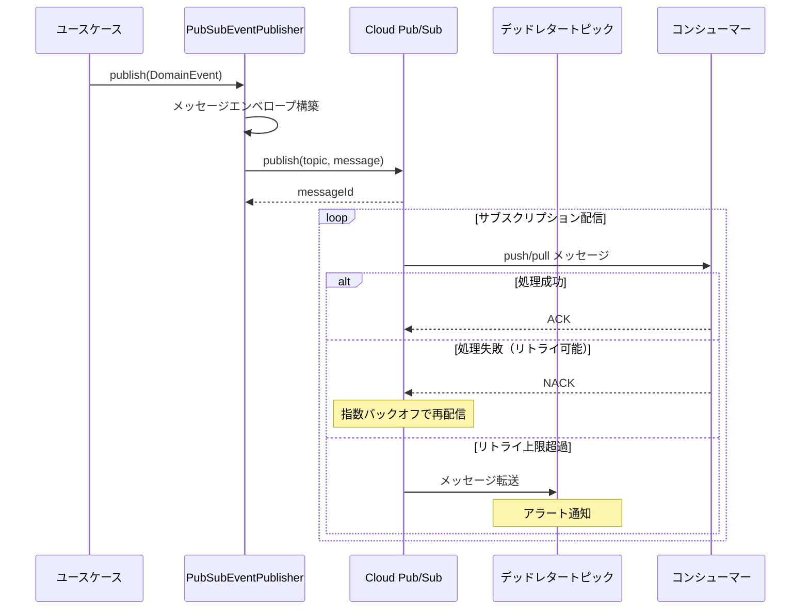

## 6. 機密情報管理（Secret Manager）

### 6.1 CredentialStorePort インターフェース

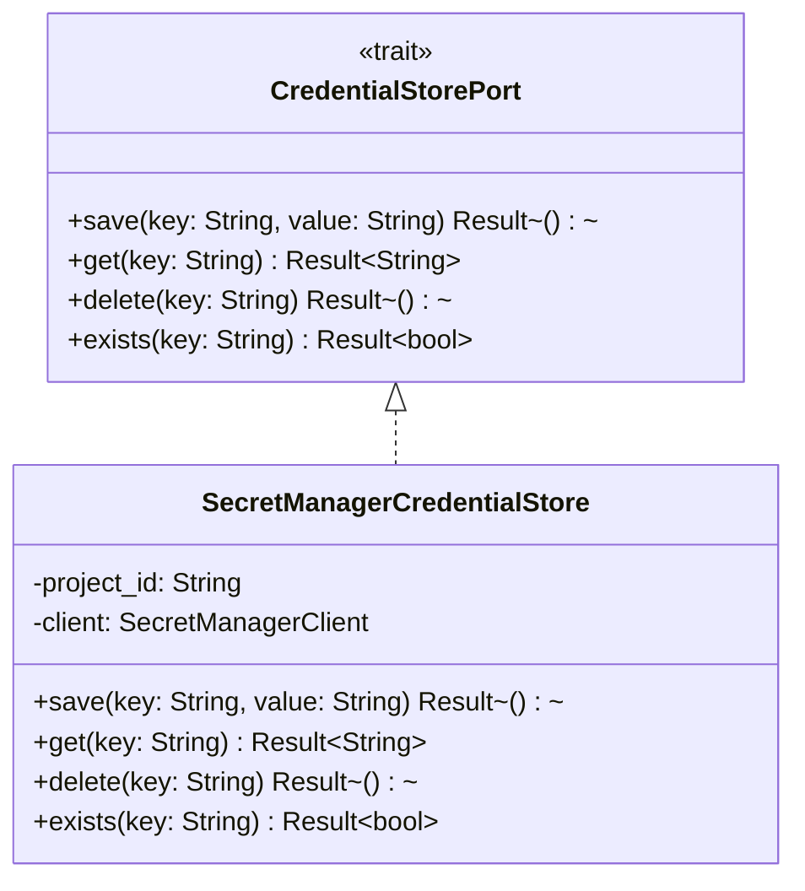

### 6.2 シークレット命名規則

| シークレット名 | 用途 | 値の形式 |
|---|---|---|
| `ipo-account-{account}` | 証券口座の機密情報 | JSON: `{"loginId":"...", "loginPassword":"...", "tradingPassword":"...", "mailCredential":{"mailAddress":"...", "mailPassword":"...", "imapHost":"...", "imapPort":993}}` |
| `ipo-line-token` | LINE Notify トークン | 平文トークン文字列 |
| `ipo-sendgrid-api-key` | SendGrid APIキー | 平文APIキー文字列 |
| `ipo-slack-webhook-url` | Slack Webhook URL | 平文URL文字列 |

### 6.3 セキュリティ方針

| 項目 | 方針 |
|---|---|
| アクセス制御 | Cloud Run サービスアカウントにのみ `secretmanager.versions.access` 権限を付与 |
| バージョニング | シークレット更新時は新バージョンを作成。古いバージョンは自動無効化 |
| 監査ログ | Cloud Audit Logsでシークレットへの全アクセスを記録 |
| ローテーション | 手動ローテーション。ユーザーが証券口座の認証情報を更新した際に新バージョンを作成 |

## 7. 通知アダプター

### 7.1 NotificationPort インターフェース

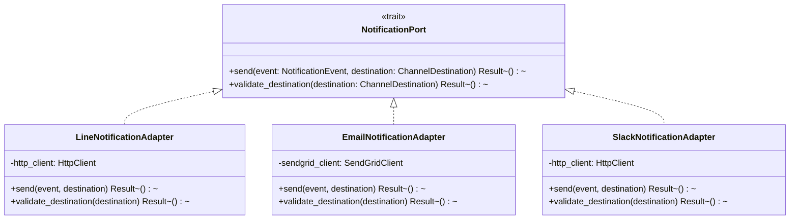

### 7.2 通知アダプター設定

| ID | アダプター | エンドポイント | 認証方式 | メッセージ形式 |
|---|---|---|---|---|
| DD-230 | LineNotificationAdapter | `https://notify-api.line.me/api/notify` | Bearer Token | `message` パラメータ（テキスト） |
| DD-231 | EmailNotificationAdapter | SendGrid API v3 | API Key | JSON（to, subject, content） |
| DD-232 | SlackNotificationAdapter | Slack Webhook URL | URL内トークン | JSON（text, blocks） |

### 7.3 通知ディスパッチフロー

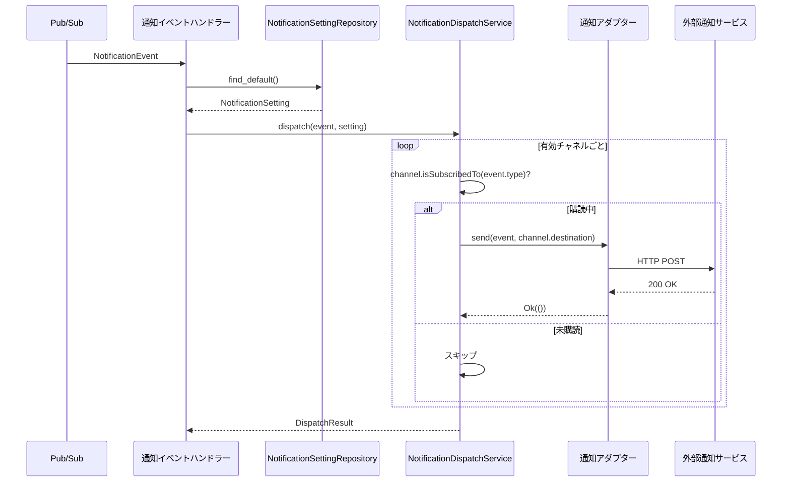

## 8. 外部サービスクライアント基盤

### 8.1 HTTPクライアント共通設定

| 設定項目 | デフォルト値 | 説明 |
|---|---|---|
| 接続タイムアウト | 10,000ms | TCP接続確立までの最大待機時間 |
| 読み取りタイムアウト | 30,000ms | レスポンス受信までの最大待機時間 |
| 最大同時接続数 | 10 | ホストあたりの最大同時接続数 |
| キープアライブ | true | HTTP Keep-Alive の有効化 |

### 8.2 リトライ方針

| 設定項目 | 値 | 説明 |
|---|---|---|
| 最大リトライ回数 | 3 | リトライの最大回数 |
| リトライ間隔 | 指数バックオフ | リトライ間隔の算出方法 |
| 初回リトライ間隔 | 1,000ms | 初回リトライまでの待機時間 |
| 最大リトライ間隔 | 30,000ms | リトライ間隔の上限値 |
| ジッター | あり（10%） | リトライ間隔にランダムなゆらぎを追加 |
| リトライ対象ステータス | 408, 429, 500, 502, 503, 504 | リトライ対象のHTTPステータスコード |

### 8.3 ブラウザ操作固有設定

| 設定項目 | 値 | 説明 |
|---|---|---|
| ページ遷移タイムアウト | 60,000ms | 1ページの遷移完了までの最大待機時間 |
| 1銘柄あたり全体タイムアウト | 180,000ms | 1銘柄の申し込み操作全体のタイムアウト |
| 操作間待機時間 | 1,000〜3,000ms（ランダム） | 人間に近い操作速度を再現するための待機 |
| スクリーンショット | エラー発生時に自動取得 | デバッグ用のスクリーンショット |

### 8.4 外部サービスクライアント一覧

| ID | 外部サービス名 | 用途 | ベースURL | 認証方式 | タイムアウト |
|---|---|---|---|---|---|
| DD-240 | IPO情報サイト | IPO銘柄情報スクレイピング | （設計時に決定） | なし | 30,000ms |
| DD-241 | LINE Notify | LINE通知送信 | `https://notify-api.line.me` | Bearer Token | 10,000ms |
| DD-242 | SendGrid | メール通知送信 | `https://api.sendgrid.com` | API Key | 10,000ms |
| DD-243 | Slack Webhook | Slack通知送信 | （設定URL） | URL内トークン | 10,000ms |
| DD-244 | ipo-browser | ブラウザ自動操作サービス | Cloud Run内部URL | IAM認証 | 180,000ms |

## 9. スクレイピングアダプター

### 9.1 IpoStockScraperPort インターフェース

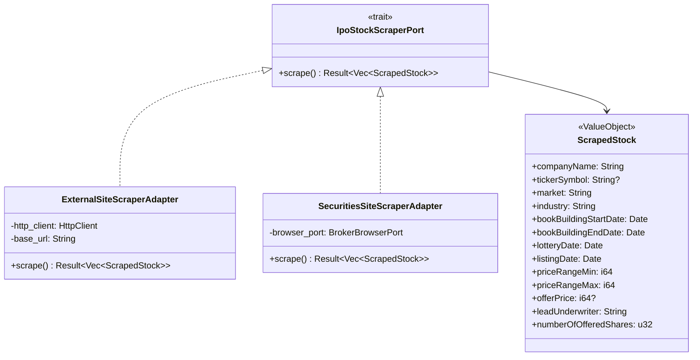

### 9.2 フォールバック戦略

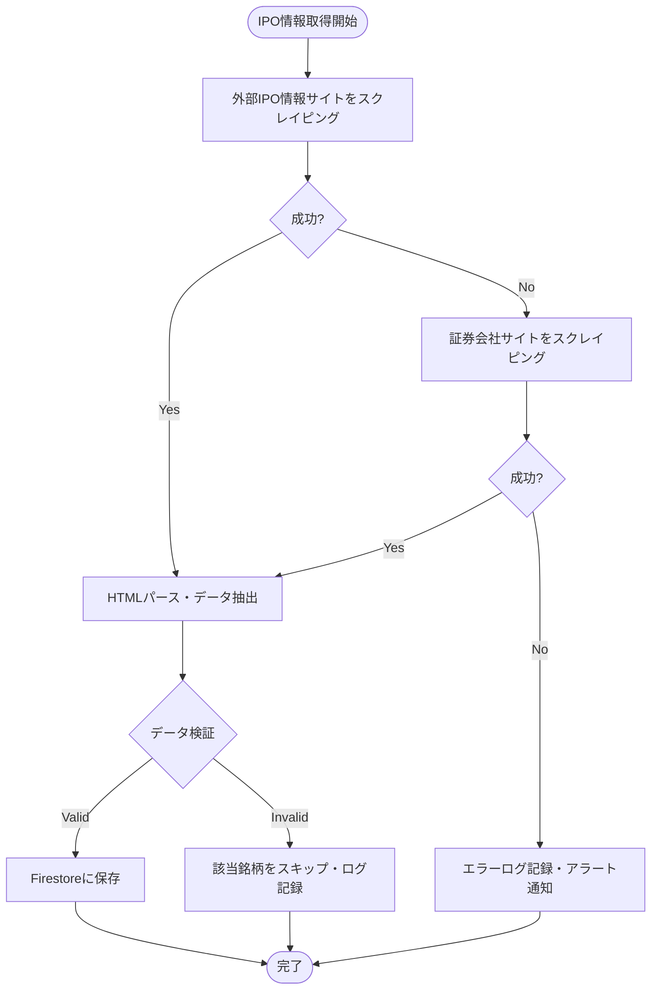

## 10. メール取得アダプター

### 10.1 MailReaderPort 実装

画像認証のOTPキーワードをメールから取得するアダプター。アダプターパターンにより IMAP / Gmail API を差し替え可能にする。

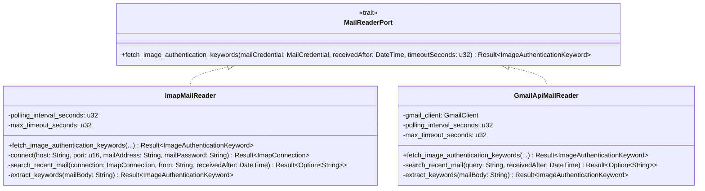

### 10.2 メール取得設定

| 設定項目 | 値 | 説明 |
|---|---|---|
| ポーリング間隔 | 3秒 | メールボックスの確認間隔 |
| タイムアウト | 120秒 | 2FA有効期限（2分）に合わせる |
| 検索条件（送信元） | 楽天証券のドメイン | 認証メールの送信元アドレスでフィルタ |
| 検索条件（時刻） | `receivedAfter` 以降 | ログイン試行直前のタイムスタンプ |

### 10.3 メール取得フロー

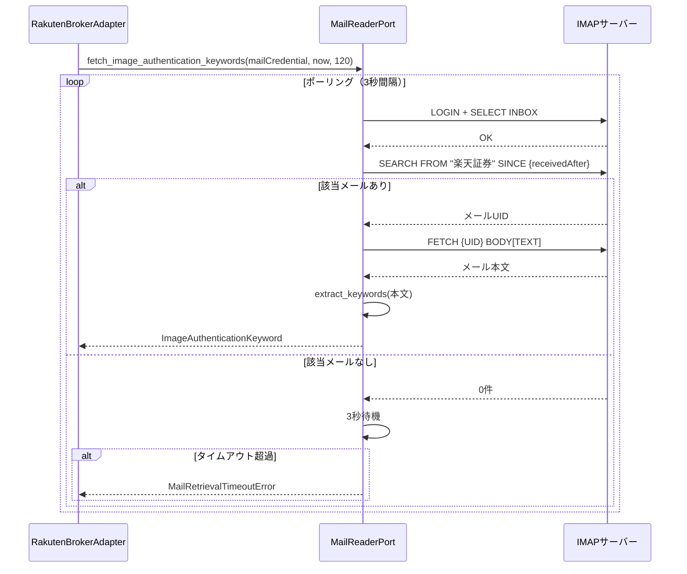

## 11. セッション永続化管理

### 11.1 BrowserSessionStorage

Playwright の `launchPersistentContext` で使用する `userDataDir` を管理する。

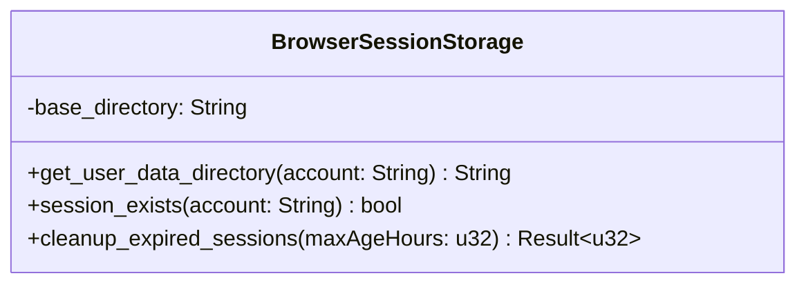

### 11.2 管理方針

| 項目 | 方針 |
|---|---|
| 保存先 | Cloud Run インスタンスのローカルファイルシステム（`/tmp/browser-sessions/{account}/`） |
| 永続化内容 | Cookie、LocalStorage、SessionStorage（Playwright persistentContext が自動管理） |
| 有効期間 | 楽天証券のセッション有効期間に依存（通常30分〜数時間） |
| クリーンアップ | 24時間経過したセッションディレクトリを自動削除 |
| Cloud Runの制約 | Cloud Runはステートレスのため、インスタンス再起動でセッションは消失する。これは第2防御線（メールOTP自動突破）でカバーされるため許容する |
| 同時アクセス | 同一accountの `userDataDir` は同時に1つのブラウザインスタンスのみが使用可能 |

### 11.3 セッション永続化フロー

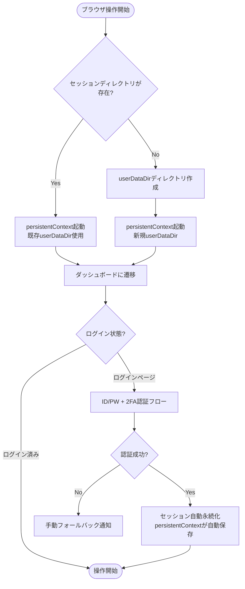

## 変更履歴

| バージョン | 日付 | 変更者 | 変更内容 |
|---|---|---|---|
| 1.0.0 | 2026-03-25 | lihs | 初版作成 |
