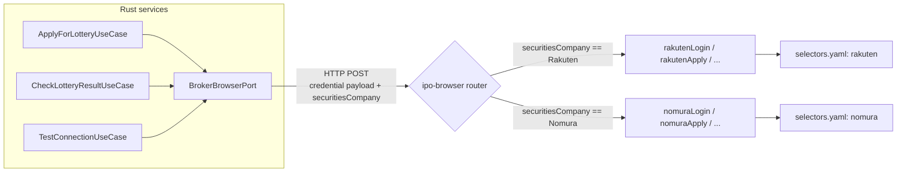

# 野村證券アダプター詳細設計書

## 1. はじめに

### 1.1 目的

本書は野村證券アダプターの詳細設計を定義する。Phase 1 MVP は楽天證券のみだが、Adapter パターンを拡張する形で野村證券への対応を追加する。設計上の判断材料となる野村サイトの実情報は [`docs/user-actions/nomura-broker-information-request.md`](../user-actions/nomura-broker-information-request.md) の回答内容で確定する（現状は **暫定設計** ）。

> **注記:** 本書のID（`DD-2xx`）は新規採番。既存 DD-001〜199 の domain / use-case / acl / infrastructure に対する追補として位置づける。

### 1.2 関連文書

**上流文書:**

- [野村證券対応 要件定義書](../01-requirements/nomura-broker-support.md) — REQ-100〜104, REQ-NF-100〜106
- [要件定義書](../01-requirements/requirements-specification.md) — Phase 1 全体要件

**同層文書:**

- [ドメイン層設計書](./domain.md) — 既存 SecuritiesCompany 値オブジェクト（DD-054）
- [ユースケース層設計書](./use-case.md) — ApplyForLotteryUseCase（DD-101）等
- [ACL 設計書](./acl.md) — BrokerBrowserPort

**下流文書:**

- [野村證券認証 セキュリティ設計](../09-security-design/nomura-authentication.md)
- [野村證券統合 Runbook](../10-operations-design/nomura-integration-runbook.md)

### 1.3 確定情報・暫定情報の区別

本書では情報の出所により以下のマーカーを併用する:

- **【確定】**: コード上の既存実装または楽天との対比で定まっている設計
- **【暫定】**: ユーザー回答待ちで仮置き。回答後に再評価が必要

## 2. 楽天証券前提が固定されている既存箇所の棚卸

### 2.1 ドメイン層

| ID | 箇所 | 現状 | 野村追加で必要な変更 |
|---|---|---|---|
| DD-201 | `services/ipo-backend-shared/src/domain/account/securities_company.rs:7-28` | enum variant が `Rakuten` のみ | `Nomura` variant 追加。文字列マッピングは "Nomura" / "野村證券" |
| DD-202 | `services/ipo-backend-shared/src/domain/account/account_credential.rs:11-38` | login_id / login_password / trading_password / mail_credential 全必須 | broker ごとに credential 構造が違う場合は **可変化** が必要（後述 § 4.2） |
| DD-203 | `services/ipo-frontend-shared/src/domain/enums.ts:73` | `z.enum(["Rakuten"])` | `z.enum(["Rakuten", "Nomura"])` に拡張 |

### 2.2 ACL / Adapter 層

| ID | 箇所 | 現状 | 野村追加で必要な変更 |
|---|---|---|---|
| DD-210 | `services/ipo-backend-shared/src/acl/browser/broker_browser_port.rs:14-50` | broker 非依存の trait | 変更不要 |
| DD-211 | `services/ipo-backend-shared/src/acl/browser/application_result.rs:25-30` | 楽天専用日本語キーワード（"受け付けました" 等） | broker 別の翻訳ロジック（後述 § 4.4） |
| DD-212 | `services/ipo-api/src/infrastructure/browser_service_client.rs:94-130` | `BrowserCredentialRequest` が楽天前提（mail_address/IMAP 必須） | broker 別の credential payload 設計（後述 § 4.3） |

### 2.3 ipo-browser 層

| ID | 箇所 | 現状 | 野村追加で必要な変更 |
|---|---|---|---|
| DD-220 | `services/ipo-browser/src/routes/accounts.ts:51-100` | `rakutenLogin()` 直呼び | broker 別 dispatch を追加 |
| DD-221 | `services/ipo-browser/src/flows/login.ts` | `rakutenLogin` のみ | `nomuraLogin` を新設 |
| DD-222 | `services/ipo-browser/src/flows/image-auth/flow.ts` | 楽天画像認証専用 | 野村が異なる 2FA の場合は新規 flow（後述 § 5.2） |
| DD-223 | `services/ipo-browser/src/config/selectors.yaml` | `rakuten:` namespace のみ | `nomura:` namespace 追加（後述 § 5.3） |
| DD-224 | `services/ipo-browser/src/flows/apply.ts` / `check-result.ts` | 楽天サイト前提 | broker 別フロー |
| DD-225 | `services/ipo-browser/src/flows/lottery-result-translator.ts` | 楽天語彙（"当選"/"落選"/"補欠"） | broker 別の翻訳テーブル |

## 3. 全体アーキテクチャ方針

### 3.1 broker dispatch の配置

`SecuritiesCompany` enum に基づき、`ipo-browser` 内のルーティング層で broker 別の flow を呼び分ける。Rust 側（ipo-api / ipo-applier / ipo-result-checker）は `BrokerBrowserPort` 越しに HTTP 呼び出しするのみで、broker を意識しない設計を維持する。



### 3.2 dispatch 実装の選択

3 案を比較:

| 案 | 説明 | 採用判定 |
|---|---|---|
| **A. ルートで if/switch** | `routes/accounts.ts` 等で `if (securitiesCompany === "Nomura") nomuraLogin(...) else rakutenLogin(...)` | **採用**。シンプルで型推論も効く。証券会社が 5 社を超えるまではこれで十分 |
| B. Strategy パターン | `BrokerStrategy` interface を定義し、`{ Rakuten: rakutenStrategy, Nomura: nomuraStrategy }` の map | broker 数が増えてから検討 |
| C. 別サービス分割 | `ipo-browser-rakuten` / `ipo-browser-nomura` を別コンテナに | デプロイ複雑化のため不採用 |

## 4. ドメイン / バックエンド層の変更

### 4.1 SecuritiesCompany の拡張 【確定】

```rust
// services/ipo-backend-shared/src/domain/account/securities_company.rs
pub enum SecuritiesCompany {
    Rakuten,
    Nomura,  // 追加
}

impl SecuritiesCompany {
    pub fn new(value: impl AsRef<str>) -> Result<Self, DomainError> {
        match value.as_ref() {
            "Rakuten" | "楽天証券" => Ok(Self::Rakuten),
            "Nomura" | "野村證券" => Ok(Self::Nomura),  // 追加
            other => Err(DomainError::InvalidSecuritiesCompany { /* ... */ }),
        }
    }

    pub fn as_str(&self) -> &'static str {
        match self {
            Self::Rakuten => "Rakuten",
            Self::Nomura => "Nomura",
        }
    }
}
```

副次変更: `services/ipo-frontend-shared/src/domain/enums.ts` の `securitiesCompanySchema` も同期。

### 4.2 AccountCredential の構造判断 【暫定】

野村証券の credential 必要要素は [Q-N-072](../user-actions/nomura-broker-information-request.md#q-n-072), [Q-N-073](../user-actions/nomura-broker-information-request.md#q-n-073) の回答待ち。回答内容に応じて以下のいずれかを採用:

#### Option-1: 楽天と同構造で対応可能な場合（取引暗証番号 + メール認証情報必須）

`AccountCredential` 構造は変更不要。野村ログインフロー側で同じ struct を消費する。

#### Option-2: 野村は trading_password / mail_credential 不要（or 別形式）

`AccountCredential` を broker 別 enum に再設計:

```rust
pub enum AccountCredential {
    Rakuten(RakutenCredential),
    Nomura(NomuraCredential),
}

pub struct RakutenCredential {
    login_id: LoginId,
    login_password: LoginPassword,
    trading_password: TradingPassword,
    mail_credential: MailCredential,  // 画像認証 OTP 取得用
}

pub struct NomuraCredential {
    login_id: LoginId,
    login_password: LoginPassword,
    // trading_password: 必要なら追加
    // sms_phone_number: SMS OTP の場合
    // totp_secret: アプリ認証コードの場合
}
```

この変更は `account_credential.rs` 周辺の **15 ファイル程度** に波及する大改造であり、後続スプリントで段階的に進める。

#### 暫定推奨

回答を待たずに準備を進めるため、まずは Option-1（既存構造の流用）を仮定して全体を組み、必要なフィールドが欠ける場合は Option-2 へ後続 PR で移行する。

### 4.3 BrowserServiceClient の payload 拡張

`services/ipo-api/src/infrastructure/browser_service_client.rs:94-130` の `BrowserCredentialRequest` に `securitiesCompany` フィールドを追加し、ipo-browser 側のルーティングで broker 判定する。

```rust
struct BrowserCredentialRequest {
    securities_company: String,  // "Rakuten" | "Nomura"
    login_id: String,
    login_password: String,
    // 以下、broker 別に Optional
    trading_password: Option<String>,
    mail_address: Option<String>,
    mail_password: Option<String>,
    imap_host: Option<String>,
    imap_port: Option<u16>,
    // 野村が別認証要素なら追加 (回答後)
}
```

### 4.4 ApplicationResult / 結果翻訳の i18n 化

`services/ipo-backend-shared/src/acl/browser/application_result.rs:25-30` の `translate_application_result()` で broker 別翻訳テーブルを引き当てる。

```rust
fn translate_application_result(text: &str, broker: SecuritiesCompany) -> ApplicationResult {
    match broker {
        SecuritiesCompany::Rakuten => translate_rakuten(text),
        SecuritiesCompany::Nomura => translate_nomura(text),  // 新設
    }
}
```

野村語彙は [Q-N-043](../user-actions/nomura-broker-information-request.md#q-n-043) で確定。

`services/ipo-browser/src/flows/lottery-result-translator.ts` も同様に broker 別関数に分割。

## 5. ipo-browser 層の変更

### 5.1 ディレクトリ構造の方針

楽天専用コードを `services/ipo-browser/src/flows/` 直下に置いていた構造から、broker 別サブディレクトリに整理する。

```
services/ipo-browser/src/flows/
├── rakuten/                # 既存ファイル群を移設
│   ├── login.ts            # 旧 flows/login.ts の楽天部分
│   ├── apply.ts            # 旧 flows/apply.ts
│   ├── check-result.ts     # 旧 flows/check-result.ts
│   ├── image-auth/         # 旧 flows/image-auth/
│   ├── apply-result-translator.ts
│   └── lottery-result-translator.ts
├── nomura/                 # 新規
│   ├── login.ts
│   ├── apply.ts
│   ├── check-result.ts
│   ├── auth/               # 2FA 方式に応じて命名（image-auth / sms-auth / totp 等）
│   ├── apply-result-translator.ts
│   └── lottery-result-translator.ts
└── shared/                 # broker 横断ユーティリティ
    └── browser-manager.ts  # 既存
```

### 5.2 認証フローの設計 【暫定】

`docs/09-security-design/nomura-authentication.md` § 2 で詳述。回答 [Q-N-020](../user-actions/nomura-broker-information-request.md#q-n-020) で 2FA 方式が判明次第、以下のいずれかのテンプレを採用:

| 2FA 方式 | 実装方針 | 既存資産流用 |
|---|---|---|
| メール OTP | `services/ipo-browser/src/mail/keyword-extractor.ts` を流用、ロジックは数値抽出 | 高 |
| SMS OTP | SMS gateway（Twilio 等）または手動入力 UI | 低 |
| アプリ認証コード（TOTP） | `otplib` 等で TOTP secret から生成 | 中 |
| 画像認証 | `services/ipo-browser/src/flows/image-auth/` を流用 | 高 |
| 質問応答 | 質問文 → 回答 map を credential に追加 | 低 |

### 5.3 selectors.yaml への nomura: namespace 追加

`services/ipo-browser/src/config/selectors.yaml` に既存 `rakuten:` と並列で追加。命名は楽天と同じキー名を維持し、broker 別に値を持つ:

```yaml
rakuten:
  login: { /* 既存 */ }
  imageAuthentication: { /* 既存 */ }
  applyList: { /* 既存 */ }
  applyForm: { /* 既存 */ }
  applyResult: { /* 既存 */ }
  lotteryResult: { /* 既存 */ }

nomura:  # 新規
  login:
    pageUrl: "https://hometrade.nomura.co.jp/..."  # 暫定（Q-N-010 で確定）
    loginIdInput: "..."
    passwordInput: "..."
    submitButton: "..."
    successMatch: "..."
  twoFactor: { /* Q-N-020 で確定 */ }
  applyList: { /* Q-N-030, Q-N-032 で確定 */ }
  applyForm: { /* Q-N-041 で確定 */ }
  applyResult: { /* Q-N-043 で確定 */ }
  lotteryResult: { /* Q-N-051 で確定 */ }
```

### 5.4 ルーティング層の dispatch

`services/ipo-browser/src/routes/accounts.ts:51-100` の `/internal/accounts/test`、`routes/lottery-applications.ts` の `/internal/lottery-applications/submit`、`routes/lottery-results.ts` の `/internal/lottery-results/check` の各エンドポイントで:

```typescript
// 例: routes/accounts.ts
import { rakutenLogin } from "../flows/rakuten/login";
import { nomuraLogin } from "../flows/nomura/login";

router.post("/internal/accounts/test", async (req, res) => {
  const { securitiesCompany, ...credential } = req.body;
  const result = securitiesCompany === "Nomura"
    ? await nomuraLogin(credential)
    : await rakutenLogin(credential);
  res.json(result);
});
```

## 6. テスト方針

### 6.1 単体テスト

- 既存楽天テストを `tests/rakuten/` 配下に移動
- `tests/nomura/` 配下に同等構成のテストを追加
- broker dispatch の単体テスト（routes 層）は両 broker をパラメータ化

### 6.2 HTML mock

- `html-mock-server` に `nomura/` 配下のフィクスチャを追加（[Q-N-011, 021, 032, 041, 051](../user-actions/nomura-broker-information-request.md) の HTML を参考に）
- E2E spec で楽天 / 野村両方のフローを検証

### 6.3 E2E（CI 自動）

`services/ipo-browser/e2e/` 配下に `nomura-*.spec.ts` を追加し、HTML mock 経由で:

- ログイン成功 / 失敗
- 2FA 突破
- IPO 申込（成功 / 重複 / 残高不足 / 失敗）
- 抽選結果確認

### 6.4 E2E（手動・実サイト）

リリース前にユーザーが実野村口座で接続テストを実行。`docs/10-operations-design/nomura-integration-runbook.md` § 3 を参照。

## 7. マイグレーション方針

### 7.1 既存データへの影響

- 既存 Firestore `securities_accounts` ドキュメントは `securitiesCompany: "Rakuten"` のまま稼働
- 新規野村口座は `securitiesCompany: "Nomura"` で書き込まれる
- マイグレーション不要

### 7.2 段階的リリース

- Sprint 16: ドメイン層拡張 + ipo-browser dispatch（楽天動作維持）
- Sprint 17: 野村フロー実装 + HTML mock + E2E
- Sprint 18: 実サイト接続テスト + UI 拡張 + 本番デプロイ

詳細は [Phase 8 ロードマップ](../11-implementation-roadmap/README.md#phase-8) を参照。

## 8. 未解決の論点

| ID | 論点 | 解決方法 |
|---|---|---|
| OPEN-N-001 | 野村サイトの 2FA 方式が確定していない | [Q-N-020](../user-actions/nomura-broker-information-request.md#q-n-020) 回答待ち |
| OPEN-N-002 | `AccountCredential` を broker 別 enum 化するか維持するか | [Q-N-072](../user-actions/nomura-broker-information-request.md#q-n-072), [Q-N-073](../user-actions/nomura-broker-information-request.md#q-n-073) 回答後に判断 |
| OPEN-N-003 | 野村の bot 検知レベル | [Q-N-060, Q-N-061](../user-actions/nomura-broker-information-request.md#q-n-060) 回答後にレート制限ロジック確定 |
| OPEN-N-004 | 利用規約上の制約 | [Q-N-003](../user-actions/nomura-broker-information-request.md#q-n-003) 回答待ち |

## 9. 更新履歴

| 日付 | 内容 |
|---|---|
| 2026-04-24 | 初版作成（draft）。情報収集依頼書回答後に詳細を確定 |
