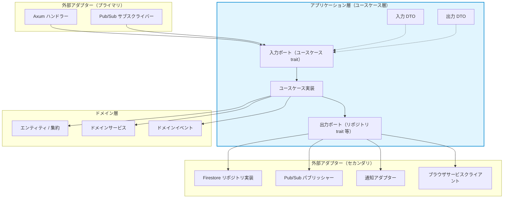
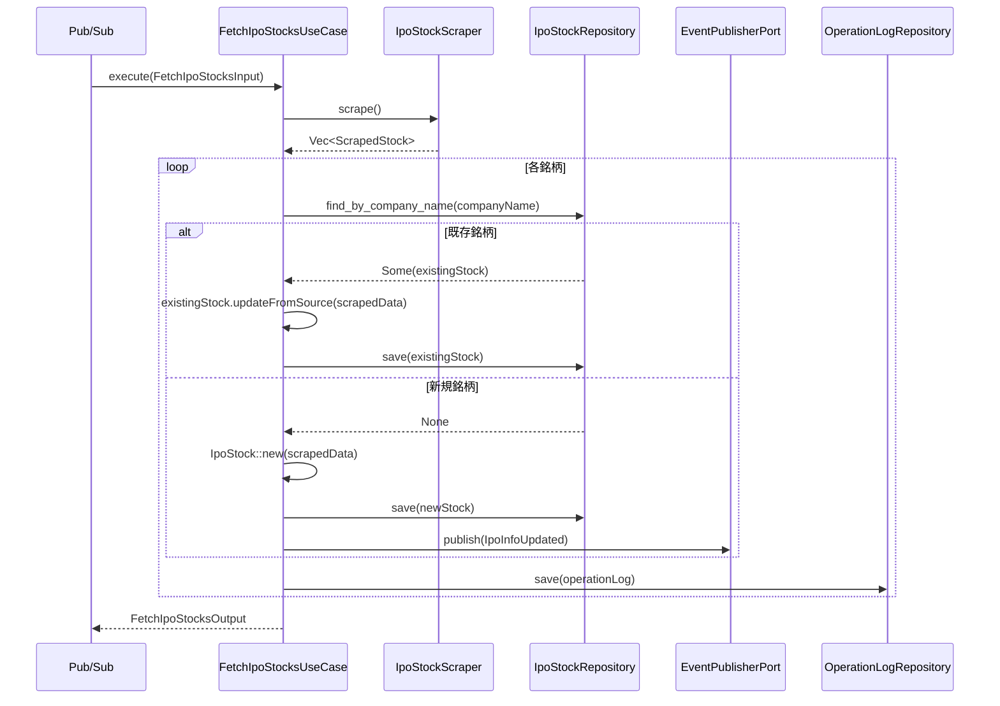
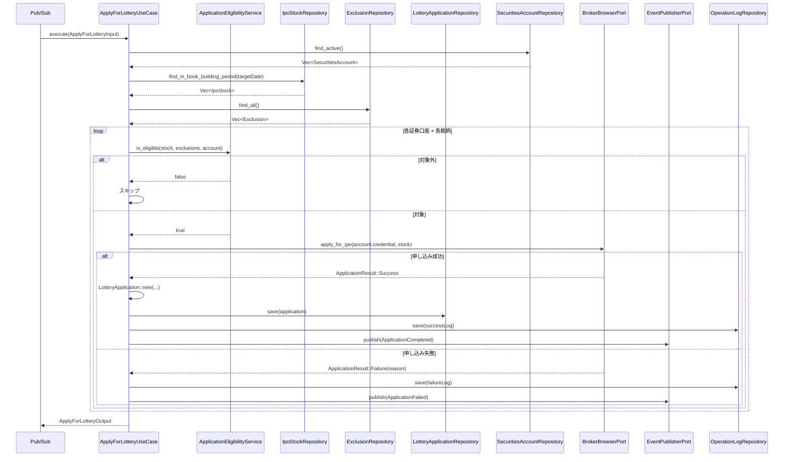
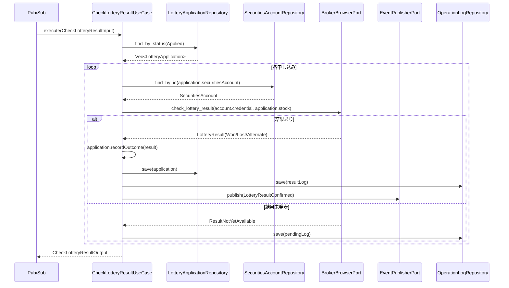

# ユースケース層設計書

## 1. はじめに

### 1.1 目的

本文書は、IPOttoのアプリケーション層（ユースケース層）の設計を定義する。ドメイン層のビジネスロジックを組み合わせてアプリケーション固有のユースケースを実現し、外部インターフェースとドメイン層の間を仲介する役割を担う層の設計方針・詳細を記述する。

### 1.2 関連文書

> **注意**: DD-xxx のIDは他の詳細設計文書と重複しないよう調整する。ユースケース層は DD-100〜DD-199 の範囲を使用する。

#### 上流文書

- [要件定義書](../01-requirements/requirements-specification.md) — REQ-xxx（機能要件）、UC-xxx（ユースケース）
- [基本設計書](../02-system-design/system-design.md) — SD-xxx（アーキテクチャ方針）

#### 同層文書

- [ドメイン層設計書](./domain.md) — ドメインモデル、ドメインサービス、ドメインイベント
- [詳細設計書](./detailed-design.md) — クラス設計、シーケンス設計

#### 下流文書

- [インフラストラクチャ層設計書](./infrastructure.md) — リポジトリ実装、外部サービス連携
- [ACL設計書](./acl.md) — 腐敗防止層の設計
- [API仕様書](../04-api-specification/api-specification.md) — エンドポイント定義

---

## 2. 設計方針

### 2.1 レイヤー位置づけ



### 2.2 ユースケースの粒度方針

- **1構造体 = 1ユースケース** の原則に従う
- 各ユースケース構造体は単一の公開メソッド（`execute`）のみを持つ
- 共通処理はユースケース間で直接呼び出さず、ドメインサービスに委譲する

### 2.3 Command/Query分離方針（CQRS適用レベル）

| 項目 | 方針 |
|---|---|
| 分離レベル | 論理分離（同一Firestoreを使用） |
| Command | 状態変更を伴う操作。戻り値は最小限（ID等）とする |
| Query | 状態変更を伴わない読み取り操作。ドメインモデルを経由せず直接DTOを返すことを許容する |
| 整合性 | Firestoreのドキュメント単位トランザクションで強整合性を保証 |

---

## 3. ユースケースカタログ

### 3.1 ユースケース一覧

| ID | 名前 | アクター | 種別 | 入力DTO | 出力DTO | 関連要件 | 関連ドメインサービス |
|---|---|---|---|---|---|---|---|
| DD-100 | IPO銘柄情報を取得・更新する | システム | Command | FetchIpoStocksInput | FetchIpoStocksOutput | [REQ-001](../01-requirements/requirements-specification.md#req-001), [UC-001](../01-requirements/requirements-specification.md#uc-001) | — |
| DD-101 | IPO抽選に自動申し込みする | システム | Command | ApplyForLotteryInput | ApplyForLotteryOutput | [REQ-002](../01-requirements/requirements-specification.md#req-002), [UC-002](../01-requirements/requirements-specification.md#uc-002) | ApplicationEligibilityService |
| DD-102 | 抽選結果を自動確認する | システム | Command | CheckLotteryResultInput | CheckLotteryResultOutput | [REQ-003](../01-requirements/requirements-specification.md#req-003), [UC-003](../01-requirements/requirements-specification.md#uc-003) | — |
| DD-103 | 除外銘柄を登録する | 投資家 | Command | RegisterExclusionInput | RegisterExclusionOutput | [REQ-005](../01-requirements/requirements-specification.md#req-005), [UC-005](../01-requirements/requirements-specification.md#uc-005) | — |
| DD-104 | 除外銘柄を削除する | 投資家 | Command | RemoveExclusionInput | — | [REQ-005](../01-requirements/requirements-specification.md#req-005), [UC-005](../01-requirements/requirements-specification.md#uc-005) | — |
| DD-105 | 通知設定を更新する | 投資家 | Command | UpdateNotificationSettingInput | UpdateNotificationSettingOutput | [REQ-006](../01-requirements/requirements-specification.md#req-006), [UC-006](../01-requirements/requirements-specification.md#uc-006) | — |
| DD-106 | 証券口座を登録する | 投資家 | Command | RegisterSecuritiesAccountInput | RegisterSecuritiesAccountOutput | [REQ-007](../01-requirements/requirements-specification.md#req-007), [UC-007](../01-requirements/requirements-specification.md#uc-007) | — |
| DD-107 | 証券口座を更新する | 投資家 | Command | UpdateSecuritiesAccountInput | UpdateSecuritiesAccountOutput | [REQ-007](../01-requirements/requirements-specification.md#req-007), [UC-007](../01-requirements/requirements-specification.md#uc-007) | — |
| DD-108 | 証券口座を削除する | 投資家 | Command | DeleteSecuritiesAccountInput | — | [REQ-007](../01-requirements/requirements-specification.md#req-007), [UC-007](../01-requirements/requirements-specification.md#uc-007) | — |
| DD-109 | 証券口座の接続テストを実行する | 投資家 | Command | TestSecuritiesAccountConnectionInput | TestSecuritiesAccountConnectionOutput | [REQ-007](../01-requirements/requirements-specification.md#req-007), [UC-007](../01-requirements/requirements-specification.md#uc-007) | — |
| DD-110 | IPO銘柄一覧を取得する | 投資家 | Query | ListIpoStocksInput | ListIpoStocksOutput | [REQ-001](../01-requirements/requirements-specification.md#req-001), [UC-001](../01-requirements/requirements-specification.md#uc-001) | — |
| DD-111 | IPO銘柄詳細を取得する | 投資家 | Query | GetIpoStockInput | GetIpoStockOutput | [REQ-001](../01-requirements/requirements-specification.md#req-001), [UC-001](../01-requirements/requirements-specification.md#uc-001) | — |
| DD-112 | ダッシュボードサマリーを取得する | 投資家 | Query | — | DashboardSummaryOutput | [REQ-004](../01-requirements/requirements-specification.md#req-004), [UC-004](../01-requirements/requirements-specification.md#uc-004) | — |
| DD-113 | 除外リストを取得する | 投資家 | Query | — | ListExclusionsOutput | [REQ-005](../01-requirements/requirements-specification.md#req-005), [UC-005](../01-requirements/requirements-specification.md#uc-005) | — |
| DD-114 | 通知設定を取得する | 投資家 | Query | — | GetNotificationSettingOutput | [REQ-006](../01-requirements/requirements-specification.md#req-006), [UC-006](../01-requirements/requirements-specification.md#uc-006) | — |
| DD-115 | 証券口座一覧を取得する | 投資家 | Query | — | ListSecuritiesAccountsOutput | [REQ-007](../01-requirements/requirements-specification.md#req-007), [UC-007](../01-requirements/requirements-specification.md#uc-007) | — |
| DD-116 | 操作ログを取得する | 投資家 | Query | ListOperationLogsInput | ListOperationLogsOutput | [REQ-008](../01-requirements/requirements-specification.md#req-008), [UC-008](../01-requirements/requirements-specification.md#uc-008) | — |

### 3.2 ユースケース依存関係図

```mermaid
graph TD
    subgraph Commands["Command ユースケース"]
        DD100["DD-100: IPO銘柄情報<br>取得・更新"]
        DD101["DD-101: 自動申し込み"]
        DD102["DD-102: 結果確認"]
        DD103["DD-103: 除外登録"]
        DD104["DD-104: 除外削除"]
        DD105["DD-105: 通知設定更新"]
        DD106["DD-106: 口座登録"]
        DD107["DD-107: 口座更新"]
        DD108["DD-108: 口座削除"]
        DD109["DD-109: 接続テスト"]
    end

    subgraph DomainServices["ドメインサービス"]
        Eligibility["ApplicationEligibility<br>Service"]
    end

    subgraph Repositories["リポジトリ（出力ポート）"]
        StockRepo["IpoStockRepository"]
        ExclusionRepo["ExclusionRepository"]
        AppRepo["LotteryApplication<br>Repository"]
        AccountRepo["SecuritiesAccount<br>Repository"]
        NotifRepo["NotificationSetting<br>Repository"]
        LogRepo["OperationLog<br>Repository"]
    end

    subgraph ExternalPorts["外部サービスポート"]
        Scraper["IpoStockScraper"]
        Browser["BrokerBrowserPort"]
        MailReader["MailReaderPort"]
        Notifier["NotificationPort"]
        EventPub["EventPublisherPort"]
    end

    DD100 --> StockRepo
    DD100 --> Scraper
    DD100 --> EventPub

    DD101 --> Eligibility
    DD101 --> StockRepo
    DD101 --> ExclusionRepo
    DD101 --> AppRepo
    DD101 --> AccountRepo
    DD101 --> Browser
    DD101 --> MailReader
    DD101 --> EventPub
    DD101 --> LogRepo

    DD102 --> AppRepo
    DD102 --> Browser
    DD102 --> MailReader
    DD102 --> EventPub
    DD102 --> LogRepo

    DD103 --> ExclusionRepo
    DD104 --> ExclusionRepo
    DD105 --> NotifRepo
    DD106 --> AccountRepo
    DD107 --> AccountRepo
    DD108 --> AccountRepo
    DD109 --> AccountRepo
    DD109 --> Browser
    DD109 --> MailReader

    Eligibility --> StockRepo
    Eligibility --> ExclusionRepo
    Eligibility --> AppRepo
```



---

## 4. Command/Query設計

### 4.1 Commandユースケース一覧

| ID | 名前 | 対応UC | 副作用 | トランザクション要否 |
|---|---|---|---|---|
| DD-100 | IPO銘柄情報を取得・更新する | [UC-001](../01-requirements/requirements-specification.md#uc-001) | Firestoreへの銘柄情報書き込み、IpoInfoUpdatedイベント発行 | 要（銘柄ごと） |
| DD-101 | IPO抽選に自動申し込みする | [UC-002](../01-requirements/requirements-specification.md#uc-002) | ブラウザ操作による申し込み実行、Firestoreへのステータス更新、操作ログ記録、イベント発行 | 要（申し込みごと） |
| DD-102 | 抽選結果を自動確認する | [UC-003](../01-requirements/requirements-specification.md#uc-003) | ブラウザ操作による結果取得、Firestoreへの結果記録、操作ログ記録、イベント発行 | 要（銘柄ごと） |
| DD-103 | 除外銘柄を登録する | [UC-005](../01-requirements/requirements-specification.md#uc-005) | Firestoreへの除外銘柄書き込み | 要 |
| DD-104 | 除外銘柄を削除する | [UC-005](../01-requirements/requirements-specification.md#uc-005) | Firestoreからの除外銘柄削除 | 要 |
| DD-105 | 通知設定を更新する | [UC-006](../01-requirements/requirements-specification.md#uc-006) | Firestoreへの通知設定書き込み | 要 |
| DD-106 | 証券口座を登録する | [UC-007](../01-requirements/requirements-specification.md#uc-007) | Firestoreへの口座情報書き込み、機密情報の暗号化保存 | 要 |
| DD-107 | 証券口座を更新する | [UC-007](../01-requirements/requirements-specification.md#uc-007) | Firestoreの口座情報更新、機密情報の再暗号化 | 要 |
| DD-108 | 証券口座を削除する | [UC-007](../01-requirements/requirements-specification.md#uc-007) | Firestoreからの口座情報削除、機密情報の削除 | 要 |
| DD-109 | 証券口座の接続テストを実行する | [UC-007](../01-requirements/requirements-specification.md#uc-007) | ブラウザ操作によるログイン確認、テスト結果の記録 | 要 |

### 4.2 Queryユースケース一覧

| ID | 名前 | 対応UC | キャッシュ可否 | ページネーション |
|---|---|---|---|---|
| DD-110 | IPO銘柄一覧を取得する | [UC-001](../01-requirements/requirements-specification.md#uc-001) | 可（TTL 5分） | 無（件数が少ない） |
| DD-111 | IPO銘柄詳細を取得する | [UC-001](../01-requirements/requirements-specification.md#uc-001) | 可（TTL 5分） | 無 |
| DD-112 | ダッシュボードサマリーを取得する | [UC-004](../01-requirements/requirements-specification.md#uc-004) | 可（TTL 1分） | 無 |
| DD-113 | 除外リストを取得する | [UC-005](../01-requirements/requirements-specification.md#uc-005) | 可（TTL 10分） | 無（件数が少ない） |
| DD-114 | 通知設定を取得する | [UC-006](../01-requirements/requirements-specification.md#uc-006) | 可（TTL 10分） | 無 |
| DD-115 | 証券口座一覧を取得する | [UC-007](../01-requirements/requirements-specification.md#uc-007) | 不可（機密情報を含む） | 無（件数が少ない） |
| DD-116 | 操作ログを取得する | [UC-008](../01-requirements/requirements-specification.md#uc-008) | 不可（リアルタイム性が必要） | 有（カーソルベース） |

---

## 5. 入出力DTO（境界オブジェクト）

### 5.1 入力DTO一覧

| ID | 名前 | 対応UC | フィールド | バリデーション |
|---|---|---|---|---|
| DTO-I-100 | FetchIpoStocksInput | DD-100 | — （パラメータなし） | — |
| DTO-I-101 | ApplyForLotteryInput | DD-101 | targetDate: Date | targetDateが現在日付以前であること |
| DTO-I-102 | CheckLotteryResultInput | DD-102 | targetDate: Date | targetDateが現在日付以前であること |
| DTO-I-103 | RegisterExclusionInput | DD-103 | companyName: String, reason: String | companyName: 1〜200文字、reason: 1〜500文字 |
| DTO-I-104 | RemoveExclusionInput | DD-104 | exclusionIdentifier: String | exclusionIdentifier: 空でないこと |
| DTO-I-105 | UpdateNotificationSettingInput | DD-105 | enabled: bool, channels: Vec\<ChannelInput\> | channelsの各要素が有効なチャネル設定であること |
| DTO-I-106 | RegisterSecuritiesAccountInput | DD-106 | securitiesCompany: String, loginId: String, loginPassword: String, tradingPassword: String, mailAddress: String, mailPassword: String, imapHost: String, imapPort: u16 | 全フィールド必須、空でないこと。mailAddressは有効なメールアドレス形式。imapPortは1-65535 |
| DTO-I-107 | UpdateSecuritiesAccountInput | DD-107 | accountIdentifier: String, loginId: String?, loginPassword: String?, tradingPassword: String?, mailAddress: String?, mailPassword: String?, imapHost: String?, imapPort: u16? | accountIdentifier必須、他は省略可（省略時は既存値を保持）。mailAddress指定時は有効なメールアドレス形式 |
| DTO-I-108 | DeleteSecuritiesAccountInput | DD-108 | accountIdentifier: String | accountIdentifier: 空でないこと |
| DTO-I-109 | TestSecuritiesAccountConnectionInput | DD-109 | accountIdentifier: String | accountIdentifier: 空でないこと |
| DTO-I-110 | ListIpoStocksInput | DD-110 | statusFilter: StockStatus? | statusFilterが指定時は有効なステータス値であること |
| DTO-I-111 | GetIpoStockInput | DD-111 | stockIdentifier: String | stockIdentifier: 空でないこと |
| DTO-I-116 | ListOperationLogsInput | DD-116 | startDate: Date?, endDate: Date?, eventType: String?, cursor: String?, limit: u32 | limit: 1〜100、startDate ≤ endDate |

### 5.2 出力DTO一覧

| ID | 名前 | 対応UC | フィールド | マッピング元 |
|---|---|---|---|---|
| DTO-O-100 | FetchIpoStocksOutput | DD-100 | fetchedCount: u32, updatedCount: u32, errors: Vec\<String\> | 処理結果の集計 |
| DTO-O-101 | ApplyForLotteryOutput | DD-101 | appliedCount: u32, skippedCount: u32, failedCount: u32, results: Vec\<ApplicationResultEntry\> | LotteryApplication集約 |
| DTO-O-102 | CheckLotteryResultOutput | DD-102 | checkedCount: u32, results: Vec\<ResultCheckEntry\> | LotteryApplication集約 |
| DTO-O-103 | RegisterExclusionOutput | DD-103 | identifier: String, companyName: String | Exclusion集約 |
| DTO-O-105 | UpdateNotificationSettingOutput | DD-105 | identifier: String, enabled: bool, channelCount: u32 | NotificationSetting集約 |
| DTO-O-106 | RegisterSecuritiesAccountOutput | DD-106 | identifier: String, securitiesCompany: String | SecuritiesAccount集約 |
| DTO-O-107 | UpdateSecuritiesAccountOutput | DD-107 | identifier: String | SecuritiesAccount集約 |
| DTO-O-109 | TestSecuritiesAccountConnectionOutput | DD-109 | success: bool, message: String, testedAt: String | ConnectionTestResult値オブジェクト |
| DTO-O-110 | ListIpoStocksOutput | DD-110 | stocks: Vec\<IpoStockSummaryEntry\>, totalCount: u32 | IpoStock集約 |
| DTO-O-111 | GetIpoStockOutput | DD-111 | stock: IpoStockFullEntry, applications: Vec\<ApplicationEntry\> | IpoStock + LotteryApplication集約 |
| DTO-O-112 | DashboardSummaryOutput | DD-112 | statusCounts: Map\<String, u32\>, recentApplications: Vec\<ApplicationEntry\>, upcomingStocks: Vec\<IpoStockSummaryEntry\> | 集計結果 |
| DTO-O-113 | ListExclusionsOutput | DD-113 | exclusions: Vec\<ExclusionEntry\> | Exclusion集約 |
| DTO-O-114 | GetNotificationSettingOutput | DD-114 | identifier: String, enabled: bool, channels: Vec\<ChannelEntry\> | NotificationSetting集約 |
| DTO-O-115 | ListSecuritiesAccountsOutput | DD-115 | accounts: Vec\<SecuritiesAccountEntry\> | SecuritiesAccount集約（機密情報を除外） |
| DTO-O-116 | ListOperationLogsOutput | DD-116 | logs: Vec\<OperationLogEntry\>, nextCursor: String?, hasMore: bool | OperationLog |

---

## 6. トランザクション境界管理

### 6.1 トランザクション方針

- トランザクション境界は **ユースケース単位** で設定する
- Firestoreのドキュメント単位トランザクションを使用する
- バッチ処理（DD-100, DD-101, DD-102）では銘柄ごとに独立したトランザクションで実行し、1件の失敗が他に波及しないようにする
- 外部サービス呼び出し（ブラウザ操作、通知送信）はトランザクション **外** で実行する
- イベント発行（Pub/Sub）はFirestore書き込み成功後に実行する

### 6.2 トランザクション境界一覧

| UC ID | 範囲 | 分離方針 | ロールバック条件 |
|---|---|---|---|
| DD-100 | 銘柄ごとにFirestoreドキュメントを更新 | 銘柄単位で独立 | ドキュメント書き込み失敗時。失敗した銘柄のみスキップし他は継続 |
| DD-101 | 申し込みごとにLotteryApplicationドキュメントを作成 | 申し込み単位で独立 | ブラウザ操作失敗またはドキュメント書き込み失敗時 |
| DD-102 | 銘柄ごとにLotteryApplicationドキュメントを更新 | 銘柄単位で独立 | 結果取得失敗またはドキュメント書き込み失敗時 |
| DD-103 | 単一Exclusionドキュメントの作成 | 単一ドキュメント | 書き込み失敗時 |
| DD-106 | 単一SecuritiesAccountドキュメントの作成 + 機密情報の保存 | 集約単位 | いずれかの書き込み失敗時 |

---

## 7. 認可制御

### 7.1 認可マトリクス

| UC ID | 名前 | 必要権限 | 追加条件 |
|---|---|---|---|
| DD-100 | IPO銘柄情報を取得・更新する | システム内部（Pub/Sub経由） | Cloud Schedulerからのトリガーのみ許可 |
| DD-101 | IPO抽選に自動申し込みする | システム内部（Pub/Sub経由） | Cloud Schedulerからのトリガーのみ許可 |
| DD-102 | 抽選結果を自動確認する | システム内部（Pub/Sub経由） | Cloud Schedulerからのトリガーのみ許可 |
| DD-103〜DD-109 | 投資家操作系 | Firebase Authentication認証済み | 許可されたUID/メールアドレスであること |
| DD-110〜DD-116 | 投資家参照系 | Firebase Authentication認証済み | 許可されたUID/メールアドレスであること |

認可チェックはAxumのミドルウェア（Tower Layer）で実装し、ユースケース実行前に検証する。

---

## 8. イベントディスパッチ

### 8.1 イベント発行パターン

- ドメインイベントは集約内部で記録する
- ユースケースの処理完了後、**Firestore書き込み成功後** にPub/Subへイベントを発行する
- Pub/Subへの発行失敗はログに記録するが、Firestoreの書き込みはロールバックしない（結果整合性）
- イベントの発行はべき等性を持つよう設計する

### 8.2 イベント発行一覧

| UC ID | イベント | タイミング | 関連ドメインイベント |
|---|---|---|---|
| DD-100 | ipo-info-updated | Firestore書き込み後 | [DD-080 IpoInfoUpdated](./domain.md) |
| DD-101 | ipo-notification | 申し込み成功/失敗後 | [DD-081 ApplicationCompleted](./domain.md), [DD-082 ApplicationFailed](./domain.md) |
| DD-102 | ipo-result-updated | 結果確認後 | [DD-083 LotteryResultConfirmed](./domain.md) |

---

## 9. エラーハンドリング戦略

### 9.1 ドメイン例外 → アプリケーション例外の変換ルール

ドメイン層から送出される例外は、ユースケース層で適切なアプリケーション例外に変換する。

### 9.2 例外変換テーブル

| ドメイン例外 | アプリ例外 | HTTPステータス | エラーコード |
|---|---|---|---|
| InvalidScheduleError | BadRequestException | 400 | `INVALID_SCHEDULE` |
| InvalidPriceRangeError | BadRequestException | 400 | `INVALID_PRICE_RANGE` |
| InvalidStatusTransitionError | ConflictException | 409 | `INVALID_STATUS_TRANSITION` |
| DuplicateApplicationError | ConflictException | 409 | `DUPLICATE_APPLICATION` |
| InvalidCompanyNameError | BadRequestException | 400 | `INVALID_COMPANY_NAME` |
| IncompleteCredentialError | BadRequestException | 400 | `INCOMPLETE_CREDENTIAL` |
| NoActiveChannelError | UnprocessableEntityException | 422 | `NO_ACTIVE_CHANNEL` |
| DuplicateChannelTypeError | ConflictException | 409 | `DUPLICATE_CHANNEL_TYPE` |
| StockNotFoundException | NotFoundException | 404 | `STOCK_NOT_FOUND` |
| AccountNotFoundException | NotFoundException | 404 | `ACCOUNT_NOT_FOUND` |
| ExclusionNotFoundException | NotFoundException | 404 | `EXCLUSION_NOT_FOUND` |
| BrowserOperationError | ServiceUnavailableException | 503 | `BROWSER_OPERATION_FAILED` |
| ScrapingError | ServiceUnavailableException | 503 | `SCRAPING_FAILED` |
| （予期しない例外） | InternalServerErrorException | 500 | `INTERNAL_ERROR` |

---

## 10. ユースケース詳細

### 10.1 DD-100: IPO銘柄情報を取得・更新する

#### 概要

| 項目 | 内容 |
|---|---|
| ID | DD-100 |
| 名前 | IPO銘柄情報を取得・更新する |
| アクター | システム（Cloud Scheduler → Pub/Sub） |
| 種別 | Command |
| 関連要件 | [REQ-001](../01-requirements/requirements-specification.md#req-001), [UC-001](../01-requirements/requirements-specification.md#uc-001) |

#### 事前条件

- Pub/Subからのメッセージでトリガーされていること

#### 事後条件

- IPO銘柄情報がFirestoreに保存・更新されていること
- 新規銘柄追加時にIpoInfoUpdatedイベントが発行されていること

#### シーケンス図



#### 例外フロー

| 条件 | 例外 | 処理 |
|---|---|---|
| スクレイピング全体が失敗 | ScrapingError | OperationErrorOccurredイベントを発行し終了 |
| 個別銘柄のパースに失敗 | ScrapingError | 該当銘柄をスキップし、エラーをログに記録。他の銘柄は継続 |
| Firestore書き込みに失敗 | InternalError | 該当銘柄をスキップし、エラーをログに記録 |

---

### 10.2 DD-101: IPO抽選に自動申し込みする

#### 概要

| 項目 | 内容 |
|---|---|
| ID | DD-101 |
| 名前 | IPO抽選に自動申し込みする |
| アクター | システム（Cloud Scheduler → Pub/Sub） |
| 種別 | Command |
| 関連要件 | [REQ-002](../01-requirements/requirements-specification.md#req-002), [UC-002](../01-requirements/requirements-specification.md#uc-002) |

#### 事前条件

- Pub/Subからのメッセージでトリガーされていること
- 有効な証券口座が登録されていること

#### 事後条件

- 対象銘柄の抽選申し込みが証券会社サイトで実行されていること
- LotteryApplicationがFirestoreに保存されていること
- 操作ログが記録されていること
- ApplicationCompleted/ApplicationFailedイベントが発行されていること

#### シーケンス図



#### 例外フロー

| 条件 | 例外 | 処理 |
|---|---|---|
| 有効な証券口座が0件 | AccountNotFoundException | OperationErrorOccurredイベントを発行し終了 |
| 証券会社サイトへのログイン失敗（3回リトライ後） | BrowserOperationError | エラー通知を送信し、該当口座の処理を中断。他の口座は継続 |
| 画像認証の自動突破に失敗 | ImageAuthenticationFailedError | ImageAuthenticationFailed通知を送信（手動介入要求）。該当口座の全銘柄をスキップ。他の口座は継続。⚠口座ロック防止のため再試行しない |
| メールからOTPキーワードの取得がタイムアウト（120秒） | MailRetrievalTimeoutError | ImageAuthenticationFailedErrorとして処理。通知送信 |
| 口座がロックされた（3回連続失敗） | AccountLockedError | 即座に通知送信。該当口座を無効化（activation = false）。他の口座は継続 |
| 残高不足で申し込み不可 | BrowserOperationError | 該当銘柄をスキップし、エラーをログに記録 |
| 除外リストの銘柄 | — | 正常系としてスキップ |

#### 実装ノート (Phase 3 Sprint 7 / Phase 4 Sprint 8)

- ブラウザ側 (`services/ipo-browser`) の HTTP 契約は `POST /internal/lottery-applications/submit` として提供される (Sprint 7.1 完了)。
- **Phase 4 Sprint 8 で UseCase 本体を `ipo-applier` 新サービスに実装** (2026-04-22)。`services/ipo-applier/` crate に Pub/Sub push handler (`POST /internal/pubsub/apply`) + `ApplyForLotteryUseCase` を配置し、Cloud Scheduler → `ipo-job-trigger` → ipo-applier の subscription で daily 発火する構成。ACL port (`BrokerBrowserPort::apply_for_ipo`) は `ipo-backend-shared` に追加済みで、`ipo-applier::BrowserServiceClient` と `ipo-api::BrowserServiceClient` の両方が override 実装を持つ。
- **申込株数 / 価格の決定ロジック**: `shares = Shares::new(100)` (単元株) / `price = stock.pricing.offer_price.unwrap_or(stock.pricing.price_range.maximum_price())`。公開価格未確定時は想定価格帯の上限で申し込むことで約定機会を最大化する。`ApplyForLotteryUseCase::determine_order_parameters` に集約。
- **画像認証の 2FA 経路**: Sprint 6 の `rakutenLogin.twoFactorHandler` + `ImapMailReader` + `runImageAuthentication` を再利用する。実画面 (`docs/reference/2段階認証画面.html`) の `emojiClick` 形式 (charaWord 無) は matcher で解決できないため、Phase 4 以降に画像 OCR 経由のキーワード照合を追加する必要がある（現状は第 3 防御線の手動介入通知で縮退）。
- **イベント発行先**: 成功は `ApplicationCompleted`、失敗系 (`Failure` / `InsufficientBalance` / browser port エラー) は `ApplicationFailed` を `ipo-notification` トピックに publish し、`ipo-api` の既存 `/internal/pubsub/ipo-notification` handler が LINE / Email / Slack にファンアウトする。`AlreadyApplied` は正常系として扱い (skippedCount++)、イベントは発行しない。

---

### 10.3 DD-102: 抽選結果を自動確認する

#### 概要

| 項目 | 内容 |
|---|---|
| ID | DD-102 |
| 名前 | 抽選結果を自動確認する |
| アクター | システム（Cloud Scheduler → Pub/Sub） |
| 種別 | Command |
| 関連要件 | [REQ-003](../01-requirements/requirements-specification.md#req-003), [UC-003](../01-requirements/requirements-specification.md#uc-003) |

#### 事前条件

- 申し込み済み（status = Applied）のLotteryApplicationが存在すること

#### 事後条件

- LotteryApplicationに抽選結果（LotteryOutcome）が記録されていること
- LotteryResultConfirmedイベントが発行されていること

#### シーケンス図



---

### 10.4 DD-103: 除外銘柄を登録する

#### 概要

| 項目 | 内容 |
|---|---|
| ID | DD-103 |
| 名前 | 除外銘柄を登録する |
| アクター | 投資家 |
| 種別 | Command |
| 関連要件 | [REQ-005](../01-requirements/requirements-specification.md#req-005), [UC-005](../01-requirements/requirements-specification.md#uc-005) |

#### 事前条件

- 投資家が認証済みであること

#### 事後条件

- Exclusion集約がFirestoreに保存されていること

#### 擬似コード

```
fn execute(input: RegisterExclusionInput) -> Result<RegisterExclusionOutput> {
    // 1. 重複チェック
    if exclusion_repository.exists_by_company_name(input.company_name)? {
        return Err(DuplicateExclusionError)
    }

    // 2. 除外銘柄の作成
    let exclusion = Exclusion::new(
        company_name: CompanyName::new(input.company_name)?,
        reason: ExclusionReason::new(input.reason)?,
    );

    // 3. 永続化
    exclusion_repository.save(&exclusion)?;

    // 4. 出力DTOの返却
    Ok(RegisterExclusionOutput {
        identifier: exclusion.identifier.value,
        company_name: exclusion.company_name.value,
    })
}
```

#### 例外フロー

| 条件 | 例外 | 処理 |
|---|---|---|
| 同一企業名の除外銘柄が既に存在 | DuplicateExclusionError → 409 Conflict | エラーメッセージを返却 |
| 企業名が空 | InvalidCompanyNameError → 400 Bad Request | バリデーションエラーを返却 |

---

### 10.5 DD-104: 除外銘柄を削除する

#### 概要

| 項目 | 内容 |
|---|---|
| ID | DD-104 |
| 名前 | 除外銘柄を削除する |
| アクター | 投資家 |
| 種別 | Command |
| 関連要件 | [REQ-005](../01-requirements/requirements-specification.md#req-005) |

#### 擬似コード

```
fn execute(input: RemoveExclusionInput) -> Result<()> {
    let exclusion = exclusion_repository.find_by_id(input.exclusion_identifier)?
        .ok_or(ExclusionNotFoundException)?;

    exclusion_repository.delete(exclusion.identifier)?;

    Ok(())
}
```

---

### 10.6 DD-105: 通知設定を更新する

#### 概要

| 項目 | 内容 |
|---|---|
| ID | DD-105 |
| 名前 | 通知設定を更新する |
| アクター | 投資家 |
| 種別 | Command |
| 関連要件 | [REQ-006](../01-requirements/requirements-specification.md#req-006), [UC-006](../01-requirements/requirements-specification.md#uc-006) |

#### 擬似コード

```
fn execute(input: UpdateNotificationSettingInput) -> Result<UpdateNotificationSettingOutput> {
    let mut setting = notification_setting_repository.find_default()?;

    // チャネルの更新
    setting.channels = input.channels.into_iter().map(|channel_input| {
        NotificationChannel::new(
            channel_type: ChannelType::from(channel_input.channel_type)?,
            destination: ChannelDestination::new(channel_input.destination)?,
            enabled: channel_input.enabled,
            subscriptions: channel_input.subscriptions,
        )
    }).collect()?;

    // 有効/無効の切り替え
    if input.enabled {
        setting.enable()?;  // NoActiveChannelErrorが発生する可能性
    } else {
        setting.disable();
    }

    notification_setting_repository.save(&setting)?;

    Ok(UpdateNotificationSettingOutput {
        identifier: setting.identifier.value,
        enabled: setting.enabled,
        channel_count: setting.channels.len(),
    })
}
```

---

### 10.7 DD-106: 証券口座を登録する

#### 概要

| 項目 | 内容 |
|---|---|
| ID | DD-106 |
| 名前 | 証券口座を登録する |
| アクター | 投資家 |
| 種別 | Command |
| 関連要件 | [REQ-007](../01-requirements/requirements-specification.md#req-007), [UC-007](../01-requirements/requirements-specification.md#uc-007) |

#### 擬似コード

```
fn execute(input: RegisterSecuritiesAccountInput) -> Result<RegisterSecuritiesAccountOutput> {
    let credential = AccountCredential::new(
        login_id: LoginId::new(input.login_id)?,
        login_password: LoginPassword::new(input.login_password)?,
        trading_password: TradingPassword::new(input.trading_password)?,
    )?;

    let account = SecuritiesAccount::new(
        securities_company: SecuritiesCompany::new(input.securities_company)?,
        credential: credential,
    );

    // 機密情報の安全な保存（インフラ層が暗号化を担当）
    securities_account_repository.save(&account)?;

    Ok(RegisterSecuritiesAccountOutput {
        identifier: account.identifier.value,
        securities_company: account.securities_company.value,
    })
}
```

---

### 10.8 DD-107: 証券口座を更新する

#### 擬似コード

```
fn execute(input: UpdateSecuritiesAccountInput) -> Result<UpdateSecuritiesAccountOutput> {
    let mut account = securities_account_repository.find_by_id(input.account_identifier)?
        .ok_or(AccountNotFoundException)?;

    // 指定されたフィールドのみ更新
    if let Some(login_id) = input.login_id {
        account.credential.login_id = LoginId::new(login_id)?;
    }
    if let Some(login_password) = input.login_password {
        account.credential.login_password = LoginPassword::new(login_password)?;
    }
    if let Some(trading_password) = input.trading_password {
        account.credential.trading_password = TradingPassword::new(trading_password)?;
    }

    securities_account_repository.save(&account)?;

    Ok(UpdateSecuritiesAccountOutput { identifier: account.identifier.value })
}
```

---

### 10.9 DD-108: 証券口座を削除する

#### 擬似コード

```
fn execute(input: DeleteSecuritiesAccountInput) -> Result<()> {
    let account = securities_account_repository.find_by_id(input.account_identifier)?
        .ok_or(AccountNotFoundException)?;

    securities_account_repository.delete(account.identifier)?;

    Ok(())
}
```

---

### 10.10 DD-109: 証券口座の接続テストを実行する

#### 概要

| 項目 | 内容 |
|---|---|
| ID | DD-109 |
| 名前 | 証券口座の接続テストを実行する |
| アクター | 投資家 |
| 種別 | Command |
| 関連要件 | [REQ-007](../01-requirements/requirements-specification.md#req-007) |

#### 擬似コード

```
fn execute(input: TestSecuritiesAccountConnectionInput) -> Result<TestSecuritiesAccountConnectionOutput> {
    let mut account = securities_account_repository.find_by_id(input.account_identifier)?
        .ok_or(AccountNotFoundException)?;

    let test_result = broker_browser_port.test_connection(account.credential)?;

    account.record_test_result(test_result.clone());
    securities_account_repository.save(&account)?;

    Ok(TestSecuritiesAccountConnectionOutput {
        success: test_result.success,
        message: test_result.message,
        tested_at: test_result.tested_at.to_string(),
    })
}
```

---

### 10.11 DD-110: IPO銘柄一覧を取得する

#### 概要

| 項目 | 内容 |
|---|---|
| ID | DD-110 |
| 名前 | IPO銘柄一覧を取得する |
| アクター | 投資家 |
| 種別 | Query |
| 関連要件 | [REQ-001](../01-requirements/requirements-specification.md#req-001) |

#### 擬似コード

```
fn execute(input: ListIpoStocksInput) -> Result<ListIpoStocksOutput> {
    let stocks = match input.status_filter {
        Some(status) => ipo_stock_repository.find_by_status(status)?,
        None => ipo_stock_repository.find_all()?,
    };

    Ok(ListIpoStocksOutput {
        stocks: stocks.iter().map(|s| IpoStockSummaryEntry::from(s)).collect(),
        total_count: stocks.len(),
    })
}
```

---

### 10.12 DD-111: IPO銘柄詳細を取得する

#### 擬似コード

```
fn execute(input: GetIpoStockInput) -> Result<GetIpoStockOutput> {
    let stock = ipo_stock_repository.find_by_id(input.stock_identifier)?
        .ok_or(StockNotFoundException)?;

    let applications = lottery_application_repository.find_by_stock_id(stock.identifier)?;

    Ok(GetIpoStockOutput {
        stock: IpoStockFullEntry::from(&stock),
        applications: applications.iter().map(|a| ApplicationEntry::from(a)).collect(),
    })
}
```

---

### 10.13 DD-112: ダッシュボードサマリーを取得する

#### 擬似コード

```
fn execute() -> Result<DashboardSummaryOutput> {
    let all_stocks = ipo_stock_repository.find_all()?;

    // ステータス別集計
    let status_counts = all_stocks.iter()
        .fold(HashMap::new(), |mut map, stock| {
            *map.entry(stock.status.value.clone()).or_insert(0) += 1;
            map
        });

    // 直近の申し込み
    let recent_applications = lottery_application_repository
        .find_recent(limit: 5)?;

    // 今後の銘柄（BB期間が近い）
    let upcoming_stocks = ipo_stock_repository
        .find_upcoming(limit: 5)?;

    Ok(DashboardSummaryOutput {
        status_counts,
        recent_applications: recent_applications.iter().map(|a| ApplicationEntry::from(a)).collect(),
        upcoming_stocks: upcoming_stocks.iter().map(|s| IpoStockSummaryEntry::from(s)).collect(),
    })
}
```

---

### 10.14 DD-113: 除外リストを取得する

#### 擬似コード

```
fn execute() -> Result<ListExclusionsOutput> {
    let exclusions = exclusion_repository.find_all()?;

    Ok(ListExclusionsOutput {
        exclusions: exclusions.iter().map(|e| ExclusionEntry::from(e)).collect(),
    })
}
```

---

### 10.15 DD-114: 通知設定を取得する

#### 擬似コード

```
fn execute() -> Result<GetNotificationSettingOutput> {
    let setting = notification_setting_repository.find_default()?;

    Ok(GetNotificationSettingOutput {
        identifier: setting.identifier.value,
        enabled: setting.enabled,
        channels: setting.channels.iter().map(|c| ChannelEntry::from(c)).collect(),
    })
}
```

---

### 10.16 DD-115: 証券口座一覧を取得する

#### 擬似コード

```
fn execute() -> Result<ListSecuritiesAccountsOutput> {
    let accounts = securities_account_repository.find_all()?;

    // 機密情報（credential）は出力DTOに含めない
    Ok(ListSecuritiesAccountsOutput {
        accounts: accounts.iter().map(|a| SecuritiesAccountEntry {
            identifier: a.identifier.value,
            securities_company: a.securities_company.value,
            is_active: a.activation.is_active,
            last_test_result: a.connection_test.as_ref().map(|t| ConnectionTestEntry::from(t)),
        }).collect(),
    })
}
```

---

### 10.17 DD-116: 操作ログを取得する

#### 擬似コード

```
fn execute(input: ListOperationLogsInput) -> Result<ListOperationLogsOutput> {
    let (logs, has_more) = operation_log_repository.find_paginated(
        start_date: input.start_date,
        end_date: input.end_date,
        event_type: input.event_type,
        cursor: input.cursor,
        limit: input.limit,
    )?;

    let next_cursor = if has_more {
        logs.last().map(|l| l.id.clone())
    } else {
        None
    };

    Ok(ListOperationLogsOutput {
        logs: logs.iter().map(|l| OperationLogEntry::from(l)).collect(),
        next_cursor,
        has_more,
    })
}
```

---

## 変更履歴

| バージョン | 日付 | 変更者 | 変更内容 |
|---|---|---|---|
| 1.0.0 | 2026-03-25 | lihs | 初版作成 |
