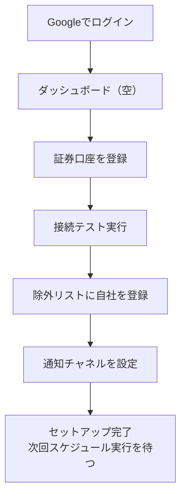
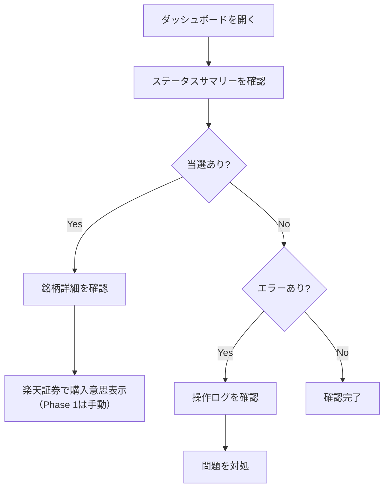

# UI/UX設計書

## 1. はじめに

### 1.1 目的

本文書は、IPOttoのUI/UX設計を定義する。ペルソナの行動パターン（「放置型」「週次確認」「夜間PC + 日中スマホ」）に最適化した、ダークモード基調のダッシュボード型UIを設計する。

### 1.2 対象ユーザー

| ユーザータイプ | 特徴 | 主な利用シーン |
|---|---|---|
| [PRS-001 中村翔太](../13-persona/persona.md#prs-001) | ソフトウェアエンジニア。テクノロジーリテラシー高。「設定して放置」を志向 | 夜間PCでダッシュボード確認（週1〜2回）、日中スマホで通知確認（都度） |

### 1.3 対応する基本設計

> [基本設計書 - 画面設計](../02-system-design/system-design.md#6-画面設計)
> [ペルソナ設計書](../13-persona/persona.md)
> [要件定義書](../01-requirements/requirements-specification.md)

## 2. デザイン原則

ペルソナの目標・行動パターンから導出した原則：

1. **グランサビリティ（一瞥性）** — 週1回のダッシュボード確認で全体像を把握できる。ステータスは色で即座に識別（ペルソナ受容基準: 「週次でダッシュボードを確認するだけで全体の進捗を把握できる」）
2. **ゼロ日常操作** — 日常的な操作は不要。設定完了後は通知の受動的確認のみ（ペルソナ体験目標: 「基本的には放置でき、必要なときだけ確認すれば済む」）
3. **異常の即時認知** — エラーや当選など対応が必要なイベントは、ダッシュボード上で視覚的に際立たせる（ペルソナ体験目標: 「問題が起きたときは即座に気づけて安心できる」）
4. **設定の正確性** — フォームUIで入力しつつ、設定値の正確さを担保する（ペルソナ意思決定傾向: 「GUIよりも正確に設定できることを重視」）

## 3. デザインシステム

### 3.1 カラーパレット

ダークモード基調。投資・金融を連想させるグリーン系アクセント。

| 名称 | カラーコード | 用途 |
|---|---|---|
| Background | `#0F172A` | ページ背景（濃紺） |
| Surface | `#1E293B` | カード、パネル背景（スレート） |
| Surface Elevated | `#334155` | ホバー、アクティブ状態 |
| Border | `#475569` | 区切り線、ボーダー |
| Primary | `#10B981` | メインアクション、リンク（エメラルド） |
| Primary Hover | `#059669` | メインアクションホバー |
| Text Primary | `#F1F5F9` | 本文テキスト |
| Text Secondary | `#94A3B8` | 補助テキスト、ラベル |
| Text Muted | `#64748B` | 非活性テキスト |

**ステータスカラー：**

| ステータス | カラーコード | 用途 |
|---|---|---|
| 申込前 | `#94A3B8` | 情報取得済み、未申し込み（グレー） |
| 申込済 | `#3B82F6` | 申し込み完了、結果待ち（ブルー） |
| 当選 | `#10B981` | 抽選当選（グリーン） |
| 落選 | `#6B7280` | 抽選落選（淡グレー） |
| 補欠 | `#F59E0B` | 補欠当選（アンバー） |
| エラー | `#EF4444` | 操作エラー（レッド） |
| 除外 | `#8B5CF6` | 除外リスト対象（パープル） |

### 3.2 タイポグラフィ

| 名称 | フォント | サイズ | ウェイト | 用途 |
|---|---|---|---|---|
| Heading 1 | system-ui | 28px | Bold | ページタイトル |
| Heading 2 | system-ui | 22px | SemiBold | セクションタイトル |
| Heading 3 | system-ui | 18px | SemiBold | サブセクション |
| Body | system-ui | 15px | Regular | 本文 |
| Small | system-ui | 13px | Regular | 補助テキスト、日時表示 |
| Caption | system-ui | 11px | Regular | ラベル、キャプション |
| Mono | ui-monospace | 14px | Regular | コード、設定値、証券コード |

> **フォント方針:** システムフォント（`system-ui`）を使用し、追加のWebフォント読み込みを排除する。表示速度を優先する。

### 3.3 スペーシング

| 名称 | サイズ | 用途 |
|---|---|---|
| xs | 4px | アイコンとテキストの間隔、バッジ内パディング |
| sm | 8px | 関連要素間の間隔 |
| md | 16px | セクション内の要素間、カード内パディング |
| lg | 24px | セクション間、サイドメニュー項目間 |
| xl | 32px | ページ上部余白 |

### 3.4 コンポーネント一覧

| コンポーネント | バリエーション | 説明 |
|---|---|---|
| Button | Primary / Ghost / Danger | アクションボタン。Primaryはグリーン、GhostはボーダーのみDangerはレッド |
| Input | Text / Password / URL | テキスト入力フィールド。ダーク背景に薄いボーダー |
| Select | Single | 選択フィールド |
| StatusBadge | 申込前 / 申込済 / 当選 / 落選 / 補欠 / エラー / 除外 | ステータス色の丸 + ラベル |
| Card | Default / Clickable | 情報カード。Surface色背景 |
| SummaryCard | StatusCount | ステータス件数表示カード |
| ActivityItem | Success / Error / Neutral | 直近アクティビティの1行アイテム |
| ScheduleItem | Upcoming | 今後の予定の1行アイテム |
| Toast | Success / Error / Warning | トースト通知 |
| Modal | Confirm / Alert | 確認・警告ダイアログ |
| SideNav | Active / Inactive | サイドナビゲーション項目（PC） |
| TabBar | Active / Inactive | 下部タブバー項目（スマホ） |

## 4. 画面設計

### 4.1 ログイン画面

**画面ID:** UI-001
**URLパターン:** `/login`
**対応機能:** [SD-010](../02-system-design/system-design.md#sd-010)

```
PC / スマホ共通
┌──────────────────────────────────┐
│                                  │
│                                  │
│         IPOtto          │
│                                  │
│   IPO抽選申し込みを自動化し、       │
│   進捗を一元管理するツール         │
│                                  │
│   ┌──────────────────────────┐   │
│   │  G  Googleでログイン      │   │
│   └──────────────────────────┘   │
│                                  │
│   個人利用専用ツールです           │
│                                  │
└──────────────────────────────────┘
```

**画面仕様:**

| 要素 | 仕様 |
|---|---|
| ロゴ | アプリ名「IPOtto」をテキスト表示。Primary色 |
| 説明文 | アプリの概要を1〜2行で表示 |
| Googleログインボタン | Firebase Authentication SDK の `signInWithPopup` を呼び出す |
| エラー表示 | 認証失敗時・許可外ユーザー時にエラーメッセージを表示 |

---

### 4.2 ダッシュボード

**画面ID:** UI-002
**URLパターン:** `/`
**対応機能:** [SD-004](../02-system-design/system-design.md#sd-004)
**ペルソナ対応:** 受容基準「週次でダッシュボードを確認するだけで全体の進捗を把握できる」

#### PC表示（1024px以上）

```
┌───────────┬──────────────────────────────────────────┐
│ IPOtto    │  ステータスサマリー                          │
│ Lottery   │  ●申込前 5  ●申込済 3  ●当選 1  ●落選 8      │
│           │  ●補欠 0   ●エラー 0  ●除外 2               │
├───────────┤                                            │
│           │  ┌─ 直近のアクティビティ ────────────────┐  │
│● ダッシュ │  │                                      │  │
│  ボード   │  │ ● ○○(株)      楽天証券   申込完了    │  │
│           │  │   03/25 10:00                        │  │
│  除外     │  │                                      │  │
│  リスト   │  │ ● △△(株)      楽天証券   落選        │  │
│           │  │   03/24 18:00                        │  │
│  通知設定  │  │                                      │  │
│           │  │ ● □□(株)      楽天証券   申込完了    │  │
│  証券口座  │  │   03/23 09:30                        │  │
│           │  └──────────────────────────────────────┘  │
│  操作ログ  │                                            │
│           │  ┌─ 今後の予定 ─────┐ ┌─ システム ─────┐  │
│           │  │ ▲▲(株)           │ │ 次回ジョブ       │  │
│           │  │  BB: 04/01-10    │ │  04/01 09:00    │  │
│           │  │  抽選: 04/15     │ │                  │  │
│           │  │                  │ │ 楽天証券         │  │
│           │  │ □□(株)           │ │  接続正常 ✔     │  │
│           │  │  BB: 04/05-12    │ │  最終確認        │  │
│           │  │  抽選: 04/18     │ │  03/25 10:00    │  │
│           │  └──────────────────┘ └──────────────────┘  │
└───────────┴──────────────────────────────────────────┘
```

#### スマホ表示（〜767px）

```
┌────────────────────────────┐
│ IPOtto             │
├────────────────────────────┤
│                            │
│ ●申込前 5 ●申込済 3 ●当選 1 ●落選 8│
│                            │
│ ─── 直近のアクティビティ ─── │
│                            │
│ ● ○○(株)          申込完了 │
│   楽天証券   03/25 10:00    │
│                            │
│ ● △△(株)              落選 │
│   楽天証券   03/24 18:00    │
│                            │
│ ● □□(株)          申込完了 │
│   楽天証券   03/23 09:30    │
│                            │
│ ─── 今後の予定 ─────── │
│                            │
│ ▲▲(株)   BB: 04/01-10      │
│           抽選: 04/15       │
│ □□(株)   BB: 04/05-12      │
│           抽選: 04/18       │
│                            │
├────────────────────────────┤
│ ダッシュ 除外 通知 口座 ログ  │
└────────────────────────────┘
```

**画面仕様:**

| エリア | 仕様 |
|---|---|
| ステータスサマリー | StatusBadgeコンポーネントの横並び。PC: 2行、スマホ: インラインバッジ1行（主要4ステータスのみ表示、件数0のステータスは非表示） |
| 直近のアクティビティ | 最新5件のイベントを時系列降順で表示。各行にステータス色の丸、企業名、証券会社名、ステータス、日時を表示 |
| 今後の予定 | BB期間が近い銘柄を最大5件表示。企業名、BB期間、抽選日を表示 |
| システムステータス | 次回ジョブ実行予定時刻、証券口座の接続状態を表示。PC表示のみ。エラー時は赤色で表示 |

---

### 4.3 IPO銘柄詳細

**画面ID:** UI-003
**URLパターン:** `/stocks/{stockId}`
**対応機能:** [SD-001](../02-system-design/system-design.md#sd-001)

```
┌──────────────────────────────────────┐
│ ← 戻る              IPO銘柄詳細      │
├──────────────────────────────────────┤
│                                      │
│ ○○株式会社                ●申込済    │
│ 証券コード: 1234  グロース  情報通信業  │
│                                      │
│ ─── スケジュール ──────────────── │
│                                      │
│ BB期間    2026/04/01 〜 2026/04/10   │
│ 抽選日    2026/04/15                  │
│ 上場日    2026/04/25                  │
│                                      │
│ ─── 価格情報 ──────────────── │
│                                      │
│ 仮条件    1,200円 〜 1,500円          │
│ 公募価格   1,400円                    │
│ 公募株数   100,000株                  │
│ 主幹事    楽天証券                    │
│                                      │
│ ─── 申し込み状況 ─────────── │
│                                      │
│ ┌────────────────────────────────┐  │
│ │ 楽天証券  100株  1,400円         │  │
│ │ 申込日時  03/25 10:00           │  │
│ │ 結果     ─（未発表）            │  │
│ └────────────────────────────────┘  │
│                                      │
│ ─── 情報取得元 ────────────── │
│ 外部IPO情報サイト  最終取得: 03/25    │
│                                      │
└──────────────────────────────────────┘
```

**画面仕様:**

| エリア | 仕様 |
|---|---|
| ヘッダー | 企業名（大）、ステータスバッジ、証券コード、市場、業種 |
| スケジュール | BB期間、抽選日、上場日を key-value 形式で表示 |
| 価格情報 | 仮条件、公募価格（確定前はハイフン表示）、公募株数、主幹事 |
| 申し込み状況 | 証券口座ごとの申し込み結果カード。株数、価格、日時、抽選結果を表示 |
| 情報取得元 | FetchOrigin と最終取得日時 |

---

### 4.4 除外リスト管理

**画面ID:** UI-004
**URLパターン:** `/exclusions`
**対応機能:** [SD-005](../02-system-design/system-design.md#sd-005)
**ペルソナ対応:** ペインポイント「インサイダー規制への対応が不安」→ 除外リストで安心を提供

```
┌──────────────────────────────────────┐
│ 除外リスト管理                        │
├──────────────────────────────────────┤
│                                      │
│ 除外リストに登録された企業のIPOには     │
│ 自動申し込みを行いません              │
│                                      │
│ ┌────────────────────┐ [追加]       │
│ │ 企業名を入力...      │              │
│ └────────────────────┘              │
│                                      │
│ ┌────────────────────────────────┐  │
│ │ ○○株式会社                      │  │
│ │ 理由: 自社（インサイダー規制対応）  │  │
│ │ 登録: 2026/03/20         [削除]  │  │
│ ├────────────────────────────────┤  │
│ │ △△ホールディングス              │  │
│ │ 理由: グループ会社                │  │
│ │ 登録: 2026/03/20         [削除]  │  │
│ └────────────────────────────────┘  │
│                                      │
└──────────────────────────────────────┘
```

**画面仕様:**

| 要素 | 仕様 |
|---|---|
| 説明文 | 除外リストの目的を簡潔に説明 |
| 追加フォーム | 企業名入力 + 除外理由入力 + 追加ボタン |
| 除外リスト | 企業名、除外理由、登録日を表示。各行に削除ボタン |
| 削除確認 | 削除ボタン押下時に確認モーダルを表示 |

---

### 4.5 通知設定

**画面ID:** UI-005
**URLパターン:** `/settings/notifications`
**対応機能:** [SD-006](../02-system-design/system-design.md#sd-006)

```
┌──────────────────────────────────────┐
│ 通知設定                             │
├──────────────────────────────────────┤
│                                      │
│ 通知全体  [ON ●──────]               │
│                                      │
│ ─── チャネル設定 ──────────── │
│                                      │
│ ┌─ LINE ────────────── [ON] ──┐  │
│ │ トークン                         │  │
│ │ ┌──────────────────────────┐   │  │
│ │ │ xxxxxxxxxxxxxxxxxxxxxxxx │   │  │
│ │ └──────────────────────────┘   │  │
│ │                                  │  │
│ │ 購読イベント                      │  │
│ │ ☑ 申し込み完了                    │  │
│ │ ☑ 当選                           │  │
│ │ ☐ 落選                           │  │
│ │ ☑ エラー                         │  │
│ │ ☐ 新規銘柄追加                    │  │
│ └──────────────────────────────────┘  │
│                                      │
│ ┌─ Slack ──────────── [ON] ──┐  │
│ │ Webhook URL                      │  │
│ │ ┌──────────────────────────┐   │  │
│ │ │ https://hooks.slack.com/ │   │  │
│ │ └──────────────────────────┘   │  │
│ │                                  │  │
│ │ 購読イベント                      │  │
│ │ ☑ 申し込み完了                    │  │
│ │ ☑ 当選                           │  │
│ │ ☑ 落選                           │  │
│ │ ☑ エラー                         │  │
│ │ ☑ 新規銘柄追加                    │  │
│ └──────────────────────────────────┘  │
│                                      │
│ [+ チャネルを追加]                    │
│                                      │
│         [保存]                        │
└──────────────────────────────────────┘
```

**画面仕様:**

| 要素 | 仕様 |
|---|---|
| 通知全体トグル | 全通知の有効/無効。無効にすると全チャネルが非活性表示になる |
| チャネルカード | チャネルタイプ、有効/無効トグル、設定値入力、購読イベントチェックボックス |
| チャネル追加 | チャネルタイプ（LINE/Email/Slack）を選択し、設定値を入力 |
| 保存ボタン | 全設定を一括保存。バリデーションエラー時はフィールド単位でエラー表示 |
| チャネル固有設定 | LINE: トークン、Email: メールアドレス、Slack: Webhook URL |

---

### 4.6 証券口座管理

**画面ID:** UI-006
**URLパターン:** `/settings/accounts`
**対応機能:** [SD-007](../02-system-design/system-design.md#sd-007)

```
┌──────────────────────────────────────┐
│ 証券口座管理                          │
├──────────────────────────────────────┤
│                                      │
│ ┌─ 楽天証券 ─────── 接続正常 ✔ ──┐  │
│ │                                  │  │
│ │ ログインID    ●●●●●●●●          │  │
│ │ 最終テスト    03/25 10:00        │  │
│ │ ステータス    有効                │  │
│ │                                  │  │
│ │ [接続テスト]  [編集]  [削除]      │  │
│ └──────────────────────────────────┘  │
│                                      │
│ [+ 証券口座を追加]                    │
│                                      │
└──────────────────────────────────────┘
```

**口座登録/編集モーダル:**

```
┌──────────────────────────────────────┐
│ 証券口座を登録                        │
├──────────────────────────────────────┤
│                                      │
│ 証券会社                             │
│ ┌──────────────────────────────┐    │
│ │ 楽天証券                  ▼  │    │
│ └──────────────────────────────┘    │
│                                      │
│ ログインID                           │
│ ┌──────────────────────────────┐    │
│ │                              │    │
│ └──────────────────────────────┘    │
│                                      │
│ ログインパスワード                    │
│ ┌──────────────────────────────┐    │
│ │ ●●●●●●●●              👁   │    │
│ └──────────────────────────────┘    │
│                                      │
│ 取引暗証番号                          │
│ ┌──────────────────────────────┐    │
│ │ ●●●●                   👁   │    │
│ └──────────────────────────────┘    │
│                                      │
│ ⚠ 認証情報はGCP Secret Managerで     │
│   暗号化して保管されます              │
│                                      │
│      [キャンセル]    [登録]           │
└──────────────────────────────────────┘
```

**画面仕様:**

| 要素 | 仕様 |
|---|---|
| 口座カード | 証券会社名、接続状態（✔正常 / ✖異常）、ログインID（マスク表示）、最終テスト日時 |
| 接続テスト | ボタン押下でipo-browserにログイン試行を依頼。結果をリアルタイム表示 |
| 登録/編集モーダル | 証券会社選択、ログインID、パスワード（表示/非表示切替）、取引暗証番号 |
| セキュリティ注記 | 機密情報の保管方法を明示し安心感を提供 |
| 削除確認 | 削除ボタン押下時に確認モーダル。「この口座に紐づく申し込みデータは保持されます」を明記 |

---

### 4.7 操作ログ

**画面ID:** UI-007
**URLパターン:** `/logs`
**対応機能:** [SD-008](../02-system-design/system-design.md#sd-008)
**ペルソナ対応:** 意思決定傾向「問題が起きたときのデバッグ情報は詳細に残してほしい」

```
┌──────────────────────────────────────────────────┐
│ 操作ログ                                          │
├──────────────────────────────────────────────────┤
│                                                    │
│ 期間: [03/20] 〜 [03/26]  種別: [すべて ▼]  [絞込] │
│                                                    │
│ ┌────────────────────────────────────────────────┐│
│ │ 03/25 10:02  ● 申込完了                         ││
│ │ ○○(株) / 楽天証券 / 100株 / 1,400円              ││
│ │ サービス: ipo-browser                            ││
│ ├────────────────────────────────────────────────┤│
│ │ 03/25 10:00  ● ログイン成功                     ││
│ │ 楽天証券                                        ││
│ │ サービス: ipo-browser                            ││
│ ├────────────────────────────────────────────────┤│
│ │ 03/25 09:30  ● IPO情報更新                      ││
│ │ 3件取得 / 1件新規 / 2件更新                       ││
│ │ サービス: ipo-info-fetcher                       ││
│ ├────────────────────────────────────────────────┤│
│ │ 03/24 18:00  ● 抽選結果確認                     ││
│ │ △△(株) / 楽天証券 / 落選                          ││
│ │ サービス: ipo-result-checker                     ││
│ └────────────────────────────────────────────────┘│
│                                                    │
│              [さらに読み込む]                        │
│                                                    │
└──────────────────────────────────────────────────┘
```

**画面仕様:**

| 要素 | 仕様 |
|---|---|
| フィルター | 日付範囲ピッカー + イベント種別ドロップダウン |
| ログ一覧 | 日時、ステータス色丸、イベント種別、詳細メッセージ、サービス名を表示 |
| エラーログ | エラー行は赤色のアクセントで強調。展開するとエラーメッセージ全文とスクリーンショットリンクを表示 |
| ページネーション | カーソルベース。「さらに読み込む」ボタンで追加読み込み |

## 5. インタラクション設計

### 5.1 操作フロー

#### 初回セットアップフロー



#### 週次確認フロー



### 5.2 アニメーション・トランジション

| 対象 | アニメーション | 時間 | イージング |
|---|---|---|---|
| ページ遷移 | フェードイン | 150ms | ease-out |
| モーダル表示 | フェードイン + スケール(0.95→1) | 200ms | ease-out |
| モーダル非表示 | フェードアウト | 150ms | ease-in |
| トースト通知 | 右上からスライドイン | 200ms | ease-out |
| トースト消去 | 右へスライドアウト | 150ms | ease-in |
| ステータス変更 | 色のトランジション | 300ms | ease-in-out |
| ローディング | パルスアニメーション | 1500ms | ease-in-out |

## 6. レスポンシブ設計

### 6.1 ブレークポイント定義

| 名称 | 幅 | 対象デバイス | ナビゲーション |
|---|---|---|---|
| Mobile | 〜767px | スマートフォン | 下部タブバー（5タブ） |
| Tablet | 768px〜1023px | タブレット | 折りたたみ可能サイドメニュー |
| Desktop | 1024px〜 | デスクトップPC | 固定サイドメニュー |

### 6.2 レイアウト方針

| ブレークポイント | サイドメニュー | コンテンツ幅 | ダッシュボードグリッド |
|---|---|---|---|
| Mobile | 非表示（下部タブバー） | 100% - padding | 1カラム（縦スクロール） |
| Tablet | 折りたたみ（アイコンのみ、64px） | calc(100% - 64px) | 2カラム |
| Desktop | 展開（ラベル付き、220px） | calc(100% - 220px) | 2カラム + サイドパネル |

### 6.3 モバイル固有の対応

| 項目 | 対応 |
|---|---|
| タッチターゲット | 最小44x44pxを確保 |
| タブバー | ダッシュボード / 除外リスト / 通知設定 / 証券口座 / 操作ログ の5タブ |
| フォーム | 入力フィールドはフルワイド。キーボード表示時にスクロール調整 |
| テーブル | 横スクロール不可。カード形式に変換 |
| モーダル | フルスクリーンモーダルに変換 |

## 7. アクセシビリティ

### 7.1 準拠基準

| 項目 | 基準 |
|---|---|
| 準拠規格 | WCAG 2.1 レベルAA |
| 対象 | 全画面・全コンポーネント |

### 7.2 対応方針

- ダーク背景でのテキストコントラスト比 4.5:1 以上を確保する（`#F1F5F9` on `#0F172A` = 15.4:1 ✔）
- ステータスの識別を色だけに依存しない。色 + テキストラベルの組み合わせで表示する
- すべてのインタラクティブ要素にキーボード操作を提供する
- フォーム要素には `<label>` を紐づける
- ステータス変更時に `aria-live="polite"` でスクリーンリーダーに通知する
- フォーカスインジケータを明示的に表示する（Primary色のアウトライン）

## 変更履歴

| バージョン | 日付 | 変更者 | 変更内容 |
|---|---|---|---|
| 1.0.0 | 2026-03-26 | lihs | 初版作成 |
