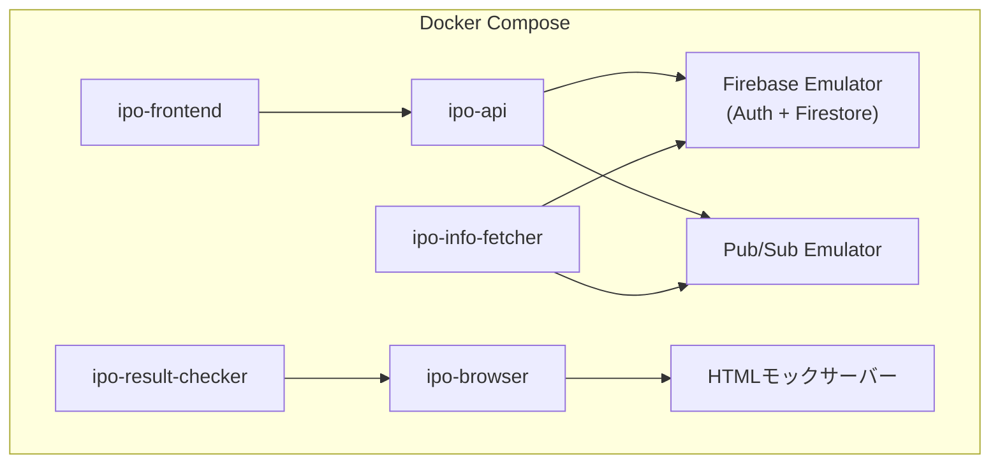
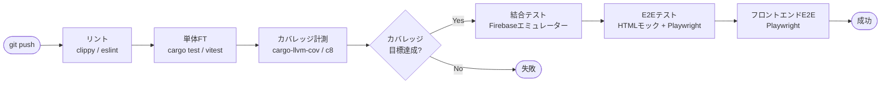

# テスト仕様書

## 1. はじめに

### 1.1 目的

本文書は、IPOttoのテスト戦略・テストケース・テスト環境を定義する。サービス単体のFT（Functional Test）、サービス間結合テスト、E2Eテストのシナリオを中心に記述する。

### 1.2 テスト範囲

**対象に含まれるもの:**

- 5マイクロサービス全ての機能テスト
- サービス間通信（Pub/Sub、HTTP）の結合テスト
- ブラウザ操作のE2Eテスト（HTMLモック + 手動実サイト）
- フロントエンドUIのE2Eテスト
- 2段階認証突破フローのテスト

**対象外:**

- 負荷テスト・性能テスト（本文書ではテスト観点のみ記載。詳細は別途計画）
- セキュリティペネトレーションテスト

### 1.3 対応する要件

> [要件定義書](../01-requirements/requirements-specification.md)
> [ユースケース層設計書](../03-detailed-design/use-case.md) — テスト対象のユースケース定義

## 2. テスト戦略

### 2.1 テストレベル

| テストレベル | 目的 | 実施者 | 実行タイミング |
|---|---|---|---|
| サービス単体FT | 各サービス内のドメインロジック・ユースケース・ACL変換の動作検証 | 開発者 | コミット時（CI） |
| サービス間結合テスト | Pub/Sub経由のイベント連携、HTTP経由のサービス間通信の検証 | 開発者 | PR作成時（CI） |
| E2Eテスト（モック） | HTMLモックに対するブラウザ操作シナリオの検証 | 開発者 | PR作成時（CI） |
| E2Eテスト（実サイト） | 実際の楽天証券サイトに対するブラウザ操作の動作検証 | 開発者 | リリース前（手動） |
| フロントエンドE2E | ダッシュボード・設定画面のユーザーシナリオ検証 | 開発者 | PR作成時（CI） |

### 2.2 テストピラミッド

```
          /‾‾‾‾‾‾‾‾‾‾‾‾\
         / E2E（実サイト）  \         ← 手動・低頻度
        /  E2E（モック）     \        ← CI・中頻度
       / サービス間結合テスト   \       ← CI・中頻度
      /━━━━━━━━━━━━━━━━━━━━━\
     / サービス単体FT（UC・ドメイン）\    ← CI・高頻度
    /‾‾‾‾‾‾‾‾‾‾‾‾‾‾‾‾‾‾‾‾‾‾‾‾‾‾‾\
```

### 2.3 テストツール

| 用途 | ツール | 対象サービス |
|---|---|---|
| 単体テスト / FT | `cargo test`（Rust標準） | ipo-api, ipo-info-fetcher, ipo-result-checker |
| モック | `mockall` crate | Rustサービス全般 |
| カバレッジ | `cargo-llvm-cov` | Rustサービス全般 |
| 単体テスト / FT | Vitest | ipo-browser, ipo-frontend |
| コンポーネントテスト | Vitest + React Testing Library | ipo-frontend |
| E2Eテスト | Playwright | ipo-browser, ipo-frontend |
| カバレッジ | c8（Vitest組み込み） | Node.js/Next.jsサービス |
| 性能テスト | k6 | ipo-api |
| CI | GitHub Actions | 全サービス |

### 2.4 テスト種別マトリクス

| サービス | 単体FT | 結合テスト | E2E（モック） | E2E（実サイト） |
|---|---|---|---|---|
| ipo-api | ドメインモデル、ユースケース、エラー変換 | Firestore結合、Pub/Sub発行 | — | — |
| ipo-browser | セレクタ解決、ACL変換、Page Object | ipo-api連携 | HTMLモック操作 | 楽天証券サイト操作 |
| ipo-info-fetcher | HTMLパーサー、変換ロジック | Firestore結合、Pub/Sub発行 | — | — |
| ipo-result-checker | 結果変換ロジック | ipo-browser連携、Firestore結合 | — | — |
| ipo-frontend | コンポーネント、フック | ipo-api連携 | ダッシュボード操作 | — |

## 3. テスト環境

| 環境 | 用途 | 構成 |
|---|---|---|
| ローカル | 単体FT・結合テスト | Docker Compose（Firebaseエミュレーター + 各サービス） |
| CI | 自動テスト | GitHub Actions（Firebaseエミュレーター + Playwright） |
| ステージング | E2E（実サイト） | ローカルPC（楽天証券テスト用口座を使用） |

### 3.1 ローカルテスト環境



### 3.2 テストデータ

| データ名 | 用途 | 内容 |
|---|---|---|
| テストIPO銘柄（正常） | 全般 | companyName: "テスト株式会社", market: "グロース", BB期間: 未来日 |
| テストIPO銘柄（BB期間中） | 申し込みテスト | BB期間が現在日を含む |
| テストIPO銘柄（抽選済み） | 結果確認テスト | status: Applied, lotteryDate: 過去日 |
| テスト除外銘柄 | 除外テスト | companyName: "除外テスト株式会社" |
| テスト証券口座 | 認証テスト | securitiesCompany: "Rakuten", テスト用認証情報 |
| テスト通知設定 | 通知テスト | LINE + Slack チャネル設定済み |
| 楽天証券HTMLモック | ブラウザ操作テスト | ログイン画面、画像認証画面、IPO一覧、申し込み画面、結果画面 |

### 3.3 HTMLモックファイル

```
tests/fixtures/html/rakuten/
├── login_page.html                      ログイン画面
├── image_authentication_page.html       画像認証画面（10個のimg[alt]ボタン）
├── image_authentication_error.html      画像認証エラー画面
├── dashboard.html                       ログイン後ダッシュボード
├── ipo_list_page.html                   IPO一覧画面（複数銘柄）
├── ipo_list_page_empty.html             IPO一覧画面（0件）
├── ipo_application_page.html            IPO申し込み画面
├── ipo_application_success.html         申し込み成功画面
├── ipo_application_already_applied.html 申し込み済みエラー
├── ipo_application_insufficient.html    残高不足エラー
├── ipo_result_page_won.html             抽選結果画面（当選）
├── ipo_result_page_lost.html            抽選結果画面（落選）
├── ipo_result_page_alternate.html       抽選結果画面（補欠当選）
└── ipo_result_page_pending.html         抽選結果画面（結果未発表）
```

## 4. テストケース

### 4.1 ipo-api: サービス単体FT

#### 4.1.1 ドメインモデルテスト

**テスト観点一覧:**

| テスト観点 | 対象 | 検証内容 |
|---|---|---|
| 値オブジェクトの生成 | CompanyName, PriceRange, BookBuildingPeriod等 | バリデーションルールに従った生成・拒否 |
| ステータス遷移 | StockStatus, ApplicationStatus | 許可された遷移のみ成功、不正な遷移は拒否 |
| 集約の不変条件 | IpoStock, LotteryApplication, SecuritiesAccount | 不変条件違反時にドメインエラーが発生 |
| 除外マッチング | Exclusion.matches() | 企業名の完全一致で判定 |
| 適格性判定 | ApplicationEligibilityService | BB期間、除外リスト、重複チェックの組み合わせ |

**主要テストケース:**

| ID | テスト区分 | テスト内容 | 期待結果 | 対応要件 |
|---|---|---|---|---|
| TST-001 | 正常系 | BB期間中かつ除外リスト外かつ未申し込みの銘柄が適格と判定される | `is_eligible` が `true` を返す | [REQ-002](../01-requirements/requirements-specification.md#req-002) |
| TST-002 | 異常系 | 除外リストに企業名が完全一致する銘柄が不適格と判定される | `is_eligible` が `false` を返す | [REQ-005](../01-requirements/requirements-specification.md#req-005) |
| TST-003 | 異常系 | BB期間外の銘柄が不適格と判定される | `is_eligible` が `false` を返す | [REQ-002](../01-requirements/requirements-specification.md#req-002) |
| TST-004 | 異常系 | 同一口座で申し込み済みの銘柄が不適格と判定される | `is_eligible` が `false` を返す | [REQ-002](../01-requirements/requirements-specification.md#req-002) |
| TST-005 | 正常系 | StockStatusがFetched→Eligibleに遷移できる | 遷移成功 | [REQ-001](../01-requirements/requirements-specification.md#req-001) |
| TST-006 | 異常系 | StockStatusがLost→Appliedに遷移しようとするとエラー | `InvalidStatusTransitionError` | [REQ-001](../01-requirements/requirements-specification.md#req-001) |
| TST-007 | 異常系 | BB開始日 > BB終了日の場合にIpoSchedule生成が失敗する | `InvalidScheduleError` | [REQ-001](../01-requirements/requirements-specification.md#req-001) |
| TST-008 | 異常系 | AccountCredentialのMailCredentialが空の場合に生成が失敗する | `IncompleteCredentialError` | [REQ-007](../01-requirements/requirements-specification.md#req-007) |

#### 4.1.2 ユースケーステスト

**テスト観点一覧:**

| テスト観点 | 対象UC | 検証内容 |
|---|---|---|
| 正常な登録・取得 | DD-103, DD-110〜DD-116 | CRUD操作の正常系 |
| 重複チェック | DD-103 | 同一企業名の除外銘柄登録が拒否される |
| 存在しないリソース | DD-104, DD-108, DD-111 | 存在しないIDに対して404エラー |
| 通知設定の整合性 | DD-105 | 有効チャネル0件で通知有効化するとエラー |
| 口座登録と機密情報保存 | DD-106 | CredentialStorePortにmailCredential含む全情報が保存される |

**主要テストケース:**

| ID | テスト区分 | テスト内容 | 期待結果 | 対応UC |
|---|---|---|---|---|
| TST-010 | 正常系 | 除外銘柄を登録すると永続化されて取得できる | identifierが返却、find_allで取得可能 | DD-103 |
| TST-011 | 異常系 | 同一企業名で除外銘柄を二重登録するとConflictエラー | `DuplicateExclusionError` | DD-103 |
| TST-012 | 正常系 | 通知設定を更新するとチャネルが反映される | 更新後のfind_defaultで変更が確認できる | DD-105 |
| TST-013 | 異常系 | 有効チャネル0件で通知を有効化しようとするとエラー | `NoActiveChannelError` | DD-105 |
| TST-014 | 正常系 | 証券口座を登録するとCredentialStoreに機密情報が保存される | CredentialStorePort.saveが呼ばれる | DD-106 |
| TST-015 | 正常系 | ダッシュボードサマリーがステータス別集計を含む | 各ステータスの件数が正しい | DD-112 |

#### 4.1.3 APIエンドポイントテスト

**テスト観点一覧:**

| テスト観点 | 検証内容 |
|---|---|
| 認証 | IDトークンなしで401、無効トークンで401、許可外ユーザーで403 |
| バリデーション | 必須フィールド欠損で400、フォーマット不正で400 |
| レスポンス形式 | JSON形式が仕様通り、一覧は `items` + `totalCount` |
| エラーレスポンス | エラーコードとメッセージが仕様通り |
| 冪等性 | DELETE操作の冪等性 |

---

### 4.2 ipo-browser: サービス単体FT

#### 4.2.1 セレクタ解決テスト

**テスト観点一覧:**

| テスト観点 | 検証内容 |
|---|---|
| 第1候補で解決 | 最優先セレクタで要素が見つかる |
| フォールバック解決 | 第1候補失敗時に第2候補以降で解決される |
| 全候補失敗 | 全セレクタ失敗時にSelectorResolutionErrorが発生しスクリーンショットが取得される |
| YAML読み込み | 不正なYAMLファイルで適切なエラーが発生 |

#### 4.2.2 Page Objectテスト（HTMLモック）

**主要テストケース:**

| ID | テスト区分 | テスト内容 | 前提条件 | 期待結果 | 対応要件 |
|---|---|---|---|---|---|
| TST-020 | 正常系 | ログインページでID/PW入力→送信→ダッシュボード遷移 | login_page.html | ログイン成功判定、画像認証不要 | [REQ-007](../01-requirements/requirements-specification.md#req-007) |
| TST-021 | 正常系 | 画像認証ページで10個のimg[alt]ボタンが取得できる | image_authentication_page.html | 10個のImageButton、各altText付き | [REQ-007](../01-requirements/requirements-specification.md#req-007) |
| TST-022 | 正常系 | alt属性一致のボタンをクリックして認証成功 | image_authentication_page.html | isAuthenticationSuccessful() = true | [REQ-007](../01-requirements/requirements-specification.md#req-007) |
| TST-023 | 異常系 | alt属性不一致のボタンをクリックして認証失敗 | image_authentication_page.html | getErrorMessage()にエラー内容 | [REQ-007](../01-requirements/requirements-specification.md#req-007) |
| TST-024 | 正常系 | IPO一覧ページで銘柄リストが取得できる | ipo_list_page.html | Vec\<RawIpoEntry\>が返却 | [REQ-002](../01-requirements/requirements-specification.md#req-002) |
| TST-025 | 正常系 | IPO申し込み操作が成功する | ipo_application_page.html → ipo_application_success.html | ApplicationResult::Success | [REQ-002](../01-requirements/requirements-specification.md#req-002) |
| TST-026 | 異常系 | 申し込み済み銘柄の申し込み操作 | ipo_application_already_applied.html | ApplicationResult::AlreadyApplied | [REQ-002](../01-requirements/requirements-specification.md#req-002) |
| TST-027 | 異常系 | 残高不足での申し込み操作 | ipo_application_insufficient.html | ApplicationResult::InsufficientBalance | [REQ-002](../01-requirements/requirements-specification.md#req-002) |
| TST-028 | 正常系 | 当選結果が正しく取得・変換される | ipo_result_page_won.html | LotteryResult::Won | [REQ-003](../01-requirements/requirements-specification.md#req-003) |
| TST-029 | 正常系 | 落選結果が正しく取得・変換される | ipo_result_page_lost.html | LotteryResult::Lost | [REQ-003](../01-requirements/requirements-specification.md#req-003) |
| TST-030 | 正常系 | 結果未発表の場合が検知される | ipo_result_page_pending.html | ResultNotYetAvailable | [REQ-003](../01-requirements/requirements-specification.md#req-003) |

#### 4.2.3 ACL変換テスト

**テスト観点一覧:**

| テスト観点 | 検証内容 |
|---|---|
| 抽選結果テキスト変換 | 「当選」→Won、「落選」→Lost、「補欠当選」→Alternate |
| 申し込み結果テキスト変換 | 「受け付けました」→Success、「既に申込済み」→AlreadyApplied |
| 未知のテキスト | 想定外のテキストでUnknownResultError |

#### 4.2.4 メール取得テスト

**主要テストケース:**

| ID | テスト区分 | テスト内容 | 期待結果 |
|---|---|---|---|
| TST-035 | 正常系 | 固定メール本文から2つのキーワードが正しく抽出される | ImageAuthenticationKeyword{first, second} |
| TST-036 | 異常系 | キーワードが1つしか含まれないメール | UnexpectedKeywordCountError |
| TST-037 | 異常系 | 楽天証券からのメールが120秒以内に届かない | MailRetrievalTimeoutError |
| TST-038 | 正常系 | ポーリングで3秒後にメールが届いた場合 | 2回目のポーリングでキーワード取得成功 |

---

### 4.3 ipo-info-fetcher: サービス単体FT

**テスト観点一覧:**

| テスト観点 | 検証内容 |
|---|---|
| HTMLパース | 正常なHTMLから全フィールドが正しく抽出される |
| 日本語パース | 日付範囲、金額、株数の日本語表記が正しくパースされる |
| データ変換 | RawScrapedEntry → ScrapedStock の変換が正しい |
| 不正データ | 欠損フィールド、不正な日付形式でエラーが適切に処理される |
| フォールバック | メインソース失敗時にフォールバックソースが使用される |

**主要テストケース:**

| ID | テスト区分 | テスト内容 | 期待結果 | 対応要件 |
|---|---|---|---|---|
| TST-040 | 正常系 | 正常なHTMLから銘柄情報が全フィールド抽出される | ScrapedStockの全フィールドが正しい値 | [REQ-001](../01-requirements/requirements-specification.md#req-001) |
| TST-041 | 正常系 | 「2026/04/01〜2026/04/10」がBB期間にパースされる | startDate=2026-04-01, endDate=2026-04-10 | [REQ-001](../01-requirements/requirements-specification.md#req-001) |
| TST-042 | 正常系 | 「1,200円〜1,500円」が仮条件にパースされる | min=1200, max=1500 | [REQ-001](../01-requirements/requirements-specification.md#req-001) |
| TST-043 | 正常系 | メインソース失敗時にフォールバックソースが呼ばれる | フォールバックの結果が返却される | [REQ-001](../01-requirements/requirements-specification.md#req-001) |
| TST-044 | 異常系 | 両ソース失敗時にScrapingErrorが発生する | ScrapingError | [REQ-001](../01-requirements/requirements-specification.md#req-001) |

---

### 4.4 ipo-frontend: コンポーネントテスト

**テスト観点一覧:**

| テスト観点 | 対象コンポーネント | 検証内容 |
|---|---|---|
| ステータスバッジ表示 | StatusBadge | 各ステータスに対応する色とラベルが表示される |
| サマリー集計 | StatusSummaryCard | ステータス別件数が正しく表示、0件のステータスは非表示 |
| アクティビティ一覧 | ActivityItem | 日時、企業名、ステータスが正しく表示される |
| フォームバリデーション | AccountRegistrationForm | 必須フィールド未入力時にエラー表示 |
| 認証状態 | FirebaseAuthProvider | 未認証時にログインページへリダイレクト |

---

### 4.5 サービス間結合テスト

#### 4.5.1 ipo-api ↔ Firestore

| ID | テスト内容 | 期待結果 |
|---|---|---|
| TST-050 | IPO銘柄をFirestoreに保存・取得できる | ドメインモデル⇔ドキュメントの変換が正しい |
| TST-051 | 除外銘柄のCRUDがFirestoreで正しく動作する | 作成・読取・削除が正しく反映 |
| TST-052 | 通知設定のサブコレクション（channels）が正しく保存・取得される | 親ドキュメント+サブコレクションの整合性 |
| TST-053 | 操作ログのカーソルベースページネーションが正しく動作する | nextCursor、hasMoreが正しい |

#### 4.5.2 ipo-api ↔ Secret Manager

| ID | テスト内容 | 期待結果 |
|---|---|---|
| TST-055 | 証券口座登録時にAccountCredential（MailCredential含む）がSecret Managerに保存される | 保存されたJSONに全フィールドが含まれる |
| TST-056 | 証券口座取得時にSecret ManagerからAccountCredentialが復元される | ドメインモデルに正しく変換される |
| TST-057 | 証券口座削除時にSecret Managerのシークレットも削除される | シークレットが存在しなくなる |

#### 4.5.3 サービス間Pub/Sub連携

| ID | テスト内容 | 期待結果 |
|---|---|---|
| TST-060 | Cloud Scheduler → Pub/Sub → ipo-info-fetcher のトリガーが正しく動作する | fetchジョブが実行される |
| TST-061 | ipo-info-fetcher が IpoInfoUpdated イベントを発行し、ipo-api（通知処理）が受信する | 通知処理が実行される |
| TST-062 | ipo-browser が ApplicationCompleted イベントを発行し、ipo-api（通知処理）が受信する | 通知送信が実行される |
| TST-063 | ipo-browser が ImageAuthenticationFailed イベントを発行し、通知が送信される | 手動介入を促す通知が送信される |

#### 4.5.4 ipo-result-checker ↔ ipo-browser

| ID | テスト内容 | 期待結果 |
|---|---|---|
| TST-065 | ipo-result-checkerがipo-browserにHTTPで結果確認を依頼し、結果が返却される | LotteryOutcomeが正しく返却・保存される |

---

### 4.6 E2Eテスト（HTMLモック）

HTMLモックサーバーに対してPlaywrightで自動操作し、全体フローの動作を検証する。CIで自動実行する。

| ID | テスト内容 | シナリオ | 期待結果 | 対応要件 |
|---|---|---|---|---|
| TST-070 | ログイン→画像認証→ダッシュボード | ログインページ→ID/PW入力→画像認証画面→キーワード照合→認証成功→ダッシュボード表示 | 全ステップが成功しダッシュボードが表示される | [REQ-007](../01-requirements/requirements-specification.md#req-007) |
| TST-071 | セッション永続化でログインスキップ | persistentContextで2回目起動→ログインページをスキップ→ダッシュボード直接表示 | 画像認証が不要でダッシュボードが表示される | [REQ-007](../01-requirements/requirements-specification.md#req-007) |
| TST-072 | IPO申し込みフルフロー | ログイン→IPO一覧取得→銘柄選択→申し込み操作→成功確認→ログ記録 | LotteryApplicationが作成され操作ログが記録される | [REQ-002](../01-requirements/requirements-specification.md#req-002) |
| TST-073 | 除外銘柄スキップ | 除外リストに登録された銘柄がIPO一覧に存在→申し込みがスキップされる | 除外銘柄は申し込まれない | [REQ-005](../01-requirements/requirements-specification.md#req-005) |
| TST-074 | 抽選結果確認フロー | ログイン→結果ページ→当選/落選取得→ステータス更新→通知送信 | LotteryOutcomeが記録され通知が送信される | [REQ-003](../01-requirements/requirements-specification.md#req-003) |
| TST-075 | セレクタ全候補失敗 | ログインページの全セレクタが見つからない→エラー通知 | スクリーンショット取得、エラー通知送信、操作中断 | RISK-001 |

---

### 4.7 E2Eテスト（実サイト・手動）

リリース前に実際の楽天証券サイトに対して手動で実行する。テスト用の証券口座を使用する。

| ID | テスト内容 | 手順 | 確認項目 | 頻度 |
|---|---|---|---|---|
| TST-080 | 楽天証券ログイン+画像認証 | 1. テスト口座でログイン 2. 画像認証が表示される 3. メールOTP取得+自動選択 | 認証が成功しダッシュボードが表示される | リリース前 |
| TST-081 | IPO一覧ページのセレクタ確認 | 1. IPOページに遷移 2. セレクタで銘柄リストが取得できるか確認 | 全セレクタが第1候補で解決される | 月次 |
| TST-082 | 申し込み操作（実際には実行しない） | 1. 申し込み画面まで遷移 2. フォーム入力まで確認 3. 確定ボタンは押さない | 申し込みフォームの各フィールドにアクセスできる | リリース前 |
| TST-083 | セッション永続化の有効期間 | 1. ログイン+認証完了 2. 30分後に再度アクセス 3. セッション有効性を確認 | セッションの有効期間を記録 | 初回のみ |

---

### 4.8 フロントエンドE2Eテスト

ipo-frontend（Next.js）に対するPlaywright E2Eテスト。ipo-apiはモックサーバーを使用する。

| ID | テスト内容 | シナリオ | 期待結果 |
|---|---|---|---|
| TST-090 | ダッシュボード表示 | ログイン→ダッシュボード→ステータスサマリー・アクティビティ・今後の予定が表示される | 全セクションが正しく描画される |
| TST-091 | IPO銘柄詳細遷移 | ダッシュボード→銘柄行クリック→詳細画面→スケジュール・価格・申し込み状況が表示される | 全フィールドが正しく表示される |
| TST-092 | 除外銘柄登録 | 除外リスト画面→企業名+理由入力→追加→リストに反映 | 追加した銘柄がリストに表示される |
| TST-093 | 除外銘柄削除 | 除外リスト画面→削除ボタン→確認モーダル→削除確定→リストから消える | 削除後にリストから消える |
| TST-094 | 証券口座登録 | 口座管理画面→追加ボタン→フォーム入力（メール認証情報含む）→登録→リストに反映 | 口座が登録されマスク表示で一覧に表示 |
| TST-095 | 接続テスト | 口座管理画面→接続テストボタン→結果表示 | 成功/失敗の結果が表示される |
| TST-096 | 通知設定更新 | 通知設定画面→チャネル追加→購読イベント選択→保存 | 設定が保存され再読み込み後も反映される |
| TST-097 | 操作ログフィルタ | 操作ログ画面→日付範囲指定→イベント種別選択→フィルタ適用 | フィルタ条件に合致するログのみ表示 |
| TST-098 | レスポンシブ表示（スマホ） | ビューポート375px→タブバーが表示→各画面が正しく表示 | タブバーナビゲーション、インラインバッジが正しく動作 |

---

### 4.9 通知テスト

| ID | テスト内容 | 検証チャネル | 期待結果 |
|---|---|---|---|
| TST-100 | 申し込み完了通知が送信される | LINE / Slack | イベント購読中のチャネルにメッセージが送信される |
| TST-101 | 当選通知が送信される | LINE / Slack | 当選を示すメッセージが送信される |
| TST-102 | エラー通知が送信される | LINE / Slack | エラー内容を含むメッセージが送信される |
| TST-103 | 画像認証失敗通知が送信される | LINE / Slack | 手動介入を促すメッセージが送信される |
| TST-104 | 購読していないイベントの通知は送信されない | — | 非購読チャネルには通知が送信されない |
| TST-105 | 1チャネル失敗時に他チャネルへの送信は継続する | LINE（失敗）/ Slack（成功） | Slackには正常に送信される |

## 5. カバレッジ目標

| サービス | メトリクス | 目標 |
|---|---|---|
| ipo-api（ドメイン層） | ステートメントカバレッジ | 100% |
| ipo-api（ユースケース層） | ステートメントカバレッジ | 100% |
| ipo-api（インフラ層） | ステートメントカバレッジ | 100% |
| ipo-browser（ACL変換） | ステートメントカバレッジ | 100% |
| ipo-browser（Page Object） | ステートメントカバレッジ | 100% |
| ipo-info-fetcher（パーサー） | ステートメントカバレッジ | 100% |
| ipo-result-checker | ステートメントカバレッジ | 100% |
| ipo-frontend | ステートメントカバレッジ | 100% |

## 6. CI/CDパイプライン統合



| ステージ | タイムアウト | 失敗時の挙動 |
|---|---|---|
| リント | 5分 | パイプライン全体を停止 |
| 単体FT | 10分 | パイプライン全体を停止 |
| カバレッジ計測 | 5分 | 目標未達でパイプライン停止 |
| 結合テスト | 10分 | パイプライン全体を停止 |
| E2Eテスト（モック） | 15分 | パイプライン全体を停止 |
| フロントエンドE2E | 10分 | パイプライン全体を停止 |

## 変更履歴

| バージョン | 日付 | 変更者 | 変更内容 |
|---|---|---|---|
| 1.0.0 | 2026-03-26 | lihs | 初版作成 |
