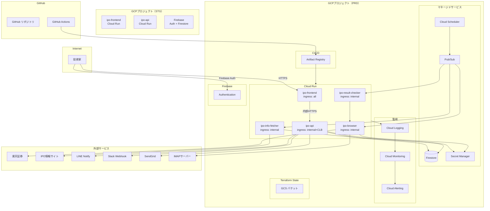
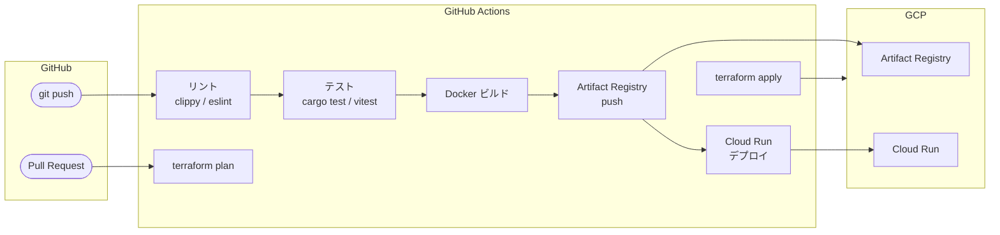

# インフラ設計書

## 1. はじめに

### 1.1 目的

本文書は、IPOttoのGCPインフラ構成、Terraformモジュール設計、CI/CDパイプライン、監視・アラート、バックアップ方針を定義する。コスト最小化（GCP無料枠の最大活用）を設計原則とする。

### 1.2 対応する非機能要件

> [要件定義書 - 非機能要件](../01-requirements/requirements-specification.md)
> [セキュリティ設計書](../09-security-design/security-design.md)

## 2. インフラ構成

### 2.1 構成図



### 2.2 サービス一覧

| ID | サービス名 | GCPサービス | スペック | 用途 |
|---|---|---|---|---|
| INF-001 | ipo-frontend | Cloud Run | CPU: 1, Memory: 256Mi, Min: 0, Max: 1 | ダッシュボードUI（Next.js） |
| INF-002 | ipo-api | Cloud Run | CPU: 1, Memory: 256Mi, Min: 0, Max: 2 | REST APIサーバー（Rust/Axum） |
| INF-003 | ipo-browser | Cloud Run | CPU: 2, Memory: 1Gi, Min: 0, Max: 1 | ブラウザ自動操作（Node.js/Playwright） |
| INF-004 | ipo-info-fetcher | Cloud Run | CPU: 1, Memory: 256Mi, Min: 0, Max: 1 | IPO情報取得ジョブ（Rust） |
| INF-005 | ipo-result-checker | Cloud Run | CPU: 1, Memory: 256Mi, Min: 0, Max: 1 | 抽選結果確認ジョブ（Rust） |
| INF-006 | Firestore | Firebase/Firestore | Native Mode | データストア |
| INF-007 | Firebase Authentication | Firebase | — | ユーザー認証 |
| INF-008 | Cloud Pub/Sub | Pub/Sub | — | イベントメッセージング |
| INF-009 | Cloud Scheduler | Cloud Scheduler | 3ジョブ | スケジュールトリガー |
| INF-010 | Secret Manager | Secret Manager | — | 機密情報管理 |
| INF-011 | Artifact Registry | Artifact Registry | Docker リポジトリ | コンテナイメージ保存 |
| INF-012 | Cloud Storage（tfstate） | GCS | — | Terraformステートファイル保存 |
| INF-013 | Cloud Monitoring | Monitoring | — | メトリクス監視 |
| INF-014 | Cloud Logging | Logging | — | ログ収集・検索 |
| INF-015 | Cloud Alerting | Alerting | — | アラート通知 |

### 2.3 Cloud Runスペック詳細

| サービス | CPU | Memory | Min Instances | Max Instances | Timeout | Concurrency | イングレス |
|---|---|---|---|---|---|---|---|
| ipo-frontend | 1 | 256Mi | 0 | 1 | 300s | 80 | all |
| ipo-api | 1 | 256Mi | 0 | 2 | 300s | 80 | internal-and-cloud-load-balancing |
| ipo-browser | 2 | 1Gi | 0 | 1 | 600s | 1 | internal |
| ipo-info-fetcher | 1 | 256Mi | 0 | 1 | 300s | 1 | internal |
| ipo-result-checker | 1 | 256Mi | 0 | 1 | 300s | 1 | internal |

> **ipo-browser:** Playwright + Chromiumのヘッドレスブラウザ実行に1Gi以上のメモリが必要。同時実行は1（ブラウザセッションの排他制御のため）。タイムアウトは600秒（1銘柄あたり最大180秒 × 複数銘柄を考慮）。

### 2.4 コスト見積もり

| サービス | 無料枠 | 想定使用量 | 月額コスト（概算） |
|---|---|---|---|
| Cloud Run | 200万リクエスト/月、180,000 vCPU秒 | ジョブ日次実行 + Web UIアクセス（週数回） | 無料枠内 |
| Firestore | 1GiB保存、50K読取/日、20K書込/日 | IPO銘柄数十件 + ログ | 無料枠内 |
| Firebase Auth | 10K認証/月 | 1ユーザー | 無料枠内 |
| Pub/Sub | 10GiB/月 | ジョブトリガー + イベント（数十メッセージ/日） | 無料枠内 |
| Cloud Scheduler | 3ジョブ/月 | 3ジョブ（情報取得、申し込み、結果確認） | 無料枠内 |
| Secret Manager | 6シークレット、10,000アクセス/月 | 口座情報 + 通知設定 | 無料枠内 |
| Artifact Registry | 0.5GiB/月 | 5コンテナイメージ | 無料枠内 |
| Cloud Storage（tfstate） | 5GiB | 数KB | 無料枠内 |
| Cloud Monitoring | 基本無料 | — | 無料 |
| Cloud Logging | 50GiB/月 | 構造化ログ | 無料枠内 |
| **合計** | | | **$0/月**（無料枠内運用想定） |

## 3. 環境定義

| 項目 | STG | PRD |
|---|---|---|
| GCPプロジェクト | `ipotto-stg` | `ipotto-prd` |
| Cloud Run インスタンス数 | Min: 0 / Max: 1（全サービス） | 上記スペック表の通り |
| Firestore | Firebaseエミュレーター（ローカル） | Native Mode |
| Firebase Auth | Firebaseエミュレーター（ローカル） | 本番設定 |
| Cloud Scheduler | なし（手動トリガー） | 3ジョブ |
| Pub/Sub | エミュレーター（ローカル） | 本番設定 |
| ドメイン | `*.run.app`（自動生成） | `*.run.app`（自動生成） |
| Terraform State | `gs://ipotto-stg-tfstate/` | `gs://ipotto-prd-tfstate/` |

## 4. Terraformモジュール設計

### 4.1 ディレクトリ構造

```
terraform/
├─ environments/
│    ├─ stg/
│    │    ├─ main.tf              # モジュール呼び出し
│    │    ├─ variables.tf         # 環境固有変数の型定義
│    │    ├─ terraform.tfvars     # 環境固有変数の値
│    │    ├─ outputs.tf           # 出力値
│    │    └─ backend.tf           # GCS backend設定
│    └─ prd/
│         ├─ main.tf
│         ├─ variables.tf
│         ├─ terraform.tfvars
│         ├─ outputs.tf
│         └─ backend.tf
└─ modules/
     ├─ cloud-run/
     │    ├─ main.tf              # google_cloud_run_v2_service
     │    ├─ variables.tf         # service_name, image, cpu, memory, etc.
     │    └─ outputs.tf           # service_url, service_id
     ├─ firestore/
     │    ├─ main.tf              # google_firestore_database, indexes
     │    └─ variables.tf
     ├─ pubsub/
     │    ├─ main.tf              # google_pubsub_topic, subscription
     │    ├─ variables.tf
     │    └─ outputs.tf
     ├─ scheduler/
     │    ├─ main.tf              # google_cloud_scheduler_job
     │    └─ variables.tf
     ├─ secret-manager/
     │    ├─ main.tf              # google_secret_manager_secret
     │    └─ variables.tf
     ├─ iam/
     │    ├─ main.tf              # google_service_account, iam_binding
     │    ├─ variables.tf
     │    └─ outputs.tf
     └─ artifact-registry/
          ├─ main.tf              # google_artifact_registry_repository
          └─ variables.tf
```

### 4.2 モジュール定義

#### cloud-run モジュール

**入力変数:**

| 変数名 | 型 | 説明 |
|---|---|---|
| `service_name` | string | Cloud Runサービス名 |
| `project_id` | string | GCPプロジェクトID |
| `region` | string | デプロイリージョン |
| `image` | string | コンテナイメージURL |
| `cpu` | string | CPU割り当て（例: "1"） |
| `memory` | string | メモリ割り当て（例: "256Mi"） |
| `min_instance_count` | number | 最小インスタンス数 |
| `max_instance_count` | number | 最大インスタンス数 |
| `timeout_seconds` | number | リクエストタイムアウト |
| `max_concurrent_requests` | number | 最大同時リクエスト数 |
| `ingress` | string | イングレス設定 |
| `service_account_email` | string | サービスアカウント |
| `environment_variables` | map(string) | 環境変数 |

**出力:**

| 出力名 | 説明 |
|---|---|
| `service_url` | Cloud RunのURL |
| `service_id` | Cloud RunのリソースID |

#### pubsub モジュール

**入力変数:**

| 変数名 | 型 | 説明 |
|---|---|---|
| `topic_name` | string | トピック名 |
| `subscriptions` | list(object) | サブスクリプション定義リスト |
| `dead_letter_topic_name` | string | デッドレタートピック名 |
| `max_delivery_attempts` | number | 最大配信試行回数 |

#### iam モジュール

**入力変数:**

| 変数名 | 型 | 説明 |
|---|---|---|
| `service_accounts` | list(object) | サービスアカウント定義（名前、ロール一覧） |

### 4.3 環境固有設定例（prd/terraform.tfvars）

```hcl
project_id = "ipotto-prd"
region     = "asia-northeast1"

# Cloud Run サービス
cloud_run_services = {
  frontend = {
    service_name           = "ipo-frontend"
    cpu                    = "1"
    memory                 = "256Mi"
    min_instance_count     = 0
    max_instance_count     = 1
    timeout_seconds        = 300
    max_concurrent_requests = 80
    ingress                = "all"
  }
  api = {
    service_name           = "ipo-api"
    cpu                    = "1"
    memory                 = "256Mi"
    min_instance_count     = 0
    max_instance_count     = 2
    timeout_seconds        = 300
    max_concurrent_requests = 80
    ingress                = "internal-and-cloud-load-balancing"
  }
  browser = {
    service_name           = "ipo-browser"
    cpu                    = "2"
    memory                 = "1Gi"
    min_instance_count     = 0
    max_instance_count     = 1
    timeout_seconds        = 600
    max_concurrent_requests = 1
    ingress                = "internal"
  }
  info_fetcher = {
    service_name           = "ipo-info-fetcher"
    cpu                    = "1"
    memory                 = "256Mi"
    min_instance_count     = 0
    max_instance_count     = 1
    timeout_seconds        = 300
    max_concurrent_requests = 1
    ingress                = "internal"
  }
  result_checker = {
    service_name           = "ipo-result-checker"
    cpu                    = "1"
    memory                 = "256Mi"
    min_instance_count     = 0
    max_instance_count     = 1
    timeout_seconds        = 300
    max_concurrent_requests = 1
    ingress                = "internal"
  }
}

# Cloud Scheduler
scheduler_jobs = {
  ipo_job_trigger = {
    name        = "ipo-daily-trigger"
    schedule    = "0 9 * * *"
    time_zone   = "Asia/Tokyo"
    description = "毎日9時にIPOジョブをトリガー"
  }
}
```

### 4.4 Terraformステート管理

| 項目 | 設定 |
|---|---|
| Backend | GCS（`gcs` backend） |
| バケット命名規則 | `{project_id}-tfstate` |
| バージョニング | 有効 |
| ロック | GCSのオブジェクトロック（デフォルト有効） |
| 暗号化 | Google管理の暗号鍵（デフォルト） |

```hcl
# backend.tf（PRD例）
terraform {
  backend "gcs" {
    bucket = "ipotto-prd-tfstate"
    prefix = "terraform/state"
  }
}
```

## 5. CI/CD

### 5.1 パイプライン構成



### 5.2 GitHub Actionsワークフロー

| ワークフロー | トリガー | 処理内容 |
|---|---|---|
| `ci.yml` | Push（全ブランチ） | リント → テスト → カバレッジ |
| `build-and-deploy.yml` | Push（mainブランチ） | Docker ビルド → Artifact Registry push → Cloud Runデプロイ |
| `terraform-plan.yml` | PR（`terraform/` 変更時） | `terraform plan` の結果をPRコメントに投稿 |
| `terraform-apply.yml` | Push（mainブランチ、`terraform/` 変更時） | `terraform apply`（PRD環境） |
| `security-scan.yml` | 週次（日曜深夜） | `cargo audit` + `npm audit` + Dependabot |

### 5.3 デプロイ手順

1. 開発者が `main` ブランチにマージ
2. GitHub Actions `build-and-deploy.yml` が起動
3. 各サービスのDockerイメージをビルド（マルチステージビルド）
4. Artifact Registryにプッシュ（タグ: `{sha}`）
5. `gcloud run deploy` で各Cloud Runサービスをデプロイ
6. デプロイ完了後、ヘルスチェックを実行
7. ヘルスチェック失敗時は前のリビジョンに自動ロールバック

### 5.4 ロールバック手順

1. Cloud Runコンソールで前のリビジョンを確認
2. `gcloud run services update-traffic --to-revisions={previous_revision}=100` でトラフィックを切り替え
3. 原因を調査・修正後、通常のデプロイフローで再デプロイ

> Cloud Runはリビジョンベースのデプロイのため、ロールバックは即座にトラフィック切り替えで完了する。

## 6. 監視・アラート

### 6.1 監視項目

| 監視対象 | メトリクス | 閾値 | 監視ツール |
|---|---|---|---|
| Cloud Run（全サービス） | リクエストレイテンシ（p95） | 5秒以上 | Cloud Monitoring |
| Cloud Run（全サービス） | エラーレート（5xx） | 1%以上 | Cloud Monitoring |
| Cloud Run（ipo-browser） | メモリ使用率 | 80%以上 | Cloud Monitoring |
| Cloud Run（ipo-browser） | リクエストタイムアウト | 発生 | Cloud Monitoring |
| Pub/Sub | デッドレターキュー滞留 | 1件以上 | Cloud Monitoring |
| Pub/Sub | 未確認メッセージ数 | 100件以上 | Cloud Monitoring |
| Cloud Scheduler | ジョブ失敗 | 発生 | Cloud Monitoring |
| Firestore | 読み取り/書き込みカウント | 無料枠の80%以上 | Cloud Monitoring |
| Secret Manager | アクセス回数 | 無料枠の80%以上 | Cloud Monitoring |

### 6.2 カスタムメトリクス

| メトリクス名 | 発行元 | 説明 |
|---|---|---|
| `ipo/job/success_count` | ipo-info-fetcher, ipo-browser, ipo-result-checker | ジョブ成功回数 |
| `ipo/job/failure_count` | 同上 | ジョブ失敗回数 |
| `ipo/application/count` | ipo-browser | 申し込み実行回数 |
| `ipo/authentication/2fa_required` | ipo-browser | 2FA認証が要求された回数 |
| `ipo/authentication/2fa_success` | ipo-browser | 2FA自動突破成功回数 |
| `ipo/selector/fallback_used` | ipo-browser | フォールバックセレクタ使用回数 |

### 6.3 アラートルール

| 重大度 | 条件 | 通知先 | 対応 |
|---|---|---|---|
| Critical | ipo-browserの画像認証2回連続失敗 | LINE + Slack | 即座に手動確認。口座ロック防止 |
| Critical | Secret Managerへの想定外アクセス | メール（Cloud Alerting） | GCPコンソールで確認 |
| Critical | Cloud Schedulerジョブが3回連続失敗 | LINE + Slack | ジョブ設定・サービス状態を確認 |
| Warning | Pub/Subデッドレターキューに1件以上 | Slack | メッセージ内容を確認し再処理 |
| Warning | Cloud Run 5xxエラーレート1%超過 | Slack | ログを確認し原因調査 |
| Warning | Firestore読み取り数が無料枠80%超過 | Slack | クエリの最適化を検討 |
| Info | セレクタフォールバック使用 | 操作ログ（Firestore） | 次回メンテナンス時にセレクタ更新 |

## 7. バックアップ・リストア

### 7.1 バックアップ方針

| 対象 | 方式 | 頻度 | 保持期間 |
|---|---|---|---|
| Firestore | GCPマネージドエクスポート（`gcloud firestore export`） | 週次（日曜深夜） | 30日 |
| Secret Manager | バージョニング（GCPマネージド） | 自動（更新時） | 全バージョン保持 |
| Terraformステート | GCSバージョニング | 自動（apply時） | 全バージョン保持 |
| コンテナイメージ | Artifact Registryのタグ管理 | 自動（デプロイ時） | 直近10バージョン |
| アプリケーション設定 | Gitリポジトリ | コミット時 | Git履歴 |

### 7.2 Firestoreバックアップ

GitHub Actionsの週次スケジュールでFirestoreエクスポートを実行する。

```yaml
# .github/workflows/backup-firestore.yml
name: Firestore Backup
on:
  schedule:
    - cron: '0 15 * * 0'  # 日曜 15:00 UTC (月曜 0:00 JST)
jobs:
  backup:
    runs-on: ubuntu-latest
    steps:
      - name: Export Firestore
        run: |
          gcloud firestore export \
            gs://ipotto-prd-backup/firestore/$(date +%Y%m%d)
```

### 7.3 リストア手順

**Firestoreリストア:**

1. GCSバケットからバックアップを確認: `gsutil ls gs://ipotto-prd-backup/firestore/`
2. リストア実行: `gcloud firestore import gs://ipotto-prd-backup/firestore/{date}`
3. リストア後のデータ整合性を確認

**Secret Managerリストア:**

1. シークレットのバージョン一覧を確認: `gcloud secrets versions list {secret_name}`
2. 前バージョンを有効化: `gcloud secrets versions enable {version} --secret={secret_name}`

**Cloud Runロールバック:**

1. リビジョン一覧を確認: `gcloud run revisions list --service={service_name}`
2. 前リビジョンにトラフィック切り替え: `gcloud run services update-traffic --to-revisions={revision}=100`

## 8. スケーリング方針

| 項目 | 方式 | 条件 |
|---|---|---|
| Cloud Run（ipo-api） | 同時リクエスト数ベースのオートスケーリング | 同時リクエスト80を超過した場合にインスタンス追加（Max: 2） |
| Cloud Run（その他） | Min: 0でコールドスタート許容 | ジョブ実行時のみインスタンス起動。実行完了後にスケールダウン |
| Firestore | マネージド（スケーリング不要） | — |
| Pub/Sub | マネージド（スケーリング不要） | — |

> 個人利用のため大規模なスケーリングは不要。コスト最小化のためMin: 0を基本とし、コールドスタートのレイテンシ（数秒〜十数秒）は許容する。

## 9. リージョン・ゾーン設計

| リソース | リージョン | 理由 |
|---|---|---|
| Cloud Run（全サービス） | `asia-northeast1`（東京） | ユーザー所在地に最も近い |
| Firestore | `asia-northeast1` | Cloud Runと同一リージョンでレイテンシ最小化 |
| Pub/Sub | グローバル（GCPデフォルト） | — |
| Secret Manager | グローバル（自動レプリケーション） | — |
| Artifact Registry | `asia-northeast1` | Cloud Runと同一リージョンでプル時間最小化 |
| GCS（tfstate） | `asia-northeast1` | — |

## 変更履歴

| バージョン | 日付 | 変更者 | 変更内容 |
|---|---|---|---|
| 1.0.0 | 2026-03-26 | lihs | 初版作成 |
