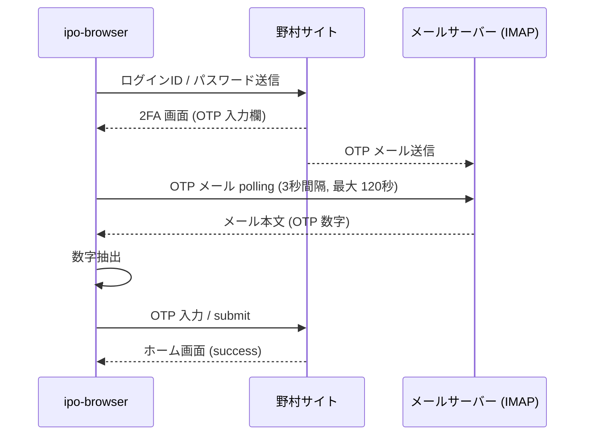
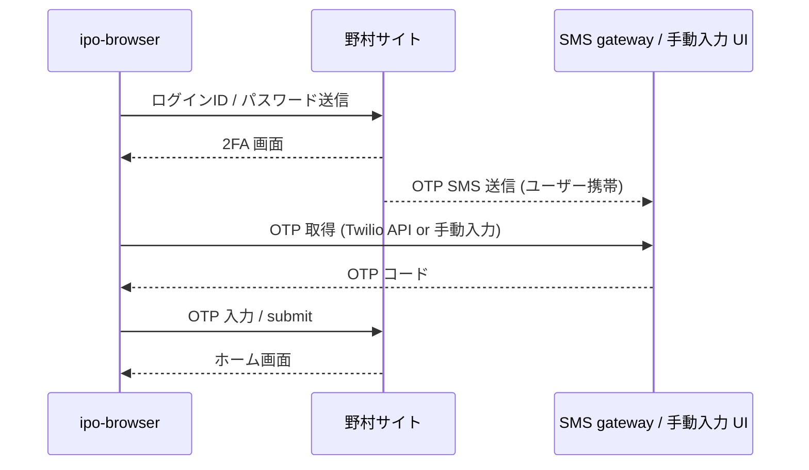
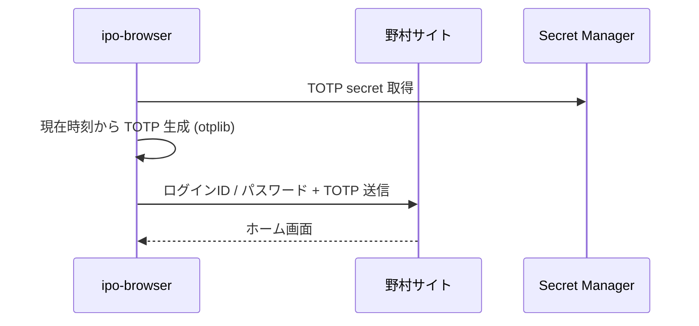

# 野村證券認証 セキュリティ設計

> 親文書: [セキュリティ設計書](./security-design.md)
> 運用チェックリスト: [checklist.md](./checklist.md) — 野村関連項目を § 1.5, § 2.4 に追加予定

## 1. 目的

[セキュリティ設計書](./security-design.md) で定義した STRIDE / OWASP Top 10 の脅威モデルを、野村證券認証フローへ拡張する。実際の 2FA 方式・credential 構造はユーザー提供情報（[`docs/user-actions/nomura-broker-information-request.md`](../user-actions/nomura-broker-information-request.md)）の回答により確定するため、本書は **暫定設計** として作成する。

## 2. 認証フロー（暫定）

[Q-N-020](../user-actions/nomura-broker-information-request.md#q-n-020) の回答により以下のいずれかになる:

### 2.1 Case A: メール OTP（最も楽天と類似）

楽天証券の `services/ipo-browser/src/mail/` 配下を流用可能。OTP 抽出の正規表現のみ野村文面に合わせて調整。

### 2.2 Case B: SMS OTP

SMS 自動取得のためには Twilio 等の SMS gateway 契約が必要。手動入力の場合は ipo-frontend に「OTP 入力モーダル」を追加する設計に変わる。

### 2.3 Case C: TOTP（Google Authenticator 等）

最もステートレスで自動化に向く。TOTP secret を `AccountCredential` に追加して Secret Manager で保管。

### 2.4 Case D: 画像認証（楽天と類似）

楽天と同じく `services/ipo-browser/src/flows/image-auth/` を野村サイト向けに調整。selectors.yaml の `nomura.imageAuthentication` 節を整備。

### 2.5 Case E: 質問応答（秘密の質問）

質問文 → 回答 map を `AccountCredential` 内に持つ。動的な質問選択を野村サイトが行う場合は、登録済み回答セットから一致するものを返す。

## 3. STRIDE 拡張

[セキュリティ設計書 § 2.1](./security-design.md#21-脅威モデルstride) に以下の行を追加する想定:

| カテゴリ | 脅威 | 対象 | リスクレベル | 対策 |
|---|---|---|---|---|
| Spoofing | 野村サイトの phishing クローンに ipo-browser がログインしてしまう | ipo-browser | 中 | ログイン URL を `selectors.yaml: nomura.login.pageUrl` で固定。HTTPS 証明書検証を必須化 |
| Tampering | 野村サイトの response 改ざん | ipo-browser | 低 | TLS 必須。応答の DOM 構造を `selectors.yaml` で厳密に定義 |
| Information Disclosure | 野村認証情報の漏洩 | Secret Manager | **最高** | Secret Manager AES-256（既存と同じ） |
| Information Disclosure | 2FA OTP のログ出力 | ipo-browser logs | 高 | OTP は Operation Log に出力しない。`pino` のシリアライザで OTP フィールドをマスク |
| DoS | 野村サイトのレート制限超過 | 全 broker | 低 | broker 別レート制限ロジック（[Q-N-060](../user-actions/nomura-broker-information-request.md#q-n-060) 回答後に閾値設定） |
| Repudiation | 野村申込の否認 | OperationLog | 低 | `securitiesCompany: "Nomura"` ラベル付きで全操作を記録 |

## 4. credential 保管の設計判断

### 4.1 Secret Manager のキー命名

既存命名規則 `ipo-account-{accountId}` を維持。野村追加にあたり broker 名をキーに含める変更は **不要**。

### 4.2 credential payload 構造

[`docs/03-detailed-design/nomura-broker-adapter.md` § 4.2](../03-detailed-design/nomura-broker-adapter.md#42-accountcredential-の構造判断-暫定) で議論。Option-1（既存構造流用）と Option-2（broker 別 enum 化）のどちらかを採用。

### 4.3 メール認証情報の broker 横断利用

[Q-N-023](../user-actions/nomura-broker-information-request.md#q-n-023) の結果次第で以下のいずれか:

- 野村もメール OTP の場合 → 楽天と同じ MailCredential を流用 / または別アドレス指定
- 野村が別経路の場合 → MailCredential は楽天専用に（or option 化）

## 5. bot 検知回避

### 5.1 Playwright のブラウザ指紋

野村サイトが Playwright を検知してブロックする場合の対策:

- `playwright-extra` + `puppeteer-extra-plugin-stealth` の導入
- User-Agent の固定
- `navigator.webdriver` フラグの除去（stealth プラグインが対応）

### 5.2 アクセス頻度の制限

`services/ipo-browser/src/` でレート制限ロジックを broker 別に持つ:

- 楽天: 既存の挙動（特に制限なし）
- 野村: [Q-N-060](../user-actions/nomura-broker-information-request.md#q-n-060) 回答に応じた min interval

### 5.3 セッション維持

楽天は `BrowserManager` で `userDataDir` を loginId キーで保持し、2FA 再要求を避ける。野村も同じパターンを採用するが、セッション有効期間は野村サイト固有の値に合わせる。

## 6. インシデント対応

### 6.1 野村サイトでログインロック発生時

- ipo-browser ログから `OperationEventType::ConnectionTest` の連続失敗を検出
- アラートを LINE Notify / Email へ送信
- 該当口座を一時的に `activation: false` へ自動切替（Phase 8.2 で検討）
- ユーザーが手動で野村サイトにログインしてロック解除

### 6.2 野村サイト UI 変更時

- 楽天での既存対応と同様、`docker-compose-smoke` の broker 別 E2E が落ちることで検知
- `selectors.yaml: nomura` 節をホットフィックス

## 7. 関連文書

- [セキュリティ設計書](./security-design.md)
- [セキュリティチェックリスト](./checklist.md)
- [野村證券アダプター詳細設計書](../03-detailed-design/nomura-broker-adapter.md)
- [野村證券情報収集依頼書](../user-actions/nomura-broker-information-request.md)

## 8. 更新履歴

| 日付 | 内容 |
|---|---|
| 2026-04-24 | 初版作成（draft）。2FA 方式の確定で本書を更新する |
