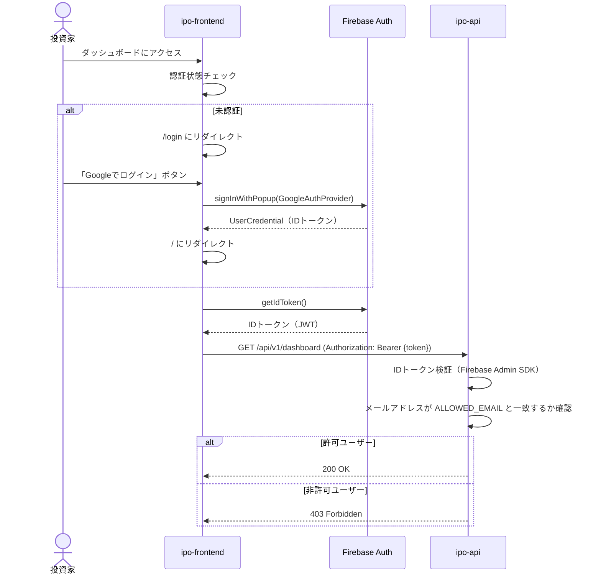
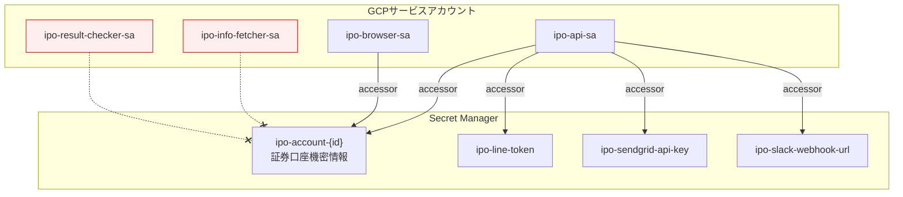
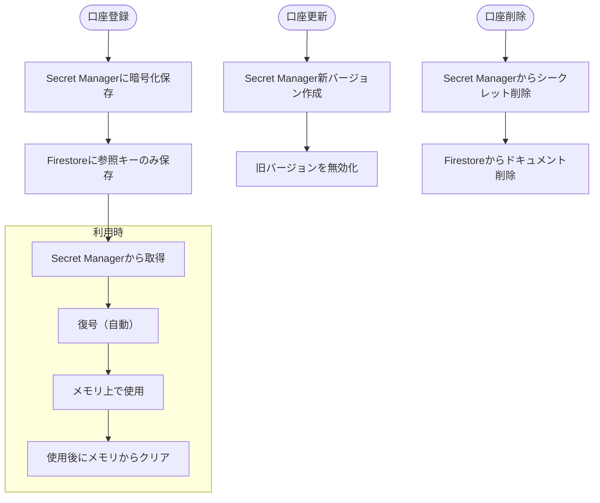
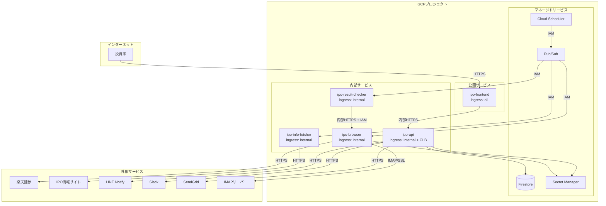
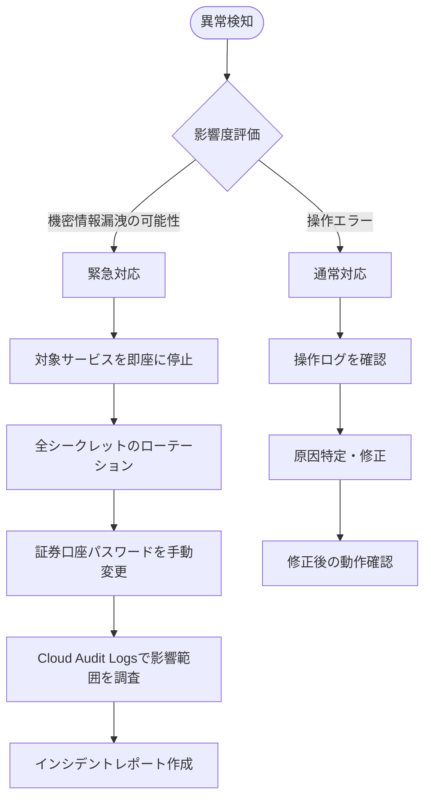

# セキュリティ設計書

> **運用チェックリスト**: 現行の実装と対応状況は [checklist.md](./checklist.md) を参照。四半期レビューや本番リリース前にはそちらを必ず通すこと。

## 1. はじめに

### 1.1 目的

本文書は、IPOttoのセキュリティ設計を定義する。本システムは証券口座の機密情報（ログインID、パスワード、取引暗証番号、メール認証情報）を扱うため、情報漏洩リスクへの対策を最重要課題として設計する。

### 1.2 準拠基準・ガイドライン

| 基準 | 概要 |
|---|---|
| OWASP Top 10 | Webアプリケーションのセキュリティリスクに対する対策 |
| GCP セキュリティベストプラクティス | Cloud Run、Secret Manager、IAMの運用ガイドライン |
| 最小権限の原則 | 各サービスに必要最小限の権限のみを付与 |

### 1.3 対応する要件

> [要件定義書 - セキュリティ要件](../01-requirements/requirements-specification.md) REQ-NF-020〜REQ-NF-025

## 2. 脅威分析

### 2.1 脅威モデル（STRIDE）

| カテゴリ | 脅威 | 対象 | リスクレベル | 対策 |
|---|---|---|---|---|
| Spoofing（なりすまし） | 第三者がWeb UIに不正ログイン | ipo-frontend, ipo-api | 高 | Firebase Authentication + 許可UID制限。Googleアカウントの2FA |
| Spoofing | Cloud Runサービスへの不正リクエスト | ipo-api, ipo-browser | 中 | IAM認証による内部通信制限 |
| Tampering（改ざん） | API リクエストの改ざん | ipo-api | 中 | TLS通信の強制、入力バリデーション |
| Tampering | 操作ログの改ざん | Firestore | 低 | Firestoreセキュリティルールによる書き込み制限 |
| Repudiation（否認） | 自動操作の否認 | 全サービス | 低 | 操作ログの完全記録、Cloud Audit Logs |
| Information Disclosure（情報漏洩） | 証券口座の機密情報漏洩 | Secret Manager, Firestore | **最高** | Secret Manager暗号化保存、IAMアクセス制御、ログへの出力禁止 |
| Information Disclosure | ブラウザセッション（userDataDir）窃取 | ipo-browser | 高 | Cloud Runのステートレス特性で自然消失、ディレクトリ権限制限 |
| Information Disclosure | メール認証情報の漏洩 | Secret Manager | 高 | AccountCredentialの一部としてSecret Managerで暗号化管理 |
| Denial of Service | Cloud Runへの大量リクエスト | ipo-frontend, ipo-api | 低 | Cloud Run標準のリクエスト制限、個人利用のため影響軽微 |
| Elevation of Privilege（権限昇格） | GCPサービスアカウントの権限過剰 | 全GCPリソース | 中 | 最小権限の原則、サービスごとに個別のサービスアカウント |
| Spoofing | 野村證券 phishing クローンへの誤接続 | ipo-browser | 中 | ログイン URL を `selectors.yaml: nomura.login.pageUrl` で固定、HTTPS 証明書検証必須（[野村證券認証 セキュリティ設計](./nomura-authentication.md)） |
| Information Disclosure | 野村證券 2FA OTP のログ出力 | ipo-browser logs | 高 | OTP は OperationLog に出力しない、`pino` シリアライザで OTP フィールドをマスク |
| Denial of Service | 野村サイトのレート制限超過 | ipo-browser | 低 | broker 別レート制限ロジック（[Q-N-060](../user-actions/nomura-broker-information-request.md#q-n-060) 回答後に閾値設定） |

### 2.2 リスク評価

| リスク | 影響度 | 発生確率 | リスクレベル | 対応優先度 |
|---|---|---|---|---|
| 証券口座の機密情報漏洩 | 最高 | 低 | 高 | P0: 最優先 |
| Web UIへの不正アクセス | 高 | 低 | 中 | P1 |
| ブラウザセッションの窃取 | 高 | 低 | 中 | P1 |
| GCPリソースへの不正アクセス | 高 | 低 | 中 | P1 |
| メール認証情報の漏洩 | 高 | 低 | 中 | P1 |
| 操作ログの改ざん | 中 | 低 | 低 | P2 |

## 3. 認証設計

### 3.1 Web UI認証方式

| 項目 | 仕様 |
|---|---|
| 認証方式 | Firebase Authentication（Googleアカウントログイン） |
| トークン形式 | Firebase IDトークン（JWT / RS256） |
| トークン有効期限 | 1時間（Firebase SDK が自動リフレッシュ） |
| 許可ユーザー制限 | 環境変数 `ALLOWED_EMAIL` で許可するメールアドレスを指定（カンマ区切りで複数可、大文字小文字無視）。それ以外は 403 Forbidden |

### 3.2 認証フロー



### 3.3 サービス間認証

| 通信経路 | 認証方式 |
|---|---|
| ipo-frontend → ipo-api | Firebase IDトークン（Bearer） |
| Cloud Scheduler → Pub/Sub | GCP IAM（サービスアカウント） |
| Pub/Sub → Cloud Run | GCP IAM（Pub/Subサービスアカウント） |
| ipo-result-checker → ipo-browser | GCP IAM（Cloud Run to Cloud Run） |
| Cloud Run → Secret Manager | GCP IAM（サービスアカウント） |
| Cloud Run → Firestore | GCP IAM（サービスアカウント） |

## 4. 認可設計

### 4.1 権限モデル

| 項目 | 仕様 |
|---|---|
| モデル | 単一ユーザー認可（許可リスト方式） |
| 実装 | Axumミドルウェア（Tower Layer）でIDトークン検証 + メールアドレスチェック |

### 4.2 リソースアクセス制御

| リソース | 許可ユーザー | システム（Pub/Sub） | 未認証 |
|---|---|---|---|
| IPO銘柄一覧・詳細 | 参照 | — | 拒否 |
| ダッシュボード | 参照 | — | 拒否 |
| 除外リスト | 参照・作成・削除 | — | 拒否 |
| 通知設定 | 参照・更新 | — | 拒否 |
| 証券口座 | 参照・作成・更新・削除・テスト | — | 拒否 |
| 操作ログ | 参照 | 作成 | 拒否 |
| IPO情報取得ジョブ | — | 実行 | 拒否 |
| 自動申し込みジョブ | — | 実行 | 拒否 |
| 結果確認ジョブ | — | 実行 | 拒否 |

### 4.3 Cloud Runのイングレス制御

| サービス | イングレス設定 | アクセス元 |
|---|---|---|
| ipo-frontend | すべてのトラフィック（`all`） | インターネット（Firebase Auth必須） |
| ipo-api | 内部トラフィック + Cloud Load Balancing（`internal-and-cloud-load-balancing`） | ipo-frontend、Pub/Sub |
| ipo-browser | 内部トラフィックのみ（`internal`） | ipo-result-checker、Pub/Sub |
| ipo-info-fetcher | 内部トラフィックのみ（`internal`） | Pub/Sub |
| ipo-result-checker | 内部トラフィックのみ（`internal`） | Pub/Sub |

## 5. データ保護

### 5.1 暗号化方針

| 対象 | 方式 | 詳細 |
|---|---|---|
| 通信暗号化 | TLS 1.2+ | Cloud Runが自動的にTLSを終端。HTTP → HTTPS自動リダイレクト |
| 保存時暗号化（Firestore） | Google管理の暗号鍵 | Firestoreのデフォルト暗号化（AES-256） |
| 保存時暗号化（Secret Manager） | Google管理の暗号鍵 | Secret Managerのデフォルト暗号化 |
| ブラウザセッション（userDataDir） | なし（平文） | Cloud Runのステートレス特性で自然消失。ディレクトリ権限700 |

### 5.2 機密データ分類と取り扱い

| 分類 | データ | 保管場所 | 取り扱い方針 |
|---|---|---|---|
| **最高機密** | 証券口座パスワード、取引暗証番号 | Secret Manager | Secret Managerで暗号化保存。メモリ上の保持時間を最小化。ログ出力絶対禁止 |
| **最高機密** | メール認証情報（パスワード） | Secret Manager | AccountCredentialの一部としてSecret Managerで管理。ログ出力絶対禁止 |
| **機密** | 証券口座ログインID | Secret Manager | Secret Manager内に保存。APIレスポンスではマスク表示（先頭3文字 + `***`） |
| **機密** | メールアドレス | Secret Manager | Secret Manager内に保存。APIレスポンスではマスク表示 |
| **機密** | ブラウザセッション（Cookie） | Cloud Run ローカル `/tmp/` | Cloud Runインスタンス終了時に自動消失。ディレクトリ権限700 |
| **機密** | Firebase IDトークン | メモリ（フロントエンド） | sessionStorageに保存しない。Firebase SDKのインメモリ管理に委任 |
| **内部** | IPO銘柄情報 | Firestore | 認証済みユーザーのみアクセス可能 |
| **内部** | 操作ログ | Firestore | 認証済みユーザーのみ参照可能。システムのみ書き込み可能 |

### 5.3 Secret Managerアクセス制御



> **最小権限の原則:** ipo-info-fetcherとipo-result-checkerは証券口座の機密情報にアクセスする必要がない。Secret Managerへのアクセス権限を付与しない。

### 5.4 機密情報のライフサイクル



## 6. セキュリティ対策

### 6.1 入力値検証

- 全てのAPIリクエストをAxumのExtractorでサーバーサイドバリデーション
- フロントエンドでもUX向上のためバリデーションするが、サーバー側を正とする
- 企業名、理由等の文字列フィールドは最大長を制限（XSS対策を兼ねる）
- IMAPポート番号は1〜65535の範囲チェック
- メールアドレスはRFC 5322準拠の形式チェック

### 6.2 CSRF対策

| 項目 | 対策 |
|---|---|
| 方式 | SameSite Cookie属性（`Strict`）+ Firebase IDトークン（Bearerトークン） |
| 理由 | API認証にCookieを使用しない（Bearerトークン方式）ため、CSRF攻撃のリスクは低い |

### 6.3 XSS対策

- Next.jsのReactコンポーネントはデフォルトでHTMLエスケープされる
- `dangerouslySetInnerHTML` の使用を禁止する
- Content-Security-Policyヘッダーを設定:
  ```
  Content-Security-Policy: default-src 'self'; script-src 'self'; style-src 'self' 'unsafe-inline'; img-src 'self' data:; connect-src 'self' https://*.firebaseapp.com https://*.googleapis.com
  ```

### 6.4 インジェクション対策

| 攻撃種別 | 対策 |
|---|---|
| NoSQLインジェクション（Firestore） | Firestore SDKのパラメータ化クエリを使用。ユーザー入力をクエリに直接埋め込まない |
| コマンドインジェクション | Playwright操作で外部入力をURLやセレクタに直接使用しない |
| ログインジェクション | 構造化ログ（JSON形式）を使用し、ユーザー入力がログフォーマットを破壊しないようにする |

### 6.5 HTTPセキュリティヘッダー

| ヘッダー | 値 | 目的 |
|---|---|---|
| `Strict-Transport-Security` | `max-age=31536000; includeSubDomains` | HTTPS強制 |
| `X-Content-Type-Options` | `nosniff` | MIMEタイプスニッフィング防止 |
| `X-Frame-Options` | `DENY` | クリックジャッキング防止 |
| `Referrer-Policy` | `strict-origin-when-cross-origin` | リファラー情報の制限 |
| `Permissions-Policy` | `camera=(), microphone=(), geolocation=()` | ブラウザ機能の制限 |

### 6.6 CORS

| 項目 | 設定 |
|---|---|
| 許可オリジン | ipo-frontendのCloud Run URL のみ（ホワイトリスト） |
| 許可メソッド | `GET, POST, PUT, DELETE, OPTIONS` |
| 許可ヘッダー | `Authorization, Content-Type` |
| クレデンシャル | `false`（Cookieを使用しないため） |

### 6.7 依存パッケージの脆弱性管理

| ツール | 対象 | 実行タイミング |
|---|---|---|
| GitHub Dependabot | 全リポジトリ | 自動（週次PR作成） |
| `cargo audit` | Rustサービス | CI パイプライン（毎ビルド） |
| `npm audit` | Node.js/Next.jsサービス | CI パイプライン（毎ビルド） |

### 6.8 シークレットのコード混入防止

| 対策 | 詳細 |
|---|---|
| `.gitignore` | `.env`, `auth.json`, `browser-sessions/`, `selectors/*.local.yaml` を除外 |
| pre-commitフック | `gitleaks` でコミット前にシークレットのスキャンを実行 |
| CI | GitHub Secret Scanning を有効化 |

## 7. ネットワークセキュリティ

### 7.1 ネットワーク構成



### 7.2 GCPサービスアカウント設計

| サービスアカウント | 付与ロール | 理由 |
|---|---|---|
| `ipo-api-sa` | `roles/datastore.user`, `roles/secretmanager.secretAccessor`, `roles/pubsub.publisher` | Firestore読み書き、シークレット読み取り、イベント発行 |
| `ipo-browser-sa` | `roles/datastore.user`, `roles/secretmanager.secretAccessor`, `roles/pubsub.publisher` | Firestore読み書き、シークレット読み取り（口座認証情報）、イベント発行 |
| `ipo-info-fetcher-sa` | `roles/datastore.user`, `roles/pubsub.publisher` | Firestore読み書き、イベント発行。**Secret Managerへのアクセス権なし** |
| `ipo-result-checker-sa` | `roles/datastore.user`, `roles/pubsub.publisher`, `roles/run.invoker` | Firestore読み書き、イベント発行、ipo-browserの呼び出し。**Secret Managerへのアクセス権なし** |
| `ipo-frontend-sa` | なし（Firebase Auth SDKのみ使用） | Cloud Runのデフォルトサービスアカウントで十分 |
| `ipo-scheduler-sa` | `roles/pubsub.publisher` | Pub/Subへのメッセージ発行のみ |

## 8. 監査ログ

### 8.1 記録項目

| イベント | 記録項目 | 保存先 |
|---|---|---|
| Web UIログイン | メールアドレス、日時、成否 | Cloud Logging（Firebase Auth） |
| 証券口座登録・更新・削除 | 操作者、口座ID、操作種別、日時 | Firestore（operation_logs） + Cloud Logging |
| Secret Managerアクセス | サービスアカウント、シークレット名、操作種別、日時 | Cloud Audit Logs（自動） |
| 証券口座ログイン試行 | 口座ID、成否、2FA要否、日時 | Firestore（operation_logs） |
| 画像認証試行 | 口座ID、成否、使用セレクタ、日時 | Firestore（operation_logs） |
| IPO申し込み実行 | 銘柄ID、口座ID、成否、日時 | Firestore（operation_logs） |
| 通知送信 | チャネルタイプ、イベント種別、成否、日時 | Firestore（operation_logs） |
| Pub/Subメッセージ | トピック、サブスクリプション、日時 | Cloud Logging（自動） |

### 8.2 保存方針

| 項目 | 仕様 |
|---|---|
| 保存先（アプリログ） | Firestore `operation_logs` コレクション |
| 保存先（インフラログ） | Cloud Logging |
| 保存先（監査ログ） | Cloud Audit Logs |
| 保存期間 | 90日 |
| アクセス制御 | 認証済みユーザーのみ参照可能（Web UI）。Cloud Audit Logsはプロジェクトオーナーのみ |

### 8.3 ログにおける機密情報の取り扱い

| データ | ログ出力 | マスキング方法 |
|---|---|---|
| パスワード、取引暗証番号 | **出力禁止** | — |
| メールパスワード | **出力禁止** | — |
| ログインID | マスク表示 | 先頭3文字 + `***` |
| メールアドレス | マスク表示 | ローカル部先頭3文字 + `***@` + ドメイン |
| Secret Managerキー | マスク表示 | `ipo-account-***` |
| Firebase IDトークン | **出力禁止** | — |
| Webhook URL | マスク表示 | `https://hooks.slack.com/***` |

## 9. インシデント対応

### 9.1 検知アラート

| 検知対象 | 条件 | 通知先 | 対応 |
|---|---|---|---|
| 画像認証連続失敗 | 2回以上失敗 | LINE / Slack | 該当口座を即座に無効化。手動確認 |
| Secret Managerへの異常アクセス | 想定外のサービスアカウントからのアクセス | Cloud Monitoring → メール | GCPコンソールで確認。必要に応じてサービスアカウント無効化 |
| ipo-apiへの認証失敗多発 | 10分間に5回以上の401/403 | Cloud Monitoring → メール | Firebase Authの不審なログインを確認 |
| 証券口座ロック | 口座ロックを検知 | LINE / Slack（即時） | 証券会社に連絡してロック解除 |

### 9.2 インシデント発生時の手順



## 変更履歴

| バージョン | 日付 | 変更者 | 変更内容 |
|---|---|---|---|
| 1.0.0 | 2026-03-26 | lihs | 初版作成 |
