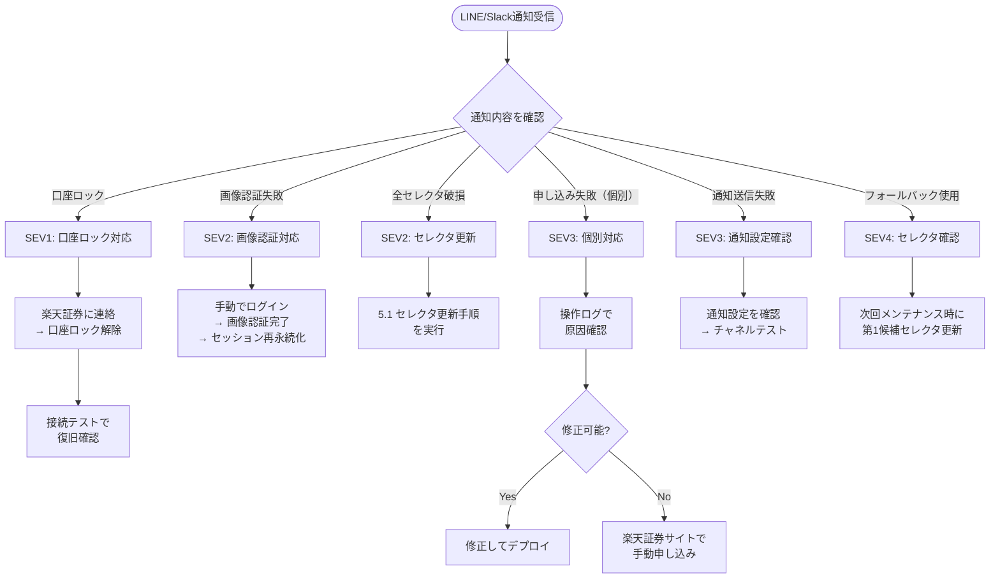
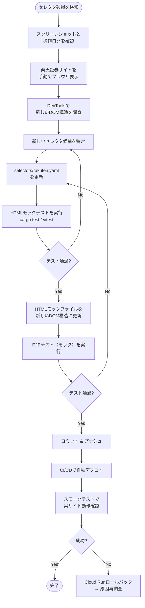

# 運用設計書

## 1. はじめに

### 1.1 目的

本文書は、IPOttoの運用設計を定義する。ペルソナの「放置型」運用（日常的な運用作業ゼロ、異常時のみ通知で対応）を実現するため、完全自動化を前提とし、人間の介入が必要なケースとその手順を明確にする。

### 1.2 運用体制

| 役割 | 担当 | 連絡手段 |
|---|---|---|
| 運用者 | 自分（唯一のユーザー） | LINE / Slack 通知 |

> 個人利用ツールのため、オンコール体制やエスカレーションフローは不要。全ての異常はLINE/Slackで通知を受け取り、自分の都合の良いタイミングで対応する。

### 1.3 運用原則

ペルソナの行動パターンから導出した運用原則:

1. **ゼロタッチ運用** — 日常的な運用作業は存在しない。全てのジョブはCloud Schedulerで自動実行される
2. **異常時のみ介入** — 正常時は通知も来ない。通知が来た＝対応が必要、という設計にする
3. **自己修復優先** — リトライ、フォールバック、セッション再取得を自動で試行し、手動介入を最後の手段とする
4. **安全側に倒す** — 判断に迷う場合は操作を中断し通知する。特に口座ロックリスクのある画像認証は1回のみ試行

### 1.4 対応する要件

> [要件定義書 - 非機能要件](../01-requirements/requirements-specification.md)
> [インフラ設計書](../08-infrastructure-design/infrastructure-design.md)
> [セキュリティ設計書](../09-security-design/security-design.md)

## 2. 定常運用

### 2.1 自動化されている作業（人間の作業なし）

| 作業 | 頻度 | 実行者 | 仕組み |
|---|---|---|---|
| IPO銘柄情報の取得・更新 | 日次（9:00 JST） | Cloud Scheduler → ipo-info-fetcher | Pub/Sub トリガー |
| IPO抽選の自動申し込み | 日次（9:00 JST） | Cloud Scheduler → ipo-browser | Pub/Sub トリガー |
| 抽選結果の自動確認 | 日次（9:00 JST） | Cloud Scheduler → ipo-result-checker | Pub/Sub トリガー |
| Firestoreバックアップ | 週次（日曜深夜） | GitHub Actions | スケジュール実行 |
| 依存パッケージの脆弱性チェック | 週次 | GitHub Dependabot | 自動PR作成 |
| セッション永続化のクリーンアップ | 日次 | ipo-browser | ジョブ実行時に24時間超過分を削除 |

### 2.2 人間が実施する定期作業

| 作業 | 頻度 | 所要時間 | 手順 |
|---|---|---|---|
| ダッシュボード確認 | 週次（週末） | 5分 | ダッシュボードを開き、ステータスサマリーと直近アクティビティを確認 |
| Dependabot PRのマージ | 随時（PR通知時） | 5分 | CIが通っていることを確認してマージ |
| GCP無料枠の使用量確認 | 月次 | 5分 | GCPコンソールの請求レポートで無料枠の消費状況を確認 |

## 3. インシデント対応

### 3.1 重大度分類

| 重大度 | 定義 | 例 | 対応時間目安 |
|---|---|---|---|
| SEV1（緊急） | 証券口座のセキュリティに関わる問題 | 口座ロック、機密情報漏洩の疑い | 即座に対応 |
| SEV2（重大） | 自動操作が完全に停止 | 全セレクタ破損、ログイン不能 | 当日中に対応 |
| SEV3（軽微） | 一部機能の障害（他は稼働中） | 特定銘柄の申し込み失敗、通知送信失敗 | 週末までに対応 |
| SEV4（低） | 運用に支障のない軽微な問題 | フォールバックセレクタでの解決、スクレイピング一時失敗 | 次回メンテナンス時に対応 |

### 3.2 インシデント対応フロー

### 3.3 SEV1: 口座ロック対応手順

**トリガー:** `ACCOUNT_LOCKED` 通知を受信

**手順:**

1. **即座に確認**: Slackの通知内容で対象口座を確認
2. **楽天証券に連絡**: カスタマーサポートに電話（0120-xxx-xxx）またはWebから問い合わせ
   - 本人確認を完了し、口座ロックの解除を依頼
3. **ロック原因の調査**: 操作ログ（`/logs`）で画像認証の試行回数と失敗理由を確認
4. **パスワード変更（必要に応じて）**: 不正アクセスの疑いがある場合はパスワードを変更
5. **IPOttoの口座設定を更新**: パスワード変更した場合、証券口座管理画面で認証情報を更新
6. **接続テスト実行**: 口座管理画面の「接続テスト」で復旧を確認
7. **口座を再有効化**: ロックにより無効化された口座を有効に戻す

### 3.4 SEV2: 画像認証失敗対応手順

**トリガー:** `IMAGE_AUTHENTICATION_FAILED` 通知を受信

**手順:**

1. 操作ログで失敗原因を確認（メール取得タイムアウト？キーワード不一致？）
2. 楽天証券のサイトに手動でアクセスし、ログイン+画像認証を完了
3. ipo-browserのpersistentContextが更新され、セッションが再永続化される
4. ダッシュボードで次回ジョブの実行予定を確認
5. 次回ジョブ実行時に自動操作が正常に動作することを確認

> **注意:** 画像認証は1回のみ自動試行する設計のため、自動突破失敗＝即SEV2。手動介入が必要。

## 4. メンテナンス

### 4.1 計画メンテナンスウィンドウ

| 項目 | 内容 |
|---|---|
| 事前告知 | 不要（個人利用） |
| メンテナンスウィンドウ | 必要に応じて随時。ただしBB期間中の銘柄がない時期が望ましい |
| サービス影響 | Cloud Runのデプロイはゼロダウンタイム（リビジョン切り替え） |

### 4.2 セレクタ更新手順（最重要メンテナンス）

楽天証券のWebサイトUI変更時に、ブラウザ操作のセレクタを更新する手順。

**検知方法:**
- ipo-browserのスモークテスト（日次）で全セレクタの存在確認
- フォールバックセレクタでの解決が発生した場合に警告通知
- 全候補失敗時にCritical通知 + スクリーンショット取得

**対応手順:**

**セレクタ更新チェックリスト:**

| # | 作業 | 確認事項 |
|---|---|---|
| 1 | スクリーンショット確認 | どのページのどのセレクタが破損したか |
| 2 | 楽天証券サイト調査 | 新しいDOM構造のセレクタ候補（CSS / XPath / テキスト） |
| 3 | YAML更新 | `selectors/rakuten.yaml` の該当セクションを更新。第1候補と第2候補の両方を設定 |
| 4 | HTMLモック更新 | `tests/fixtures/html/rakuten/` の該当HTMLファイルを新しいDOM構造に更新 |
| 5 | 単体テスト | `cargo test` / `vitest` が全て通過 |
| 6 | E2Eテスト（モック） | Playwrightテストが全て通過 |
| 7 | デプロイ | mainブランチにマージ → CI/CDで自動デプロイ |
| 8 | 実サイト確認 | スモークテストまたは手動で実サイト動作確認 |

### 4.3 証券会社の認証フロー変更時の対応

楽天証券が画像認証の方式を変更した場合（例: TOTP導入、別の認証方式への移行）の対応方針。

| 変更種別 | 影響 | 対応 |
|---|---|---|
| 画像認証の画像セットが変更 | `alt`属性のテキストが変わる可能性 | メール取得のキーワード抽出ロジックで自動対応。問題があれば正規表現を調整 |
| 画像認証のDOM構造が変更 | セレクタ破損 | セレクタ更新手順（4.2）で対応 |
| 画像認証からTOTP方式に変更 | メールOTP突破が不要になる | ACL設計書のBrokerOperationPort実装を更新。TOTPライブラリ（`otpauth`等）を導入 |
| 画像認証に加えてSMS認証が追加 | 自動突破が困難になる | SMS取得の自動化を検討。不可能な場合は手動フォールバックに依存 |
| パスキー認証が必須化 | ブラウザ自動操作では対応困難 | FIDO2/WebAuthn対応を調査。対応不能な場合はプロジェクトのアーキテクチャ見直し |

### 4.4 通知チャネルのメンテナンス

| 作業 | トリガー | 手順 |
|---|---|---|
| LINE Notifyトークン更新 | トークン期限切れ、またはLINE Notify終了 | LINE Developers Consoleで新トークンを発行 → 通知設定画面で更新 |
| Slack Webhook URL更新 | Webhook無効化 | Slack管理画面で新Webhook URLを発行 → 通知設定画面で更新 |
| SendGrid APIキー更新 | キー漏洩の疑い | SendGridで新APIキーを発行 → Secret Managerを更新 |

## 5. 障害復旧

### 5.1 復旧手順

#### Cloud Runサービスのクラッシュ

1. Cloud Runは自動でインスタンスを再起動する（ヘルスチェック）
2. 再起動後もクラッシュする場合、Cloud Loggingでエラーログを確認
3. コードの問題であれば前リビジョンにロールバック: `gcloud run services update-traffic --to-revisions={prev}=100`

#### Firestoreのデータ破損

1. 破損範囲を特定（どのコレクション・ドキュメント）
2. 週次バックアップからリストア: `gcloud firestore import gs://ipotto-prd-backup/firestore/{date}`
3. バックアップ以降のデータ損失は操作ログから手動で復元

#### Secret Managerのシークレット消失

1. Secret Managerのバージョン履歴を確認: `gcloud secrets versions list {secret_name}`
2. 前バージョンが存在すれば有効化: `gcloud secrets versions enable {version}`
3. 全バージョンが消失した場合は証券口座管理画面から認証情報を再登録

### 5.2 災害復旧計画（DR）

| 項目 | 内容 |
|---|---|
| DR方式 | コールドスタンバイ（Terraformによる再構築） |
| DR手順 | Terraformで別リージョンに同一構成をデプロイ |
| RTO | 1時間（Terraform apply + Firestore import） |
| RPO | 1週間（Firestoreの週次バックアップ） |

> 個人利用のため、マルチリージョン構成は不要。災害時はTerraformで再構築する方針。IPO申し込みは日次実行のため、数時間の停止は許容範囲。

### 5.3 DR実行手順

1. 別リージョン（例: `asia-northeast2`大阪）にTerraformでリソースを作成
2. Firestoreの最新バックアップをインポート
3. Secret Managerのシークレットを再作成（手動で認証情報を再入力）
4. GitHub ActionsのデプロイターゲットをDRリージョンに変更
5. 各サービスのデプロイとヘルスチェック
6. Cloud Schedulerのジョブを再設定

## 6. 運用メトリクス

### 6.1 KPI

| メトリクス | 目標値 | 計測方法 |
|---|---|---|
| IPO申し込み漏れ率 | 0%（除外リスト以外） | ダッシュボードのステータスサマリー |
| ジョブ実行成功率 | 99%以上（月間） | Cloud Monitoringカスタムメトリクス |
| 画像認証自動突破成功率 | 90%以上 | カスタムメトリクス `ipo/authentication/2fa_success` |
| セレクタ第1候補解決率 | 95%以上 | カスタムメトリクス `ipo/selector/fallback_used` |
| 通知配信成功率 | 99%以上 | 操作ログの通知送信結果 |
| 手動介入回数 | 月2回以下 | インシデント記録 |

### 6.2 月次レビュー項目

| 項目 | 確認内容 |
|---|---|
| GCP無料枠消費量 | Firestore読み書き数、Cloud Runリクエスト数が枠内か |
| ジョブ実行履歴 | 失敗したジョブの原因と対策 |
| セレクタ健全性 | フォールバック使用回数、スモークテスト結果 |
| セキュリティ | Dependabot PRの未マージ数、cargo audit結果 |
| IPO実績 | 申し込み件数、当選件数、除外件数の推移 |

## 変更履歴

| バージョン | 日付 | 変更者 | 変更内容 |
|---|---|---|---|
| 1.0.0 | 2026-03-26 | lihs | 初版作成 |
